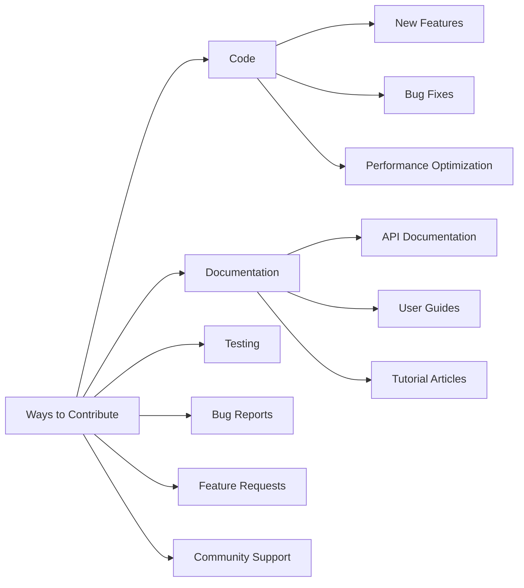

# Contributing Guide

Welcome to contribute to the Gthulhu project! This guide will help you understand how to participate in project development.

## Before You Begin

### Code of Conduct

We follow the [CNCF Code of Conduct](https://github.com/cncf/foundation/blob/main/code-of-conduct.md).

### Ways to Contribute

Before starting to contribute, we recommend reading the [Development History](development-history.md) to understand the project's technical background and challenges encountered.

You can contribute to the project in various ways:



## Development Environment Setup

### Required Tools

Ensure your development environment has the following tools:

| Tool | Version | Installation |
|------|---------|--------------|
| Go | 1.22+ | [Download](https://golang.org/dl/) |
| Clang | 17+ | `apt install clang-17` |
| Git | Latest | `apt install git` |
| Make | Latest | `apt install make` |
| Docker | Latest | [Install Docker](https://docs.docker.com/install/) |

### Clone the Project

```bash
# 1. Fork the project (click Fork button on GitHub)
# 2. Clone your fork
git clone https://github.com/your-username/Gthulhu.git
cd Gthulhu

# 3. Add upstream repository
git remote add upstream https://github.com/Gthulhu/Gthulhu.git

# 4. Verify remote settings
git remote -v
```

### Build the Project

```bash
# Install dependencies
make dep

# Initialize submodules
git submodule init
git submodule sync  
git submodule update

# Build project
make build

# Run tests
make test

# Code linting
make lint
```

## Development Workflow

### 1. Create Feature Branch

```bash
# Create new branch from latest main
git checkout main
git pull upstream main
git checkout -b feature/your-feature-name

# Or for bug fixes
git checkout -b fix/issue-number-description
```

### 2. Code Development

#### Code Style

- **Go code**: Follow `gofmt` and `golint` standards
- **C code**: Follow Linux kernel code style
- **Commit messages**: Use semantic commit messages

```bash
# Format Go code
gofmt -w .

# Run linter
make lint

# Run tests
make test
```

#### Commit Message Format

```bash
# Format: <type>(<scope>): <description>
#
# Types:
# - feat: new feature
# - fix: bug fix
# - docs: documentation update
# - style: code formatting
# - refactor: code refactoring
# - test: test related
# - chore: build or auxiliary tools

# Examples:
feat(scheduler): add CPU topology aware scheduling
fix(bpf): resolve memory leak in task cleanup
docs(api): update API reference documentation
```

### 3. Testing

#### Run Test Suite

```bash
# Run all tests
make test

# Run specific tests
go test ./internal/sched/

# Run benchmark tests
go test -bench=. ./...

# Test coverage
go test -coverprofile=coverage.out ./...
go tool cover -html=coverage.out
```

#### Manual Testing

```bash
# Build and test
make build
sudo ./main &

# Run stress tests
stress-ng --cpu 4 --timeout 60s

# Check performance
perf stat -e context-switches,cpu-migrations,page-faults sudo ./main

# Stop test
sudo pkill -f "./main"
```

### 4. Commit Changes

```bash
# Add changed files
git add .

# Commit changes
git commit -m "feat(scheduler): add CPU topology aware scheduling

- Implement cache-aware CPU selection
- Add NUMA node preference logic  
- Improve task migration decisions

Closes #123"

# Push to your fork
git push origin feature/your-feature-name
```

### 5. Create Pull Request

1. **Go to GitHub**: Visit your fork's page
2. **Create PR**: Click "New Pull Request"
3. **Fill Template**: Use the provided PR template
4. **Wait for Review**: Maintainers will review your code

#### PR Template Example

```markdown
## Description
Brief description of changes in this PR.

## Type of Change
- [ ] Bug fix
- [ ] New feature
- [ ] Performance improvement
- [ ] Documentation update
- [ ] Code refactoring

## Testing
- [ ] Ran existing test suite
- [ ] Added new test cases
- [ ] Manually tested functionality

## Checklist
- [ ] Code follows style guidelines
- [ ] Commit messages are clear
- [ ] Updated relevant documentation
- [ ] Changes are backward compatible

## Related Issues
Fixes #123
```

## Code Review

### Review Standards

Code reviews will check the following aspects:

1. **Correctness**: Is the code logic correct
2. **Performance**: Are there performance issues
3. **Security**: Are there security risks
4. **Readability**: Is the code easy to understand
5. **Maintainability**: Is the code structure reasonable

### Responding to Review Comments

```bash
# Modify code based on review comments
git add .
git commit -m "address review comments: improve error handling"
git push origin feature/your-feature-name
```

### Common Review Comments

1. **Error Handling**:
```go
// ❌ Poor error handling
result, _ := someFunction()

// ✅ Proper error handling
result, err := someFunction()
if err != nil {
    return fmt.Errorf("failed to do something: %w", err)
}
```

2. **Memory Management**:
```c
// ❌ Memory leak
char *buffer = malloc(size);
// ... use buffer
// forgot to free memory

// ✅ Proper memory management
char *buffer = malloc(size);
if (!buffer) return -ENOMEM;
// ... use buffer
free(buffer);
```

3. **Concurrency Safety**:
```go
// ❌ Race condition
var counter int
go func() { counter++ }()
go func() { counter++ }()

// ✅ Use mutex
var mu sync.Mutex
var counter int
go func() {
    mu.Lock()
    counter++
    mu.Unlock()
}()
```

## Special Contribution Types

### Documentation Contributions

Documentation improvements are equally important:

```bash
# Clone documentation project
git clone https://github.com/Gthulhu/docs.git
cd docs

# Install MkDocs
pip install mkdocs mkdocs-material

# Local preview
mkdocs serve

# Edit documentation files
# docs/your-page.md
```

### Testing Contributions

Add test cases:

```go
// Example: Add benchmark test
func BenchmarkScheduleTask(b *testing.B) {
    scheduler := NewScheduler()
    task := &Task{PID: 123, Weight: 1024}
    
    b.ResetTimer()
    for i := 0; i < b.N; i++ {
        scheduler.ScheduleTask(task)
    }
}

// Example: Add integration test
func TestSchedulerIntegration(t *testing.T) {
    // Set up test environment
    scheduler := NewScheduler()
    
    // Test cases
    testCases := []struct{
        name     string
        tasks    []*Task
        expected int
    }{
        // Test cases...
    }
    
    for _, tc := range testCases {
        t.Run(tc.name, func(t *testing.T) {
            // Execute test...
        })
    }
}
```

### BPF Program Contributions

Modifying BPF programs requires special attention:

```c
// 1. Ensure BPF verifier passes
static __always_inline int validate_task(struct task_struct *p) {
    if (!p) return -EINVAL;
    // Other validations...
    return 0;
}

// 2. Use BPF helper functions
SEC("struct_ops/select_cpu")
s32 BPF_STRUCT_OPS(gthulhu_select_cpu, struct task_struct *p, s32 prev_cpu, u64 wake_flags) {
    // Use BPF helper
    u32 cpu = bpf_get_smp_processor_id();
    
    // Boundary check
    if (cpu >= MAX_CPUS) return prev_cpu;
    
    return select_best_cpu(p, prev_cpu);
}

// 3. Add trace points
bpf_trace_printk("Task %d scheduled on CPU %d\n", p->pid, cpu);
```

## Release Process

### Version Numbering Rules

Follow [Semantic Versioning](https://semver.org/):

```
MAJOR.MINOR.PATCH

Example: 1.0.0, 1.1.0, 1.1.1
```

- **MAJOR**: Incompatible API changes
- **MINOR**: Backward-compatible feature additions
- **PATCH**: Backward-compatible bug fixes

### Release Checklist

Before release, confirm:

- [ ] All tests pass
- [ ] Documentation updated
- [ ] CHANGELOG updated
- [ ] Version number updated
- [ ] GitHub Release created
- [ ] Docker image updated

## Community Participation

### Contact Methods

- **GitHub Issues**: Bug reports and feature requests
- **GitHub Discussions**: Technical discussions and Q&A
- **Email**: Important matters contact

### Community Activities

- **Monthly Meetings**: Online technical discussion meetings
- **Code Reviews**: Mutual review and learning
- **Tech Sharing**: Share usage experiences and best practices

## Recognition and Thanks

### Contributors List

All contributors will be recognized in the following places:

- Contributors section in README.md
- GitHub Contributors page
- Thanks list in release notes

### Special Contributions

For major contributions, we will provide:

- Project Committer privileges
- Technical blog byline opportunities
- Conference speaking invitations

---

!!! success "Welcome to Contribute"
    Thank you for considering contributing to the Gthulhu project! Every contribution, no matter how big or small, is very important to the project's development.

!!! tip "Need Help?"
    If you encounter any problems during the contribution process, please feel free to seek help in GitHub Issues or contact project maintainers. We're happy to assist you!
