# 貢獻指南

歡迎您為 Gthulhu 專案做出貢獻！本指南將協助您了解如何參與專案開發。

## 開始之前

### 行為準則

參與專案請遵守我們的行為準則：

- 🤝 **尊重他人**：友善對待所有參與者
- 💬 **建設性溝通**：提供有建設性的意見和建議
- 🌍 **包容多元**：歡迎不同背景的貢獻者
- 📚 **樂於學習**：保持開放的學習態度

### 貢獻方式

在開始貢獻之前，建議先閱讀 [開發歷程](development-history.md) 以了解專案的技術背景和曾經遇到的挑戰。

您可以通過多種方式為專案做出貢獻：

```mermaid
graph LR
    A[貢獻方式] --> B[程式碼]
    A --> C[文檔]
    A --> D[測試]
    A --> E[問題回報]
    A --> F[功能建議]
    A --> G[社群支援]
    
    B --> B1[新功能]
    B --> B2[錯誤修復]
    B --> B3[效能最佳化]
    
    C --> C1[API 文檔]
    C --> C2[使用指南]
    C --> C3[教學文章]
```



## 開發環境設定

### 必要工具

確保您的開發環境具備以下工具：

| 工具 | 版本需求 | 安裝方式 |
|------|----------|----------|
| Go | 1.22+ | [下載安裝](https://golang.org/dl/) |
| Clang | 17+ | `apt install clang-17` |
| Git | 最新 | `apt install git` |
| Make | 最新 | `apt install make` |
| Docker | 最新 | [安裝 Docker](https://docs.docker.com/install/) |

### 克隆專案

```bash
# 1. Fork 專案 (在 GitHub 上點擊 Fork 按鈕)
# 2. 克隆您的 fork
git clone https://github.com/您的用戶名/Gthulhu.git
cd Gthulhu

# 3. 新增上游倉庫
git remote add upstream https://github.com/Gthulhu/Gthulhu.git

# 4. 驗證 remote 設定
git remote -v
```

### 建置專案

```bash
# 安裝相依套件
make dep

# 初始化 submodules
git submodule init
git submodule sync  
git submodule update

# 建置專案
make build

# 執行測試
make test

# 程式碼檢查
make lint
```

## 開發工作流程

### 1. 建立功能分支

```bash
# 從最新的 main 分支建立新分支
git checkout main
git pull upstream main
git checkout -b feature/your-feature-name

# 或者修復錯誤
git checkout -b fix/issue-number-description
```

### 2. 程式碼開發

#### 程式碼風格

- **Go 程式碼**：遵循 `gofmt` 和 `golint` 標準
- **C 程式碼**：遵循 Linux 核心程式碼風格
- **提交訊息**：使用語意化提交訊息

```bash
# 格式化 Go 程式碼
gofmt -w .

# 執行 linter
make lint

# 執行測試
make test
```

#### 提交訊息格式

```bash
# 格式: <類型>(<範圍>): <描述>
#
# 類型:
# - feat: 新功能
# - fix: 錯誤修復
# - docs: 文檔更新
# - style: 程式碼格式化
# - refactor: 程式碼重構
# - test: 測試相關
# - chore: 建置或輔助工具

# 範例:
feat(scheduler): add CPU topology aware scheduling
fix(bpf): resolve memory leak in task cleanup
docs(api): update API reference documentation
```

### 3. 測試

#### 執行測試套件

```bash
# 執行所有測試
make test

# 執行特定測試
go test ./internal/sched/

# 執行基準測試
go test -bench=. ./...

# 測試覆蓋率
go test -coverprofile=coverage.out ./...
go tool cover -html=coverage.out
```

#### 手動測試

```bash
# 建置並測試
make build
sudo ./main &

# 執行壓力測試
stress-ng --cpu 4 --timeout 60s

# 檢查效能
perf stat -e context-switches,cpu-migrations,page-faults sudo ./main

# 停止測試
sudo pkill -f "./main"
```

### 4. 提交變更

```bash
# 添加變更檔案
git add .

# 提交變更
git commit -m "feat(scheduler): add CPU topology aware scheduling

- Implement cache-aware CPU selection
- Add NUMA node preference logic  
- Improve task migration decisions

Closes #123"

# 推送到您的 fork
git push origin feature/your-feature-name
```

### 5. 建立 Pull Request

1. **前往 GitHub**：訪問您 fork 的頁面
2. **建立 PR**：點擊 "New Pull Request"
3. **填寫模板**：使用提供的 PR 模板
4. **等待審查**：維護者會審查您的程式碼

#### PR 模板範例

```markdown
## 變更說明
簡要描述這個 PR 的變更內容。

## 變更類型
- [ ] 錯誤修復
- [ ] 新功能
- [ ] 效能改進
- [ ] 文檔更新
- [ ] 程式碼重構

## 測試
- [ ] 已執行現有測試套件
- [ ] 已新增新的測試案例
- [ ] 已手動測試功能

## 檢查清單
- [ ] 程式碼符合風格指南
- [ ] 提交訊息清晰明確 
- [ ] 已更新相關文檔
- [ ] 變更向後兼容

## 相關 Issue
Fixes #123
```

## 程式碼審查

### 審查標準

程式碼審查將檢查以下方面：

1. **正確性**：程式碼邏輯是否正確
2. **效能**：是否有效能問題
3. **安全性**：是否存在安全風險
4. **可讀性**：程式碼是否易於理解
5. **可維護性**：程式碼結構是否合理

### 回應審查意見

```bash
# 根據審查意見修改程式碼
git add .
git commit -m "address review comments: improve error handling"
git push origin feature/your-feature-name
```

### 常見審查意見

1. **錯誤處理**：
```go
// ❌ 不好的錯誤處理
result, _ := someFunction()

// ✅ 正確的錯誤處理
result, err := someFunction()
if err != nil {
    return fmt.Errorf("failed to do something: %w", err)
}
```

2. **記憶體管理**：
```c
// ❌ 記憶體洩漏
char *buffer = malloc(size);
// ... 使用 buffer
// 忘記釋放記憶體

// ✅ 正確的記憶體管理
char *buffer = malloc(size);
if (!buffer) return -ENOMEM;
// ... 使用 buffer
free(buffer);
```

3. **並發安全**：
```go
// ❌ 競態條件
var counter int
go func() { counter++ }()
go func() { counter++ }()

// ✅ 使用互斥鎖
var mu sync.Mutex
var counter int
go func() {
    mu.Lock()
    counter++
    mu.Unlock()
}()
```

## 特殊貢獻類型

### 文檔貢獻

文檔改進同樣重要：

```bash
# 克隆文檔專案
git clone https://github.com/Gthulhu/docs.git
cd docs

# 安裝 MkDocs
pip install mkdocs mkdocs-material

# 本地預覽
mkdocs serve

# 編輯文檔檔案
# docs/your-page.md
```

### 測試貢獻

新增測試用例：

```go
// 範例：新增基準測試
func BenchmarkScheduleTask(b *testing.B) {
    scheduler := NewScheduler()
    task := &Task{PID: 123, Weight: 1024}
    
    b.ResetTimer()
    for i := 0; i < b.N; i++ {
        scheduler.ScheduleTask(task)
    }
}

// 範例：新增整合測試
func TestSchedulerIntegration(t *testing.T) {
    // 設定測試環境
    scheduler := NewScheduler()
    
    // 測試案例
    testCases := []struct{
        name     string
        tasks    []*Task
        expected int
    }{
        // 測試案例...
    }
    
    for _, tc := range testCases {
        t.Run(tc.name, func(t *testing.T) {
            // 執行測試...
        })
    }
}
```

### BPF 程式貢獻

修改 BPF 程式需要特別注意：

```c
// 1. 確保 BPF 驗證器通過
static __always_inline int validate_task(struct task_struct *p) {
    if (!p) return -EINVAL;
    // 其他驗證...
    return 0;
}

// 2. 使用 BPF helper 函數
SEC("struct_ops/select_cpu")
s32 BPF_STRUCT_OPS(gthulhu_select_cpu, struct task_struct *p, s32 prev_cpu, u64 wake_flags) {
    // 使用 BPF helper
    u32 cpu = bpf_get_smp_processor_id();
    
    // 邊界檢查
    if (cpu >= MAX_CPUS) return prev_cpu;
    
    return select_best_cpu(p, prev_cpu);
}

// 3. 添加追蹤點
bpf_trace_printk("Task %d scheduled on CPU %d\n", p->pid, cpu);
```

## 發布流程

### 版本號規則

遵循 [語意化版本](https://semver.org/)：

```
MAJOR.MINOR.PATCH

例如: 1.0.0, 1.1.0, 1.1.1
```

- **MAJOR**：不相容的 API 變更
- **MINOR**：向後相容的功能新增
- **PATCH**：向後相容的錯誤修復

### 發布檢查清單

發布前確認：

- [ ] 所有測試通過
- [ ] 文檔已更新
- [ ] CHANGELOG 已更新
- [ ] 版本號已更新
- [ ] 建立 GitHub Release
- [ ] 更新 Docker 映像檔

## 社群參與

### 聯繫方式

- **GitHub Issues**：問題回報和功能請求
- **GitHub Discussions**：技術討論和問答
- **Email**：重要事項聯絡

### 社群活動

- **每月會議**：線上技術討論會議
- **程式碼審查**：互相審查和學習
- **技術分享**：分享使用經驗和最佳實踐

## 認可與感謝

### 貢獻者列表

所有貢獻者都會在以下地方被認可：

- README.md 的貢獻者章節
- GitHub Contributors 頁面
- 發布說明中的感謝名單

### 特殊貢獻

對於重大貢獻，我們會提供：

- 專案 Committer 權限
- 技術部落格署名機會
- 會議演講邀請

---

!!! success "歡迎貢獻"
    感謝您考慮為 Gthulhu 專案做出貢獻！每一個貢獻，無論大小，都對專案的發展非常重要。

!!! tip "需要幫助？"
    如果您在貢獻過程中遇到任何問題，請隨時在 GitHub Issues 中尋求幫助，或聯繫專案維護者。我們很樂意協助您！
