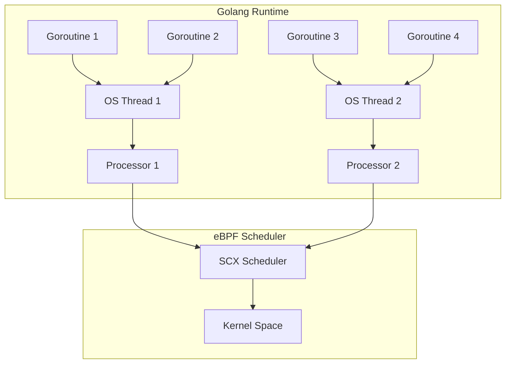

# Development History

!!! info "Author"
    [Yi Chen](https://www.linkedin.com/in/ian-chen-88b70b1aa/) [[GitHub](https://github.com/ianchen0119)], Founder of Gthulhu <ychen.desl@gmail.com>

This page documents the development history, technical challenges, and solutions of the Gthulhu and Qumun projects.

## Project Origins

Having been a long-time lurker in Professor Jserv's system software community, I learned about Linux's upcoming support for eBPF-based schedulers during the early development of sched_ext (scx). Later, I discovered Andrea Righi's presentation "Crafting a Linux kernel scheduler in Rust" at Rust Lab 2024, which revealed that scx had already included an eBPF scheduler called "scx_rustland" that performs scheduling policy decisions in userspace.

This inspired the idea of recreating this scheduler using Golang, for several reasons:

- Open-source libbpfgo was available for use
- Golang has a lower development complexity compared to Rust  
- Using Golang for K8s operator development is more convenient

## Infrastructure Setup

Before beginning the reconstruction work, some infrastructure needed to be established:

1. **libbpfgo Support Assessment**: Could it support scx-type eBPF programs? Were the API implementations complete?
2. **Skeleton Tools**: Was there a convenient way for golang applications to use eBPF skeletons?

Initially, I was overly optimistic, thinking that simply enabling libbpfgo to support struct-ops map attachment would allow recreating what scx_rustland does in golang. But reality was far from ideal.

## Technical Contributions and Fixes

### Patch #1: libbpfgo struct-ops Support

**Link**: [feat: add AttachStructOps() #476 for aquasecurity/libbpfgo](https://github.com/aquasecurity/libbpfgo/pull/476)

The primary task for developing scx-based schedulers using golang was enabling golang applications to manage struct-ops type BPF Maps. However, libbpfgo didn't support the relevant APIs, so libbpfgo needed to be extended.

Main changes:

```go
func (m *BPFMap) AttachStructOps() error {
    if m.Type().String() != MapTypeStructOps.String() {
        return errors.New("Map type should be BPF_MAP_TYPE_STRUCT_OPS")
    }
    linkC, errno := C.bpf_map__attach_struct_ops(m.bpfMap)
    if linkC == nil {
        return fmt.Errorf("Map attach failed: %v", &errno)
    }
    return nil
}
```

Most time was spent writing selftests, choosing to use golang to write the user space agent for scx-simple as the selftest for this patch.

Additionally, the project's CI Runner used kernel version v6.8, but scheduler extension requires v6.12+ kernels. After discussion, arighi's suggestion to use virtme-ng for testing was accepted.

### Patch #2: User Ring Buffer Support

**Link**: [support user ring buffer #480 for aquasecurity/libbpfgo](https://github.com/aquasecurity/libbpfgo/pull/480)

When attempting to implement scx_goland, I discovered that libbpfgo lacked API support for user-ring-buffer type BPF maps.

The scx_rustland_core architecture diagram shows that scx_goland (scx_rustland) heavily relies on user-ring-buffer maps (which work like ring buffers but with reverse transmission order, allowing user space applications to pass messages to BPF programs).

With these two patches, golang gained the ability to load scx eBPF programs and pass scheduling decisions to eBPF schedulers.

### Patch #3: eBPF Documentation Fix

**Link**: [chore: update BPF_PROG_TEST_RUN.md for isovalent/ebpf-docs](https://github.com/isovalent/ebpf-docs/pull/119)

Since Linux kernel v5.14, the kernel supports `BPF_PROG_TYPE_SYSCALL` type eBPF programs. Note that these can only be executed through system calls, specifically the BPF system call.

To execute `BPF_PROG_TYPE_SYSCALL` type eBPF programs, eBPF provides `BPF_PROG_TEST_RUN`, which can invoke the following types of eBPF programs:

- `BPF_PROG_TYPE_SOCK_OPS`
- `BPF_PROG_TYPE_SYSCALL`
- `BPF_PROG_TYPE_RAW_TRACEPOINT`
- `BPF_PROG_TYPE_TRACING`
- `BPF_PROG_TYPE_SOCKET_FILTER`
- `BPF_PROG_TYPE_SCHED_CLS`
- `BPF_PROG_TYPE_SCHED_ACT`
- `BPF_PROG_TYPE_XDP`
- `BPF_PROG_TYPE_CGROUP_SKB`
- `BPF_PROG_TYPE_LWT_IN`
- `BPF_PROG_TYPE_LWT_OUT`
- `BPF_PROG_TYPE_LWT_XMIT`
- `BPF_PROG_TYPE_LWT_SEG6LOCAL`
- `BPF_PROG_TYPE_FLOW_DISSECTOR`

In scx_goland (scx_rustland), `BPF_PROG_TYPE_SYSCALL` type programs allow user-space programs to call customized functions to select a CPU for newly awakened tasks (the select_cpu hook mentioned in scheduler_extension documentation):

```c
/*
 * Select and wake-up an idle CPU for a specific task from the user-space
 * scheduler.
 */
SEC("syscall")
int rs_select_cpu(struct task_cpu_arg *input)
{
    struct task_struct *p;
    int cpu;

    p = bpf_task_from_pid(input->pid);
    if (!p)
        return -EINVAL;

    bpf_rcu_read_lock();
    cpu = pick_idle_cpu(p, input->cpu);
    bpf_rcu_read_unlock();

    bpf_task_release(p);

    /*
     * Wake-up the CPU if idle. Use SCX_KICK_IDLE to prevent unecessary
     * rescheduling events in case the CPU is already awake (since we don't
     * know exactly what the user-space scheduler is doing we can't
     * implicitly assume that the target CPU is idle here).
     */
    if (cpu >= 0)
        scx_bpf_kick_cpu(cpu, SCX_KICK_IDLE);

    return cpu;
}
```

**Important Discovery**: When using the `BPF_PROG_TEST_RUN` command and consulting eBPF-docs, I learned that `BPF_PROG_TYPE_SYSCALL` type eBPF programs only required passing the `ctx_in` parameter. **However, this information was incorrect** - actually `ctx_size_in` also needs to be provided for `BPF_PROG_TYPE_SYSCALL` type eBPF programs to execute successfully.

This issue caused significant delays (I once suspected libbpfgo was poorly implemented), before finally discovering it was a documentation problem. The eBPF documentation regarding `ctx_size_in` has now been corrected, saving other developers from this pitfall.

## Issues Encountered During Porting

### Page Fault Problem

While modifying infrastructure took some time, the progress of patches didn't actually affect scheduler development, since forked repos could be used before PR merges.

However, after adding the necessary APIs to libbpfgo, I encountered a **system freeze problem**. This occurred after scx_goland loaded, causing the system to freeze for about five seconds before recovering (exactly matching the watchdog timeout for removing schedulers).

Initially, I suspected that the newly added user_ringbuffer wasn't successfully communicating dispatched tasks to the eBPF program, but unit tests disproved this hypothesis.

After much thought without finding a solution, I consulted Andrea Righi, who revealed that **golang-developed user-space agents encounter page fault problems** (Andrea Righi was certain because he encountered the same issue when developing scx_rustland, solving it by using a buddy allocator to avoid page faults).

When user-space agents experience page faults, all task allocation stops, and since page faults rely on kthreads for resolution, this creates a deadlock.

**Solution Evaluation**:

1. Use TinyGo for compilation
2. Implement buddy allocator in golang (following the same approach)
3. Have all kthreads scheduled directly by eBPF

The first two approaches would require more time, so considering time costs, I chose solution #3:

```c
void BPF_STRUCT_OPS(goland_enqueue, struct task_struct *p, u64 enq_flags)
{
    struct queued_task_ctx *task;
    
    // ...
    
    /*
     * WORKAROUND: Dispatch user-space scheduler to the shared DSQ to avoid
     * starvation on user space scheduler goroutine(s).
     */
    if (is_belong_usersched_task(p)) {
        scx_bpf_dsq_insert_vtime(p, SHARED_DSQ,
            SCX_SLICE_INF, -1ULL, 0);
        __sync_fetch_and_add(&nr_kernel_dispatches, 1);
        kick_task_cpu(p);
        return;
    }
    // ...
}
```

### Golang Runtime Complexity Problem

After avoiding page faults, I found the scheduler still froze. After some time, I realized this was a **golang runtime problem**.

Using scx_rustland as an example, the user space agent tells the eBPF program its PID, allowing the user space agent to be scheduled directly by the eBPF scheduler without going through the agent. However, when recreating the agent in golang, I overlooked golang runtime complexity - even with `GOMAXPROC` set to 1, golang runtime still creates multiple Ms (one M corresponds to one Kernel Scheduling Entry).

Therefore, scheduling only a single process won't allow the golang agent to work properly - we need all associated Ms to be scheduled directly by the eBPF scheduler:

```c
/*
 * Return true if the target task @p belongs to the user-space scheduler.
 */
static inline bool is_belong_usersched_task(const struct task_struct *p)
{
    return p->tgid == usersched_pid;
}
```

This function checks if a task's tgid belongs to the golang agent, and if so, schedules it directly via eBPF scheduler during the `.enqueue` hook:

```c
 /*
  * WORKAROUND: Dispatch user-space scheduler to the shared DSQ to avoid
  * starvation on user space scheduler goroutine(s).
  */
 if (is_belong_usersched_task(p)) {
  scx_bpf_dsq_insert_vtime(p, SHARED_DSQ,
      SCX_SLICE_INF, -1ULL, 0);
  __sync_fetch_and_add(&nr_kernel_dispatches, 1);
  kick_task_cpu(p);
  return;
 }
```

## Technical Architecture Diagram

Golang Runtime's G-M-P Model:



## Summary

Through a series of efforts, the "fantasy" of developing Linux schedulers using golang was realized (though current implementation performance is suboptimal):

**Project Link**: [https://github.com/Gthulhu/scx_goland_core](https://github.com/Gthulhu/scx_goland_core)

### Future Considerations

Initially, I hoped scx_goland_core could be accepted by the scx project, but considering the following points, I temporarily abandoned this idea:

1. **Maintenance Burden**: Contributing to upstream means future changes would require significant time investment, preventing rapid patch progress based on requirements
2. **Project Integration**: scx_goland_core is just one infrastructure component for achieving the ultimate goal. I expect corresponding golang scheduler implementations and k8s operators to be in the same project. Unless scx can accept all derivative projects, contributing to upstream at this point would affect future development flexibility

### Technical Challenges Summary

| Challenge | Problem Description | Solution | Status |
|-----------|---------------------|----------|--------|
| struct-ops Support | libbpfgo lacks struct-ops map support | Contributed PR #476 | ✅ Resolved |
| User Ring Buffer | Missing user-ring-buffer API | Contributed PR #480 | ✅ Resolved |
| Documentation Error | BPF_PROG_TEST_RUN docs missing ctx_size_in | Fixed official docs | ✅ Resolved |
| Page Fault | Golang agent causes system freeze | kthread direct eBPF scheduling | ✅ Mitigated |
| Runtime Complexity | Golang M:N model causes scheduling issues | tgid group scheduling | ✅ Resolved |

---

!!! tip "Get Involved"
    If you're interested in this project, feel free to try submitting patches! :)
