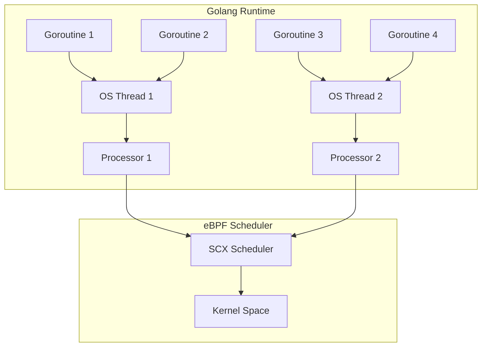

# 開發歷程

!!! info "作者"
    [Yi Chen](https://www.linkedin.com/in/ian-chen-88b70b1aa/) [[GitHub](https://github.com/ianchen0119)], Gthulhu 專案發起人 <ychen.desl@gmail.com>

本頁面記錄了 Gthulhu 和 SCX GoLand Core 專案的開發歷程、技術挑戰及解決方案。

## 專案緣起

由於筆者長期潛水在 Jserv 老師的系統軟體社團，在 sched_ext (scx) 發展的初期就得知 Linux 將支援 eBPF-based scheduler。後來在網路上看見 Andrea Righi 在 Rust Lab 2024 的演講「Crafting a Linux kernel scheduler in Rust」，得知 scx 已收錄一種在 userspace 進行 scheduling policy decision 的 eBPF scheduler「scx_rustland」。

這激發了使用 Golang 重造這款 scheduler 的想法，主要原因包括：

- 已有開源的 libbpfgo 可利用
- Golang 的開發難度較 Rust 更低
- 使用 Golang 開發 K8s operator 較為方便

## 基礎設施建設

在開始重建工作之前，需要搭建一些基礎設施：

1. **libbpfgo 支援評估**: 能否支援 scx 類型的 eBPF program？API 實作是否完善？
2. **skeleton 工具**: 有沒有便捷的方式讓 golang application 使用 eBPF skeleton？

起初過度樂觀地以為只要讓 libbpfgo 支援 struct-ops map attachment 就能在 golang 上重現 scx_rustland 所做的事情，但事實總是距離理想非常遠。

## 技術貢獻與修正

### Patch #1: libbpfgo struct-ops 支援

**連結**: [feat: add AttachStructOps() #476 for aquasecurity/libbpfgo](https://github.com/aquasecurity/libbpfgo/pull/476)

要使用 golang 開發 scx-based scheduler 的首要任務就是讓 golang application 能夠管理 struct-ops 類型的 BPF Map。然而，libbpfgo 並不支援相關的 APIs，因此需要擴充 libbpfgo。

主要改動內容：

```go
func (m *BPFMap) AttachStructOps() error {
    if m.Type().String() != MapTypeStructOps.String() {
        return errors.New("Map type should be BPF_MAP_TYPE_STRUCT_OPS")
    }
    linkC, errno := C.bpf_map__attach_struct_ops(m.bpfMap)
    if linkC == nil {
        return fmt.Errorf("Map attach failed: %v", &errno)
    }
    return nil
}
```

花費較多時間的是撰寫 selftest，選擇使用 golang 撰寫 scx-simple 的 user space agent 作為該 patch 的 selftest。

此外，該專案所採用的 CI Runner 的 kernel 版本為 v6.8，但 scheduler extension 需要 v6.12 以上的核心。經過討論後接受 arighi 的建議，在測試中採用 virtme-ng。

### Patch #2: user ring buffer 支援

**連結**: [support user ring buffer #480 for aquasecurity/libbpfgo](https://github.com/aquasecurity/libbpfgo/pull/480)

嘗試實作 scx_goland 時發現 libbpfgo 並沒有支援 user-ring-buffer 類型 BPF map 的 API。

scx_rustland_core 的架構圖顯示，scx_goland（scx_rustland）高度仰賴 user-ring-buffer map（作用與 ring buffer 一樣，但傳遞順序相反，讓 user space application 能夠傳遞消息到 BPF program）。

有了這兩個 Patch，golang 就被賦予了載入 scx eBPF program 和傳遞 scheduling decision 至 eBPF scheduler 的能力。

### Patch #3: eBPF 文檔修正

**連結**: [chore: update BPF_PROG_TEST_RUN.md for isovalent/ebpf-docs](https://github.com/isovalent/ebpf-docs/pull/119)

自 Linux kernel v5.14 開始，kernel 支援 `BPF_PROG_TYPE_SYSCALL` 類型的 eBPF program。需要注意的是，它僅能透過 system call 執行，對應的 system call 即 BPF system call。

為了執行 `BPF_PROG_TYPE_SYSCALL` 類型的 eBPF program，eBPF 提供了 `BPF_PROG_TEST_RUN`，該命令能夠調用以下類型的 eBPF program：

- `BPF_PROG_TYPE_SOCK_OPS`
- `BPF_PROG_TYPE_SYSCALL`
- `BPF_PROG_TYPE_RAW_TRACEPOINT`
- `BPF_PROG_TYPE_TRACING`
- `BPF_PROG_TYPE_SOCKET_FILTER`
- `BPF_PROG_TYPE_SCHED_CLS`
- `BPF_PROG_TYPE_SCHED_ACT`
- `BPF_PROG_TYPE_XDP`
- `BPF_PROG_TYPE_CGROUP_SKB`
- `BPF_PROG_TYPE_LWT_IN`
- `BPF_PROG_TYPE_LWT_OUT`
- `BPF_PROG_TYPE_LWT_XMIT`
- `BPF_PROG_TYPE_LWT_SEG6LOCAL`
- `BPF_PROG_TYPE_FLOW_DISSECTOR`

在 scx_goland（scx_rustland）中使用 `BPF_PROG_TYPE_SYSCAL` 類型的 program，讓 user-space program 得以呼叫客製化的函式為剛喚醒的任務選擇一個 CPU（也就是 scheduler_extension 文件提到的 select_cpu hook）：

```c
/*
 * Select and wake-up an idle CPU for a specific task from the user-space
 * scheduler.
 */
SEC("syscall")
int rs_select_cpu(struct task_cpu_arg *input)
{
    struct task_struct *p;
    int cpu;

    p = bpf_task_from_pid(input->pid);
    if (!p)
        return -EINVAL;

    bpf_rcu_read_lock();
    cpu = pick_idle_cpu(p, input->cpu);
    bpf_rcu_read_unlock();

    bpf_task_release(p);

    /*
     * Wake-up the CPU if idle. Use SCX_KICK_IDLE to prevent unecessary
     * rescheduling events in case the CPU is already awake (since we don't
     * know exactly what the user-space scheduler is doing we can't
     * implicitly assume that the target CPU is idle here).
     */
    if (cpu >= 0)
        scx_bpf_kick_cpu(cpu, SCX_KICK_IDLE);

    return cpu;
}
```

**重要發現**: 在使用 `BPF_PROG_TEST_RUN` command 時翻閱 eBPF-docs 文件得知 `BPF_PROG_TYPE_SYSCALL` 類型的 eBPF program 僅需要傳入 `ctx_in` 參數。**但這部分的資訊是錯誤的**，實際上 `ctx_size_in` 也需要被帶入，`BPF_PROG_TYPE_SYSCALL` 類型的 eBPF program 才能順利執行。

這部分讓筆者卡了不少時間（一度懷疑是 libbpfgo 沒有寫好），最後才發現是文件的問題。目前 eBPF 文件對於 `ctx_size_in` 的論述已得到修正，其他開發者也可以少踩一些坑。

## 移植過程中遇到的問題

### Page Fault 問題

修改基礎設施雖然花上了一些時間，但 Patch 的推進與否其實不影響開發 scheduler，因為可以在 PR merged 之前使用 forked repo 替代。

然而，當補足 libbpfgo 必要的 APIs 後卻遇到了**系統停滯的問題**，該問題會發生在 scx_goland loaded 之後，系統會停滯約五秒的時間才恢復正常（剛好等於 watch dog 踢除排程器的 timeout 設定值）。

起初懷疑是自己新增的 user_ringbuffer 沒有順利的將 dispatched task 傳達給 eBPF program，隨後透過單元測試驗證否定了這個假設。

思考了許久實在沒有頭緒，因此向 Andrea Righi 請教，這才得知是因為 **golang 所開發的 user-space agent 會遇到 page fault 的問題**（Andrea Righi 會這麼篤定是因為他在開發 scx_rustland 時也遇到了同樣的問題，他是利用 buddy allocator 來避免 page fault 發生）。

若 user-space agent 發生 page fault，會導致所有的任務分配暫停，而 page fault 又仰賴 kthread 來解決，這就導致了 deadlock 發生。

**解決方案評估**:

1. 改用 TinyGo 編譯
2. 依樣畫葫蘆，在 golang 實作 buddy allocator
3. 讓所有 kthread 直接由 eBPF 排程

前兩者會需要更多的時間完成，考慮到時間成本，先選擇了方案 #3：

```c
void BPF_STRUCT_OPS(goland_enqueue, struct task_struct *p, u64 enq_flags)
{
    struct queued_task_ctx *task;
    
    // ...
    
    /*
     * WORKAROUND: Dispatch user-space scheduler to the shared DSQ to avoid
     * starvation on user space scheduler goroutine(s).
     */
    if (is_belong_usersched_task(p)) {
        scx_bpf_dsq_insert_vtime(p, SHARED_DSQ,
            SCX_SLICE_INF, -1ULL, 0);
        __sync_fetch_and_add(&nr_kernel_dispatches, 1);
        kick_task_cpu(p);
        return;
    }
    // ...
}
```

### Golang Runtime 複雜度問題

避免掉 page fault 後，發現排程器仍然會卡住，經過了一段時間才注意到是 **golang runtime 造成的問題**。

以 scx_rustland 為例，user space agent 會將自己的 PID 告訴 eBPF program，讓 user space agent 可以不用經過 agent 直接由 eBPF scheduler 進行排程。但在使用 golang 重造 agent 時卻忽略了 golang runtime 的複雜度，即使將 `GOMAXPROC` 設置為 1 的情況下，golang runtime 仍會建立多個 M（一個 M 對應一個 Kernel Scheduling Entry）。

因此，只有單個 process 被排程是無法讓 golang agent 正常工作的，我們要讓相關聯的 M 都能夠直接被 eBPF scheduler 排程：

```c
/*
 * Return true if the target task @p belongs to the user-space scheduler.
 */
static inline bool is_belong_usersched_task(const struct task_struct *p)
{
    return p->tgid == usersched_pid;
}
```

該函式會判斷 task 的 tgid 是否屬於 golang agent，如果是，則會在 `.enqueue` hook 時由 eBPF scheduler 直接排程：

```c
 /*
  * WORKAROUND: Dispatch user-space scheduler to the shared DSQ to avoid
  * starvation on user space scheduler goroutine(s).
  */
 if (is_belong_usersched_task(p)) {
  scx_bpf_dsq_insert_vtime(p, SHARED_DSQ,
      SCX_SLICE_INF, -1ULL, 0);
  __sync_fetch_and_add(&nr_kernel_dispatches, 1);
  kick_task_cpu(p);
  return;
 }
```

## 技術架構圖

Golang Runtime 的 G-M-P 模型：



## 總結

經過一系列的努力，使用 golang 開發 Linux 排程器的"幻想"得以實現（雖然目前的實作效能不佳）：

**專案連結**: [https://github.com/Gthulhu/scx_goland_core](https://github.com/Gthulhu/scx_goland_core)

### 未來考量

最初希望 scx_goland_core 能夠被 scx 專案接受，但考慮到以下幾點，暫時打消了這個念頭：

1. **維護負擔**: 貢獻到 upstream 意味著之後的更動都需要耗費大量時間，沒辦法根據需求快速的推進某項 patch 的進度
2. **專案整合**: scx_goland_core 只是實現終極目標的一項基礎設施，預期之後還會有對應的 golang scheduler 實作、k8s operator 會放在同一個專案下。除非 scx 有辦法接受所有衍伸的專案，否則在這個時間點貢獻到 upstream 會影響之後開發的靈活度

### 技術挑戰摘要

| 挑戰 | 問題描述 | 解決方案 | 狀態 |
|------|----------|----------|------|
| struct-ops 支援 | libbpfgo 缺少 struct-ops map 支援 | 貢獻 PR #476 | ✅ 已解決 |
| user ring buffer | 缺少 user-ring-buffer API | 貢獻 PR #480 | ✅ 已解決 |
| 文檔錯誤 | BPF_PROG_TEST_RUN 文檔缺少 ctx_size_in | 修正官方文檔 | ✅ 已解決 |
| Page Fault | Golang agent 引起系統停滯 | kthread 直接 eBPF 排程 | ✅ 已緩解 |
| Runtime 複雜度 | Golang M:N 模型導致排程問題 | tgid 群組排程 | ✅ 已解決 |

---

!!! tip "參與貢獻"
    如果你對於這個專案感興趣，也可以嘗試提交 Patch 喔 :)
