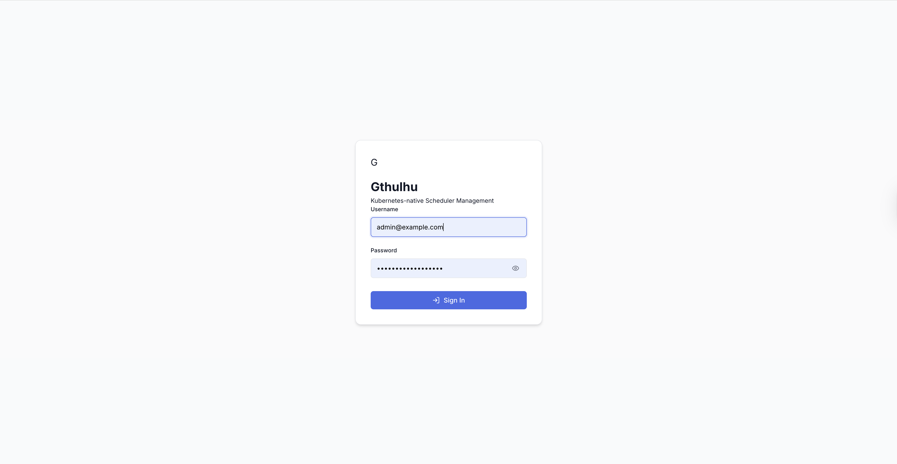
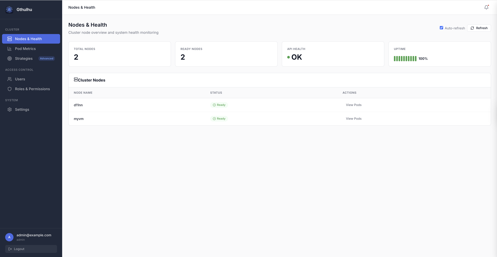
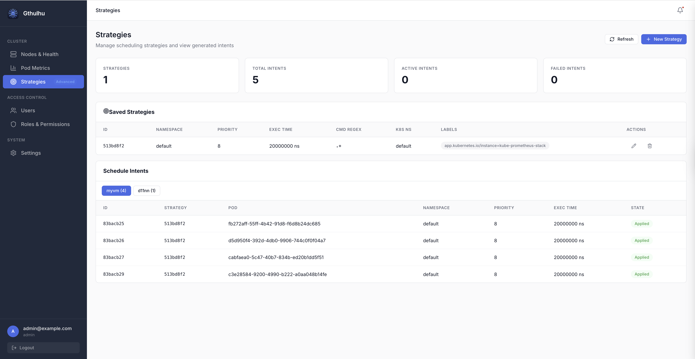

# 使用 Web GUI 設定 scheduling policies

Gthulhu 提供了一個 Web GUI，讓使用者可以方便地設定 scheduling policies。

> !注意
> 如果你將 Gthulhu 部署於 Kubernetes 叢集，請先使用 `kubectl port-forward svc/gthulhu-manager 8080:8080` 命令將本地的 8080 端口轉發到 Gthulhu Manager 的服務上，然後在瀏覽器中訪問 `http://localhost:8080` 即可使用 Web GUI。

若一切順利，你應該會看到以下的 Web GUI 介面：

請使用預設的帳號密碼登入，帳號為 `admin@example.com`，密碼為 `your-password-here`。登入後，你將看到以下的介面：

接下來，你可以新增或刪除 scheduling policies，並且可以在這裡查看目前的 scheduling policies 列表。當你新增或刪除 scheduling policies 後，Gthulhu Scheduler 會自動更新其配置，並且根據新的 scheduling policies 進行排程決策：

- Strategy ID：由系統自動生成的唯一識別碼。
- Namespace：指定該 scheduling policy 的 Namespace。
- Priority：設定該 scheduling policy 的優先級，範圍是 0 - 20。
    - 範圍 0 - 9 是高優先任務類別，這些任務能夠 preempt 其他優先權較低的任務。
    - 範圍 10 - 19 是一般優先任務類別，不具有 preempt 能力。
    - 不同的優先權會取得不同的截止時間，數值越低代表優先權越高，優先權越高的任務截止時間越短。
- Execution Time：指定該 scheduling policy 的執行時間，需要注意的是，這個欄位設定的是一次排程中最大允許的執行時間。
- Command Regex：用於匹配命令的正則表達式，例如：`.*` 能夠匹配符合 label selector 找到的 Pod 上的所有 Process。
- K8s Namespaces：指定該 scheduling policy 適用的 Kubernetes Namespace。

若 scheduling policy 正確生效，你會看到 scheduling intent 產生。

scheduling intent 是根據 scheduling policy 產生的，當 scheduling policy 生效後，Gthulhu API Server（Manager Mode） 會根據該 policy 產生對應的 scheduling intent。再將這些 intent 送往 Pod 所屬 node 上的 Gthulhu Scheduler，讓 Scheduler 根據 intent 來調整 Pod 的資源配置，以達到最佳化排程的目的。