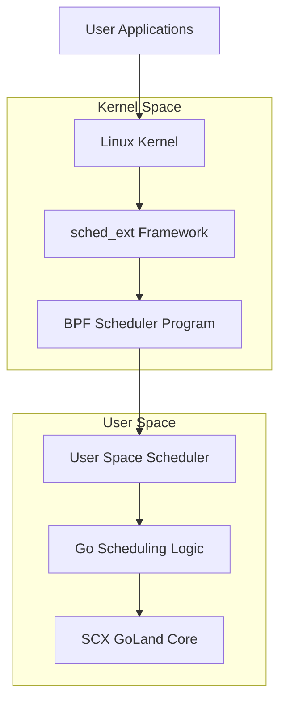
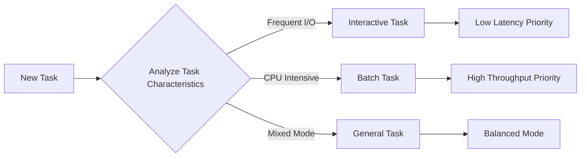
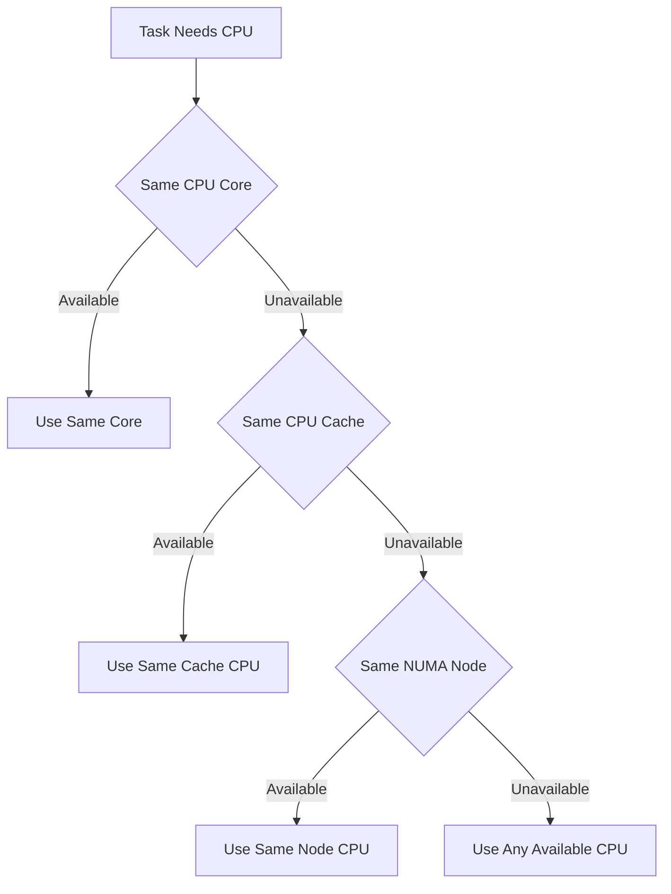
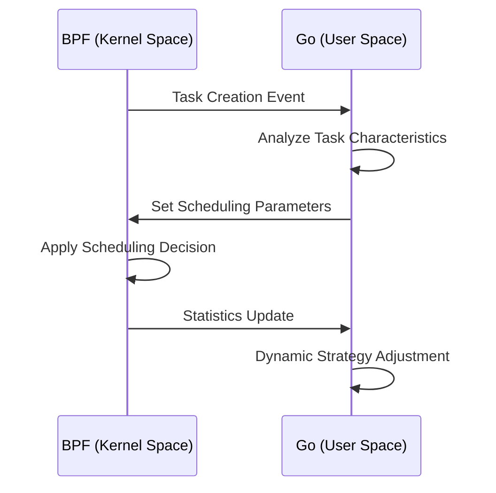

# How It Works

This page provides detailed information about the core working principles and technical architecture of Gthulhu and SCX GoLand Core schedulers.

## Overall Architecture

### Dual-Component Design

Gthulhu scheduler adopts a modern dual-component architecture:



#### 1. BPF Component (Kernel Space)

- **File**: `main.bpf.c`
- **Function**: Implements low-level sched_ext framework interfaces
- **Responsibilities**:
  - Task queue management
  - CPU selection logic
  - Basic scheduling decisions
  - Communication with user space

#### 2. Go Component (User Space)

- **File**: `main.go` + SCX GoLand Core
- **Function**: Implements high-level scheduling policies
- **Responsibilities**:
  - Complex scheduling algorithms
  - Task priority calculation
  - System monitoring and statistics
  - Dynamic parameter adjustment

## Core Scheduling Algorithm

### Virtual Runtime (vruntime)

Gthulhu uses a virtual runtime-based fair scheduling algorithm:

```go
// Virtual runtime calculation
vruntime = actual_runtime * NICE_0_WEIGHT / task_weight
```

#### Key Concepts

1. **Time Slice**
   ```c
   // Basic time slice calculation
   slice_ns = base_slice_ns * (task_weight / NICE_0_WEIGHT)
   ```

2. **Task Weight**
   ```c
   // Weight calculation based on nice value
   weight = prio_to_weight[task->static_prio - MAX_RT_PRIO]
   ```

3. **Scheduling Decision**
   ```c
   // Select task with minimum vruntime
   next_task = min_vruntime_task(runqueue)
   ```

### Latency-Sensitive Optimization

#### Task Classification

The system automatically identifies and classifies different types of tasks:



#### Priority Boost Strategy

```c
// Priority boost based on voluntary context switches
if (task->voluntary_ctxt_switches > threshold) {
    task->priority_boost = calculate_boost(task->behavior);
    task->vruntime -= priority_boost;
}
```

## CPU Topology-Aware Scheduling

### Hierarchical CPU Selection



### Cache Affinity Optimization

```c
// CPU cache level considerations
struct cpu_topology {
    int cpu_id;
    int core_id;
    int package_id;
    int cache_level;
    int numa_node;
};

// Scoring function for optimal CPU selection
int calculate_cpu_score(struct task_struct *task, int cpu) {
    int score = 0;
    
    // Same core gets highest score
    if (task->last_cpu == cpu) score += 100;
    
    // Same cache
    if (same_cache_domain(task->last_cpu, cpu)) score += 50;
    
    // Same NUMA node
    if (same_numa_node(task->last_cpu, cpu)) score += 20;
    
    // CPU load consideration
    score -= cpu_utilization(cpu);
    
    return score;
}
```

## Dynamic Adjustment Mechanisms

### System Load Monitoring

```go
// System load metrics
type SystemMetrics struct {
    CPUUtilization  float64
    ContextSwitches uint64
    LoadAverage     [3]float64
    MemoryPressure  float64
}

// Dynamically adjust scheduling parameters
func adjustSchedulingParams(metrics *SystemMetrics) {
    if metrics.CPUUtilization > 0.8 {
        // High load: increase time slice, reduce context switches
        increaseTimeSlice()
    } else if metrics.CPUUtilization < 0.3 {
        // Low load: decrease time slice, improve responsiveness
        decreaseTimeSlice()
    }
}
```

### Adaptive Adjustment

```c
// Dynamically adjust task parameters based on behavior
void adapt_task_parameters(struct task_struct *task) {
    // Calculate task's I/O ratio
    double io_ratio = task->io_wait_time / task->total_runtime;
    
    if (io_ratio > 0.7) {
        // I/O intensive task: reduce vruntime penalty
        task->io_boost_factor = 1.5;
    } else if (io_ratio < 0.1) {
        // CPU intensive task: normal scheduling
        task->io_boost_factor = 1.0;
    }
}
```

## BPF and User Space Communication

### Communication Mechanism



### Shared Data Structures

```c
// BPF Map definition
struct {
    __uint(type, BPF_MAP_TYPE_HASH);
    __uint(max_entries, MAX_TASKS);
    __type(key, pid_t);
    __type(value, struct task_info);
} task_info_map SEC(".maps");

// Task information structure
struct task_info {
    __u64 vruntime;
    __u32 weight;
    __u32 slice_ns;
    __u64 exec_start;
    __u64 sum_exec_runtime;
    __u32 voluntary_ctxt_switches;
    __u32 nonvoluntary_ctxt_switches;
};
```

## Performance Optimization Techniques

### 1. Lock-Free Data Structures

```c
// Lock-free queue protected by RCU
struct lockless_queue {
    struct rcu_head rcu;
    atomic_t head;
    atomic_t tail;
    struct queue_node *nodes;
};
```

### 2. Batch Processing

```go
// Batch processing task updates
func batchUpdateTasks(tasks []TaskInfo) {
    batch := make([]TaskInfo, 0, BATCH_SIZE)
    
    for _, task := range tasks {
        batch = append(batch, task)
        
        if len(batch) >= BATCH_SIZE {
            processBatch(batch)
            batch = batch[:0]
        }
    }
    
    if len(batch) > 0 {
        processBatch(batch)
    }
}
```

### 3. Memory Alignment Optimization

```c
// Ensure structure alignment to reduce cache misses
struct aligned_task_info {
    __u64 vruntime;      // 8 bytes
    __u64 exec_start;    // 8 bytes
    __u32 weight;        // 4 bytes
    __u32 slice_ns;      // 4 bytes
    // Total 24 bytes, fits cache line size
} __attribute__((aligned(64)));
```

## Debugging and Monitoring

### BPF Tracing

```bash
# Monitor BPF program execution
sudo cat /sys/kernel/debug/tracing/trace_pipe

# Check BPF statistics
sudo bpftool prog show
sudo bpftool map dump name task_info_map
```

### Performance Metrics

```go
// Key performance indicators
type PerformanceMetrics struct {
    AverageLatency      time.Duration
    ContextSwitchRate   float64
    CPUUtilization      float64
    TaskMigrationRate   float64
    SchedulingOverhead  float64
}

// Real-time monitoring
func monitorPerformance() {
    ticker := time.NewTicker(1 * time.Second)
    defer ticker.Stop()
    
    for {
        select {
        case <-ticker.C:
            metrics := collectMetrics()
            logMetrics(metrics)
            adjustParameters(metrics)
        }
    }
}
```

## Differences from CFS

| Feature | CFS (Completely Fair Scheduler) | Gthulhu |
|---------|----------------------------------|---------|
| Scheduling Policy | Virtual runtime based | Virtual runtime + latency optimization |
| Task Classification | Unified processing | Automatic classification optimization |
| CPU Selection | Basic load balancing | Topology-aware + cache affinity |
| Dynamic Adjustment | Limited | Comprehensive adaptive adjustment |
| Extensibility | Kernel built-in | User-space extensible |

## Future Development Directions

1. **Machine Learning Integration**: Use ML models to predict task behavior
2. **Container-Aware Scheduling**: Optimization for containerized environments
3. **Energy Optimization**: Integration of power management considerations
4. **Real-Time Task Support**: Support for hard real-time task scheduling

---

!!! info "Deep Dive"
    For more implementation details, refer to the [API Reference](api-reference.en.md) and source code comments.
