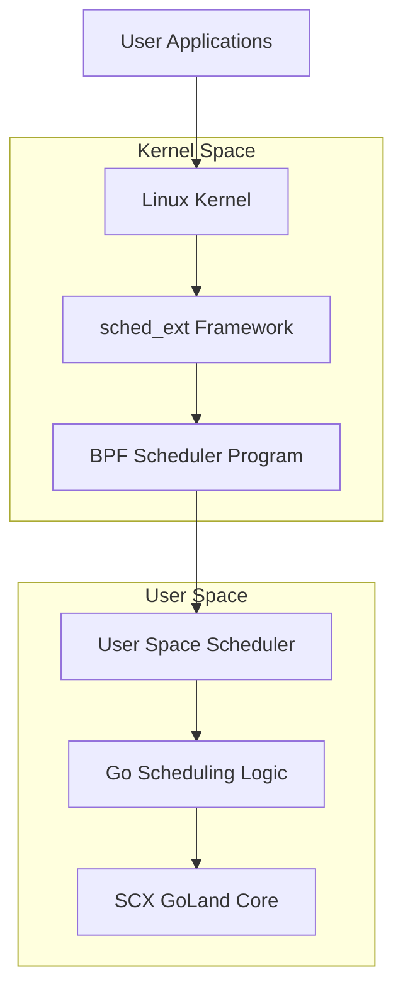
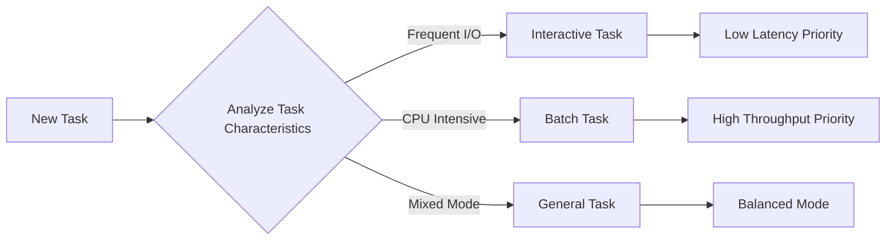
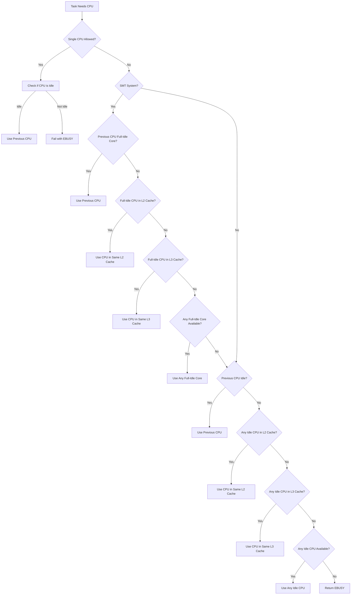
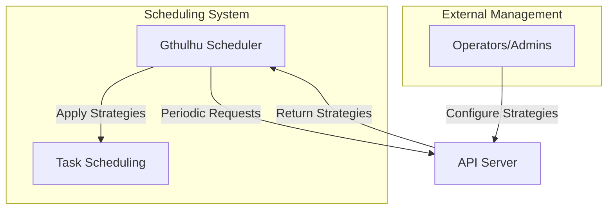
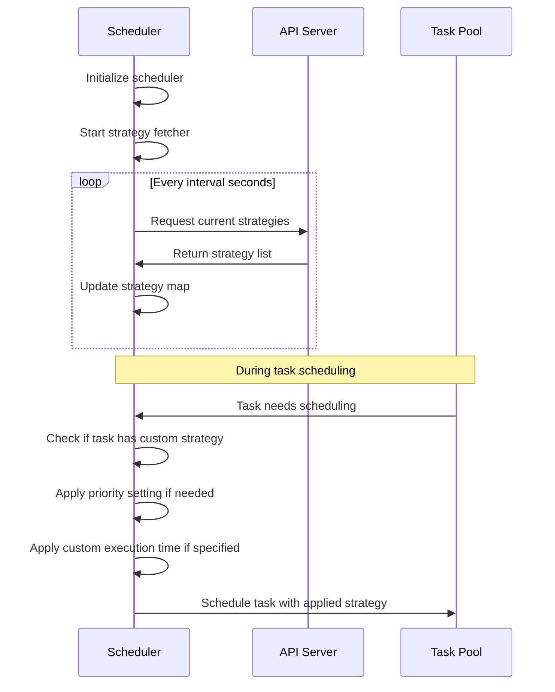
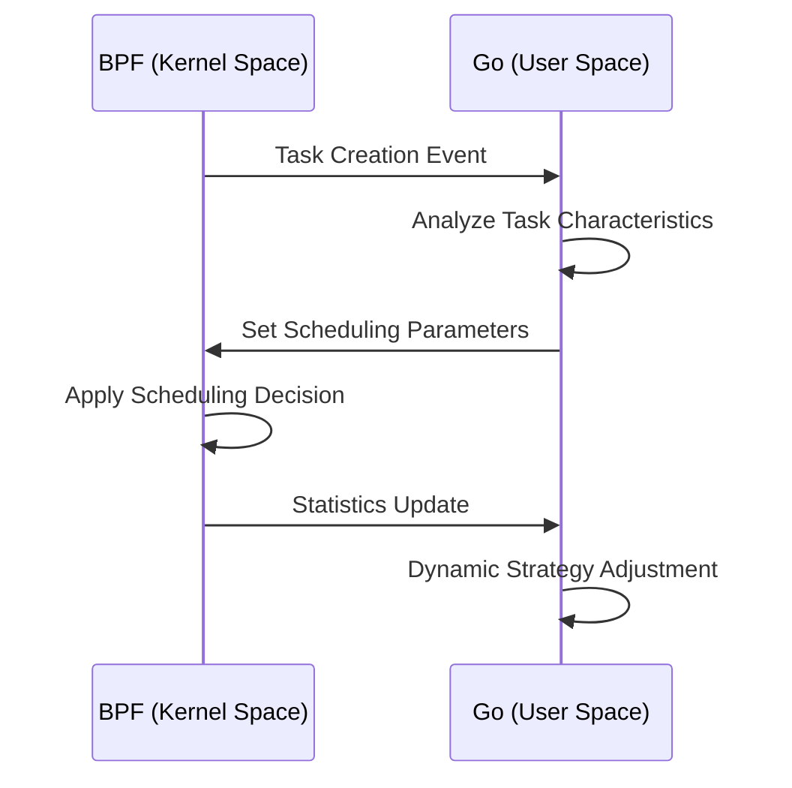

# How It Works

This page provides detailed information about the core working principles and technical architecture of Gthulhu and SCX GoLand Core schedulers.

## Overall Architecture

### Dual-Component Design

Gthulhu scheduler adopts a modern dual-component architecture:



#### 1. BPF Component (Kernel Space)

- **File**: `main.bpf.c`
- **Function**: Implements low-level sched_ext framework interfaces
- **Responsibilities**:
  - Task queue management
  - CPU selection logic
  - Basic scheduling decisions
  - Communication with user space

#### 2. Go Component (User Space)

- **File**: `main.go` + SCX GoLand Core
- **Function**: Implements high-level scheduling policies
- **Responsibilities**:
  - Complex scheduling algorithms
  - Task priority calculation
  - System monitoring and statistics
  - Dynamic parameter adjustment

## Core Scheduling Algorithm

### Virtual Runtime (vruntime)

Gthulhu uses a virtual runtime-based fair scheduling algorithm:

```go
// Virtual runtime calculation
vruntime = actual_runtime * NICE_0_WEIGHT / task_weight
```

#### Key Concepts

1. **Time Slice**
   ```c
   // Basic time slice calculation
   slice_ns = base_slice_ns * (task_weight / NICE_0_WEIGHT)
   ```

2. **Task Weight**
   ```c
   // Weight calculation based on nice value
   weight = prio_to_weight[task->static_prio - MAX_RT_PRIO]
   ```

3. **Scheduling Decision**
   ```c
   // Select task with minimum vruntime
   next_task = min_vruntime_task(runqueue)
   ```

### Latency-Sensitive Optimization

#### Task Classification

The system automatically identifies and classifies different types of tasks:



## CPU Topology-Aware Scheduling

### Hierarchical CPU Selection



## API and Scheduling Policy Design

Gthulhu implements a flexible mechanism to dynamically adjust its scheduling behavior through a RESTful API interface. This allows operators to fine-tune the scheduler's performance characteristics without restarting or recompiling the code.

### API Architecture

The API server provides endpoints for retrieving and setting scheduling strategies:



#### API Endpoints

The API server exposes two primary endpoints for scheduling strategy management:

- **GET /api/v1/scheduling/strategies**: Retrieves current scheduling strategies
- **POST /api/v1/scheduling/strategies**: Sets new scheduling strategies

### Scheduling Strategy Data Model

A scheduling strategy is represented using the following structure:

```json
{
  "scheduling": [
    {
      "priority": true,
      "execution_time": 20000000,
      "pid": 12345
    },
    {
      "priority": false,
      "execution_time": 10000000,
      "selectors": [
        {
          "key": "tier",
          "value": "control-plane"
        }
      ]
    }
  ]
}
```

Key components of a scheduling strategy:

1. **Priority** (`boolean`): When true, the task's virtual runtime is set to the minimum value, effectively giving it the highest scheduling priority
2. **Execution Time** (`uint64`): Custom time slice in nanoseconds for the task
3. **PID** (`int`): Process ID to which the strategy applies
4. **Selectors** (`array`): Optional Kubernetes label selectors for targeting groups of processes

### Strategy Application Flow

The process of fetching and applying scheduling strategies follows this sequence:



### Kubernetes Integration

For containerized environments, Gthulhu can map scheduling strategies to specific pods using label selectors:

1. **Label Selector Resolution**: The API server translates label selectors into specific PIDs by scanning the system for matching pods
2. **PID Mapping**: Each pod's processes are identified and associated with the appropriate scheduling strategy
3. **Dynamic Updates**: As pods are created, destroyed, or moved, the scheduler adapts by periodically refreshing its strategies

### Strategy Prioritization Logic

When applying scheduling strategies, Gthulhu follows these rules:

1. **Direct PID Match**: Strategies that explicitly specify a PID have highest precedence
2. **Label Selector Match**: Strategies using label selectors apply to all matching processes
3. **Default Behavior**: Processes without specific strategies use the standard scheduling algorithm

### Configuration Parameters

The strategy fetching behavior can be configured through the scheduler's configuration file:

```yaml
api:
  url: "http://api-server:8080"   # API server endpoint
  interval: 10                    # Refresh interval in seconds
```

This architecture allows for dynamic, fine-grained control over scheduling behavior without interrupting the scheduler's operation.

## BPF and User Space Communication

### Communication Mechanism



## Debugging and Monitoring

### BPF Tracing

```bash
# Monitor BPF program execution
sudo cat /sys/kernel/debug/tracing/trace_pipe

# Check BPF statistics
sudo bpftool prog show
sudo bpftool map dump name task_info_map
```

## Differences from CFS

| Feature | CFS (Completely Fair Scheduler) | Gthulhu |
|---------|----------------------------------|---------|
| Scheduling Policy | Virtual runtime based | Virtual runtime + latency optimization |
| Task Classification | Unified processing | Automatic classification optimization |
| CPU Selection | Basic load balancing | Topology-aware + cache affinity |
| Dynamic Adjustment | Limited | Comprehensive adaptive adjustment |
| Extensibility | Kernel built-in | User-space extensible |

## Future Development Directions

1. **Machine Learning Integration**: Use ML models to predict task behavior
2. **Container-Aware Scheduling**: Optimization for containerized environments
3. **Energy Optimization**: Integration of power management considerations
4. **Real-Time Task Support**: Support for hard real-time task scheduling

---

!!! info "Deep Dive"
    For more implementation details, refer to the [API Reference](api-reference.en.md) and source code comments.
