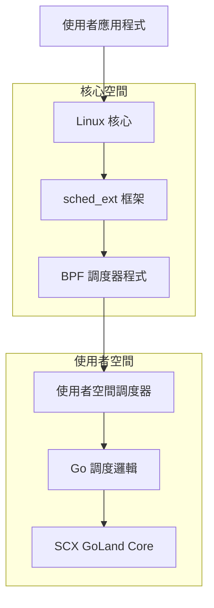
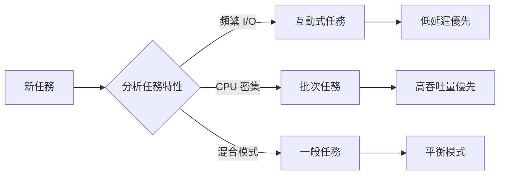
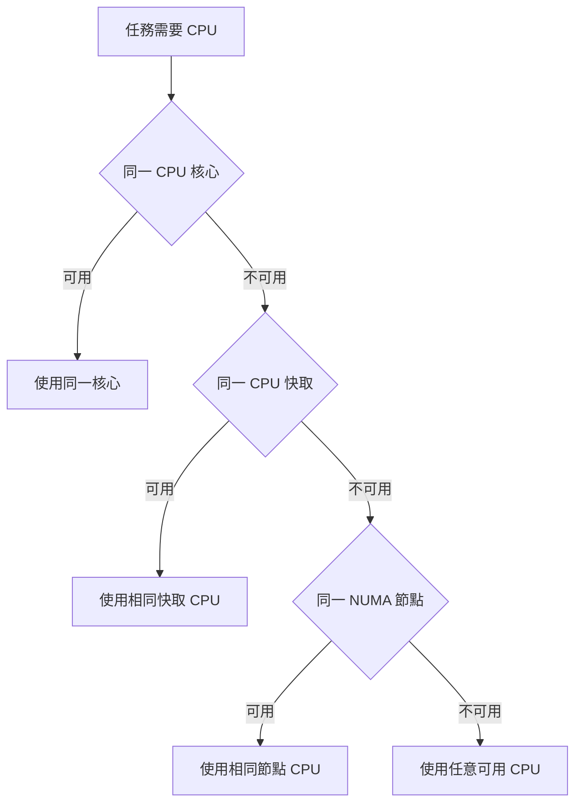
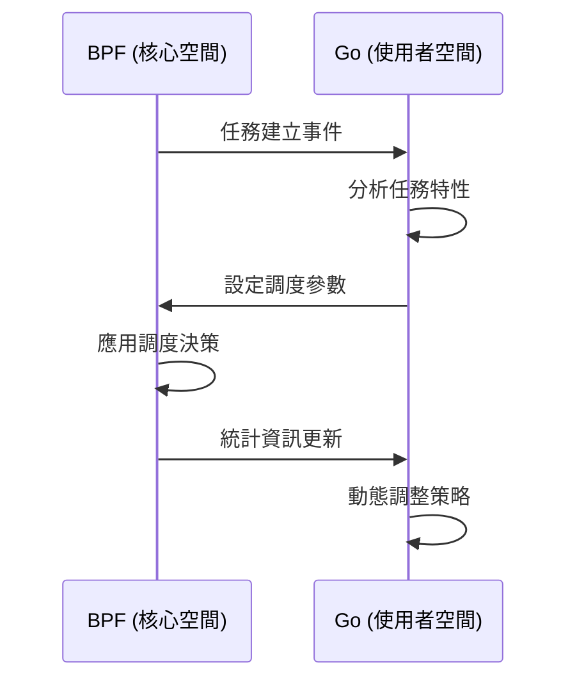

# 工作原理

本頁面詳細介紹 Gthulhu 和 SCX GoLand Core 調度器的核心工作原理與技術架構。

## 整體架構

### 雙組件設計

Gthulhu 調度器採用現代化的雙組件架構：



#### 1. BPF 組件 (核心空間)

- **檔案**: `main.bpf.c`
- **功能**: 實作 sched_ext 框架的低階介面
- **職責**:
  - 任務佇列管理
  - CPU 選擇邏輯
  - 基本調度決策
  - 與使用者空間通訊

#### 2. Go 組件 (使用者空間)

- **檔案**: `main.go` + SCX GoLand Core
- **功能**: 實作高階調度策略
- **職責**:
  - 複雜調度演算法
  - 任務優先級計算
  - 系統監控與統計
  - 動態參數調整

## 核心調度算法

### 虛擬執行時間 (Virtual Runtime)

Gthulhu 使用基於虛擬執行時間的公平調度算法：

```go
// 虛擬執行時間計算
vruntime = actual_runtime * NICE_0_WEIGHT / task_weight
```

#### 關鍵概念

1. **時間片 (Time Slice)**
   ```c
   // 基本時間片計算
   slice_ns = base_slice_ns * (task_weight / NICE_0_WEIGHT)
   ```

2. **任務權重 (Task Weight)**
   ```c
   // 基於 nice 值的權重計算
   weight = prio_to_weight[task->static_prio - MAX_RT_PRIO]
   ```

3. **調度決策**
   ```c
   // 選擇 vruntime 最小的任務
   next_task = min_vruntime_task(runqueue)
   ```

### 延遲敏感最佳化

#### 任務分類

系統自動識別並分類不同類型的任務：



#### 優先級提升策略

```c
// 基於自願上下文切換的優先級提升
if (task->voluntary_ctxt_switches > threshold) {
    task->priority_boost = calculate_boost(task->behavior);
    task->vruntime -= priority_boost;
}
```

## CPU 拓撲感知調度

### 階層式 CPU 選擇



### 快取親和性優化

```c
// CPU 快取層級考量
struct cpu_topology {
    int cpu_id;
    int core_id;
    int package_id;
    int cache_level;
    int numa_node;
};

// 選擇最佳 CPU 的評分函數
int calculate_cpu_score(struct task_struct *task, int cpu) {
    int score = 0;
    
    // 相同核心得分最高
    if (task->last_cpu == cpu) score += 100;
    
    // 相同快取
    if (same_cache_domain(task->last_cpu, cpu)) score += 50;
    
    // 相同 NUMA 節點
    if (same_numa_node(task->last_cpu, cpu)) score += 20;
    
    // CPU 負載考量
    score -= cpu_utilization(cpu);
    
    return score;
}
```

## 動態調整機制

### 系統負載監控

```go
// 系統負載指標
type SystemMetrics struct {
    CPUUtilization  float64
    ContextSwitches uint64
    LoadAverage     [3]float64
    MemoryPressure  float64
}

// 動態調整調度參數
func adjustSchedulingParams(metrics *SystemMetrics) {
    if metrics.CPUUtilization > 0.8 {
        // 高負載：增加時間片，減少上下文切換
        increaseTimeSlice()
    } else if metrics.CPUUtilization < 0.3 {
        // 低負載：減少時間片，提高回應性
        decreaseTimeSlice()
    }
}
```

### 適應性調整

```c
// 根據任務行为动态调整
void adapt_task_parameters(struct task_struct *task) {
    // 计算任务的 I/O 比率
    double io_ratio = task->io_wait_time / task->total_runtime;
    
    if (io_ratio > 0.7) {
        // I/O 密集任务：减少 vruntime 惩罚
        task->io_boost_factor = 1.5;
    } else if (io_ratio < 0.1) {
        // CPU 密集任务：正常调度
        task->io_boost_factor = 1.0;
    }
}
```

## BPF 與使用者空間通訊

### 通訊機制



### 資料結構共享

```c
// BPF Map 定義
struct {
    __uint(type, BPF_MAP_TYPE_HASH);
    __uint(max_entries, MAX_TASKS);
    __type(key, pid_t);
    __type(value, struct task_info);
} task_info_map SEC(".maps");

// 任務資訊結構
struct task_info {
    __u64 vruntime;
    __u32 weight;
    __u32 slice_ns;
    __u64 exec_start;
    __u64 sum_exec_runtime;
    __u32 voluntary_ctxt_switches;
    __u32 nonvoluntary_ctxt_switches;
};
```

## 效能最佳化技術

### 1. 無鎖數據結構

```c
// 使用 RCU 保護的無鎖佇列
struct lockless_queue {
    struct rcu_head rcu;
    atomic_t head;
    atomic_t tail;
    struct queue_node *nodes;
};
```

### 2. 批次處理

```go
// 批次處理任務更新
func batchUpdateTasks(tasks []TaskInfo) {
    batch := make([]TaskInfo, 0, BATCH_SIZE)
    
    for _, task := range tasks {
        batch = append(batch, task)
        
        if len(batch) >= BATCH_SIZE {
            processBatch(batch)
            batch = batch[:0]
        }
    }
    
    if len(batch) > 0 {
        processBatch(batch)
    }
}
```

### 3. 記憶體對齊最佳化

```c
// 確保結構體對齊，減少快取未命中
struct aligned_task_info {
    __u64 vruntime;      // 8 bytes
    __u64 exec_start;    // 8 bytes
    __u32 weight;        // 4 bytes
    __u32 slice_ns;      // 4 bytes
    // 總共 24 bytes，符合快取行大小
} __attribute__((aligned(64)));
```

## 調試與監控

### BPF 追蹤

```bash
# 監控 BPF 程式執行
sudo cat /sys/kernel/debug/tracing/trace_pipe

# 檢查 BPF 統計
sudo bpftool prog show
sudo bpftool map dump name task_info_map
```

### 效能指標

```go
// 關鍵效能指標
type PerformanceMetrics struct {
    AverageLatency      time.Duration
    ContextSwitchRate   float64
    CPUUtilization      float64
    TaskMigrationRate   float64
    SchedulingOverhead  float64
}

// 即時監控
func monitorPerformance() {
    ticker := time.NewTicker(1 * time.Second)
    defer ticker.Stop()
    
    for {
        select {
        case <-ticker.C:
            metrics := collectMetrics()
            logMetrics(metrics)
            adjustParameters(metrics)
        }
    }
}
```

## 與 CFS 的差異

| 特性 | CFS (完全公平調度器) | Gthulhu |
|------|---------------------|---------|
| 調度策略 | 基於虛擬執行時間 | 基於虛擬執行時間 + 延遲最佳化 |
| 任務分類 | 統一處理 | 自動分類最佳化 |
| CPU 選擇 | 基本負載平衡 | 拓撲感知 + 快取親和性 |
| 動態調整 | 有限 | 全面的適應性調整 |
| 擴展性 | 核心內建 | 使用者空間可擴展 |

## 未來發展方向

1. **機器學習整合**: 使用 ML 模型預測任務行為
2. **容器感知調度**: 針對容器化環境最佳化
3. **能耗最佳化**: 整合電源管理考量
4. **即時任務支援**: 支援硬即時任務調度

---

!!! info "深入了解"
    想要更深入了解實作細節，建議查看 [API 參考文檔](api-reference.md) 和原始碼註解。
