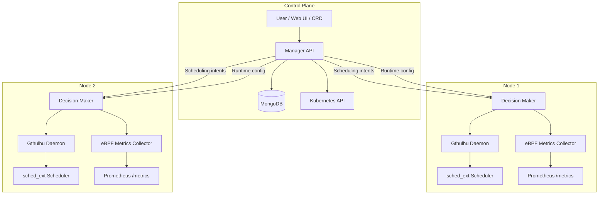
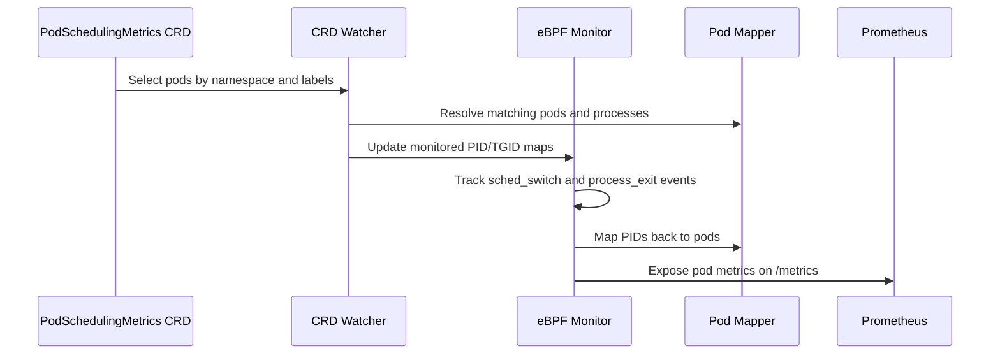
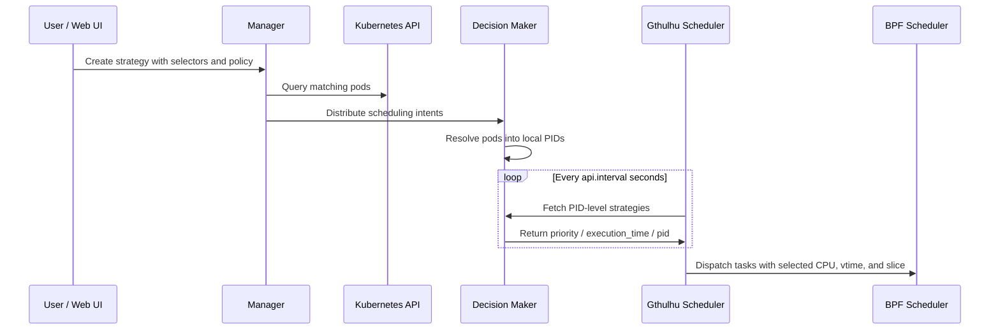
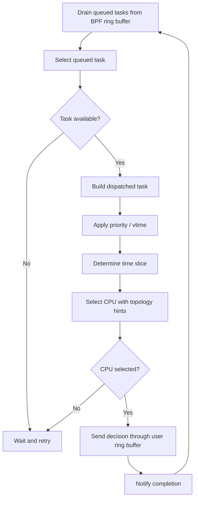

# How It Works

Gthulhu connects Kubernetes workload intent with Linux scheduler behavior. It has two layers:

- **Pod scheduling observability**: the base feature, powered by an eBPF monitor that collects scheduler metrics and exports pod-level Prometheus data.
- **Custom CPU scheduling**: an advanced feature for Linux 6.12+ with `sched_ext`, where Gthulhu applies priority and time-slice policies through a user-space scheduler and BPF scheduler program.

The two layers can run together, or Gthulhu can run in monitor-only mode when no scheduler mode is configured.

## Architecture


```mermaid
graph TB
    subgraph "Control Plane"
        U[User / Web UI / CRD] --> M[Manager API]
        M --> DB[(MongoDB)]
        M --> K8S[Kubernetes API]
    end

    M -->|Scheduling intents| DM1
    M -->|Scheduling intents| DM2
    M -->|Runtime config| DM1
    M -->|Runtime config| DM2

    subgraph "Node 1"
        DM1[Decision Maker] --> MON1[eBPF Metrics Collector]
        DM1 --> G1[Gthulhu Daemon]
        G1 --> S1[sched_ext Scheduler]
        MON1 --> P1[Prometheus /metrics]
    end

    subgraph "Node 2"
        DM2[Decision Maker] --> MON2[eBPF Metrics Collector]
        DM2 --> G2[Gthulhu Daemon]
        G2 --> S2[sched_ext Scheduler]
        MON2 --> P2[Prometheus /metrics]
    end
```

### Manager

The Manager is the user-facing control plane service. In the current API server implementation it handles:

- Authentication and token lifecycle: `/api/v1/auth/login`, `/api/v1/auth/refresh`, `/api/v1/auth/logout`
- RBAC resources: users, roles, and permissions
- Scheduling strategies: `/api/v1/strategies`
- Scheduling intents: `/api/v1/intents/self`
- Pod-to-PID visibility by node: `/api/v1/nodes`, `/api/v1/nodes/:nodeID/pods/pids`
- Pod scheduling metrics configuration and runtime values: `/api/v1/pod-scheduling-metrics`, `/api/v1/pod-scheduling-metrics/runtime`, `/api/v1/classify`
- Scheduler runtime configuration: `/api/v1/scheduler/runtime-config/apply`, `/api/v1/scheduler/runtime-config/status`

The Manager persists state in MongoDB and uses Kubernetes APIs to resolve workload selectors.

### Decision Maker

The Decision Maker runs per node. It receives cluster-level intent from the Manager, resolves it into node-local process information, and serves the local scheduler and monitor.

Important endpoints include:

- `POST /api/v1/intents` — receive scheduling intents from the Manager
- `GET /api/v1/scheduling/strategies` — expose PID-level strategies to the local scheduler
- `POST /api/v1/metrics` — receive scheduler BSS metrics from the Gthulhu daemon
- `GET /api/v1/pods/pids` — return pod-to-PID mappings for the node
- `POST /api/v1/runtime-config` and `GET /api/v1/runtime-config` — apply and inspect runtime daemon configuration
- `POST /api/v1/auth/token` — issue the scheduler token used for authenticated local API calls
- `GET /metrics` — expose Decision Maker Prometheus metrics

### Gthulhu Daemon

The root Gthulhu binary can run the monitor, the scheduler, or both:

- The **monitor** is enabled by `monitor.enabled` and is the default base feature.
- The **scheduler** is enabled when `scheduler.mode` is set to `gthulhu`, `simple`, or `simple-fifo`.
- If no scheduler mode is configured, the daemon stays in monitor-only mode.

## Pod Scheduling Metrics Flow

The monitor is designed to work without `sched_ext`. It loads `sched_monitor.bpf.o`, attaches eBPF programs to scheduler tracepoints, reads BPF maps, maps PIDs to Kubernetes pods, and exports pod-level metrics.


```mermaid
sequenceDiagram
    participant C as PodSchedulingMetrics CRD
    participant W as CRD Watcher
    participant B as eBPF Monitor
    participant P as Pod Mapper
    participant M as Prometheus

    C->>W: Select pods by namespace and labels
    W->>P: Resolve matching pods and processes
    W->>B: Update monitored PID/TGID maps
    B->>B: Track sched_switch and process_exit events
    B->>P: Map PIDs back to pods
    B->>M: Expose pod metrics on /metrics
```

The collector tracks signals such as runtime, wait time, voluntary and involuntary context switches, run count, and CPU migrations. These metrics can be consumed by Prometheus, Grafana dashboards, and KEDA-based scaling.

## Scheduling Strategy Flow

Scheduling strategies start at the Kubernetes workload level and end as PID-level decisions on each node.


```mermaid
sequenceDiagram
    participant U as User / Web UI
    participant M as Manager
    participant K as Kubernetes API
    participant DM as Decision Maker
    participant G as Gthulhu Scheduler
    participant B as BPF Scheduler

    U->>M: Create strategy with selectors and policy
    M->>K: Query matching pods
    M->>DM: Distribute scheduling intents
    DM->>DM: Resolve pods into local PIDs

    loop Every api.interval seconds
        G->>DM: Fetch PID-level strategies
        DM->>G: Return priority / execution_time / pid
    end

    G->>B: Dispatch tasks with selected CPU, vtime, and slice
```

A PID-level strategy contains:

```json
{
  "priority": 1,
  "execution_time": 20000000,
  "pid": 12345
}
```

- `priority` greater than `0` gives the task priority treatment.
- `execution_time` sets a custom time slice in nanoseconds.
- `pid` identifies the Linux process that receives the policy.

## sched_ext Scheduler Internals

The advanced scheduler is split between BPF and Go:

- `main.bpf.c` implements the low-level `sched_ext` hooks, dispatch queues, task maps, priority tracking, and ring buffer communication.
- `main.go` loads configuration, initializes the plugin, loads `main.bpf.o`, attaches the scheduler, initializes CPU topology domains, and runs the dispatch loop.
- The plugin layer provides scheduling policy implementations: `gthulhu`, `simple`, and `simple-fifo`.

### User-Space Dispatch Loop


```mermaid
flowchart TD
    A[Drain queued tasks from BPF ring buffer] --> B[Select queued task]
    B --> C{Task available?}
    C -->|No| D[Wait and retry]
    C -->|Yes| E[Build dispatched task]
    E --> F[Apply priority / vtime]
    F --> G[Determine time slice]
    G --> H[Select CPU with topology hints]
    H --> I{CPU selected?}
    I -->|No| D
    I -->|Yes| J[Send decision through user ring buffer]
    J --> K[Notify completion]
    K --> A
```

BPF enqueues tasks to user space through a ring buffer. Go drains the queued tasks, asks the active plugin to select work, determines the time slice, picks a CPU, and returns a dispatch decision through the user ring buffer. BPF then performs the final `sched_ext` dispatch.

### Priority Handling

In user-space scheduler mode, priority is represented by setting a dispatched task's virtual time to the minimum value. BPF tracks priority tasks and can insert them at the head of the dispatch queue or trigger preemption behavior.

In kernel mode, the user-space loop is bypassed for per-task decisions. The Go process watches strategy changes and updates BPF maps through `UpdatePriorityTaskWithPrio` and `RemovePriorityTask`, allowing BPF to dispatch directly in kernel space.

## CPU Selection

Gthulhu initializes CPU topology and cache domains before attaching the scheduler. CPU selection prefers locality and idle capacity:

1. Reuse the previous CPU when it is allowed and idle.
2. Prefer a fully idle sibling/core when SMT is available.
3. Prefer CPUs in the same L2 or L3 cache domain.
4. Fall back to any idle CPU.
5. Return busy when no suitable CPU is available.

The user-space scheduler provides CPU hints, while BPF performs the final dispatch and kick behavior.

## Runtime Configuration

The daemon reads YAML configuration and can also receive runtime configuration from the Decision Maker.

```yaml
monitor:
  enabled: true
  bpf_object_path: sched_monitor.bpf.o
  collection_interval_sec: 10
  monitor_all: false
  stream_events: false
  prometheus_port: 9090
  enable_crd_watcher: true

scheduler:
  slice_ns_default: 20000000
  slice_ns_min: 1000000
  mode: gthulhu
  kernel_mode: false
  max_time_watchdog: true

api:
  url: http://127.0.0.1:8080
  interval: 5
  public_key_path: ./api/config/jwt_public_key.pem
  enabled: true
  auth_enabled: true
```

Important behavior:

- `monitor.enabled` controls the base eBPF metrics collector.
- `scheduler.mode` controls whether the advanced scheduler starts.
- `scheduler.kernel_mode` enables experimental BPF-side dispatch.
- `api.enabled` controls communication with the Decision Maker.
- `api.auth_enabled` enables JWT authentication for scheduler API calls.
- `api.mtls` can enable mutual TLS between the scheduler and API server.

## Metrics

Gthulhu reports two families of metrics:

| Source | Examples | Consumer |
|--------|----------|----------|
| eBPF pod monitor | wait time, runtime, context switches, CPU migrations | Prometheus, Grafana, KEDA |
| sched_ext BSS data | `nr_queued`, `nr_scheduled`, `nr_running`, dispatch counters, congestion counters | Decision Maker API and logs |

The scheduler periodically reads BSS data from the BPF module. When API communication is enabled, it posts those metrics to the Decision Maker.

## Debugging

Useful commands while developing or operating the scheduler:

```bash
# Trace BPF debug output
sudo cat /sys/kernel/debug/tracing/trace_pipe

# Inspect loaded BPF programs and maps
sudo bpftool prog show
sudo bpftool map show

# Run the Gthulhu daemon with an explicit config
sudo ./main scheduler -config config/config.yaml
```

For monitor-only deployments, omit `scheduler.mode` or set it to an empty value in the runtime configuration.
