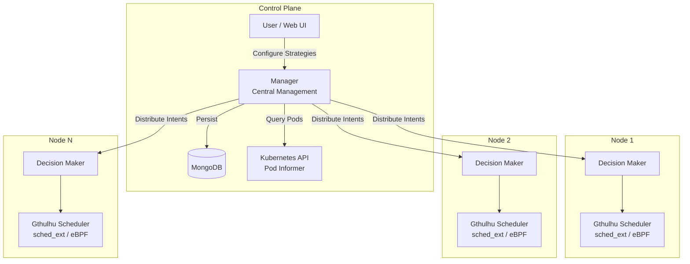
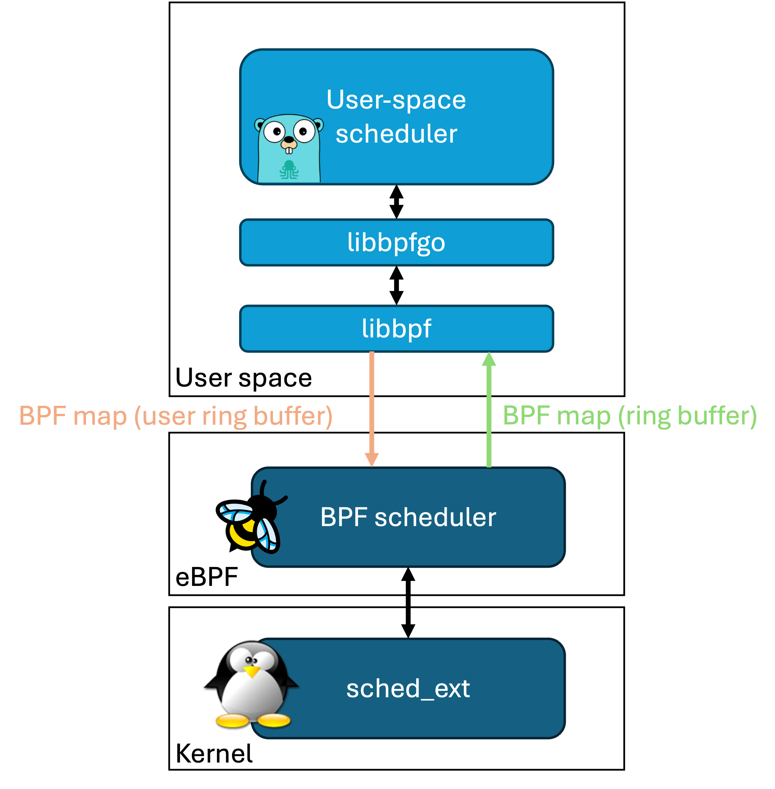
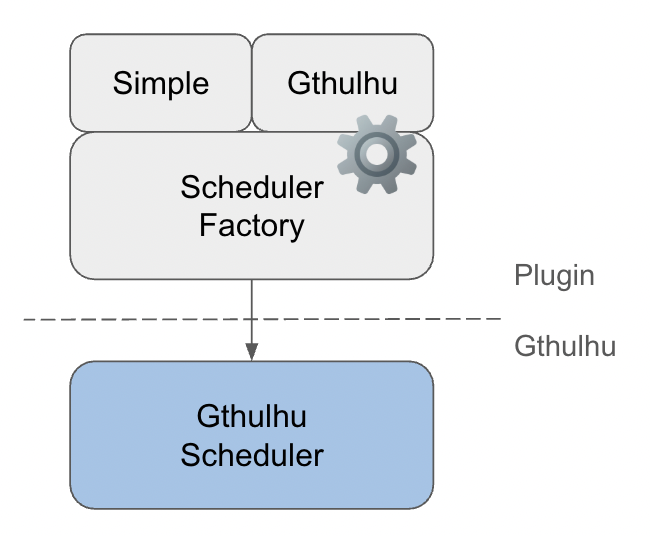
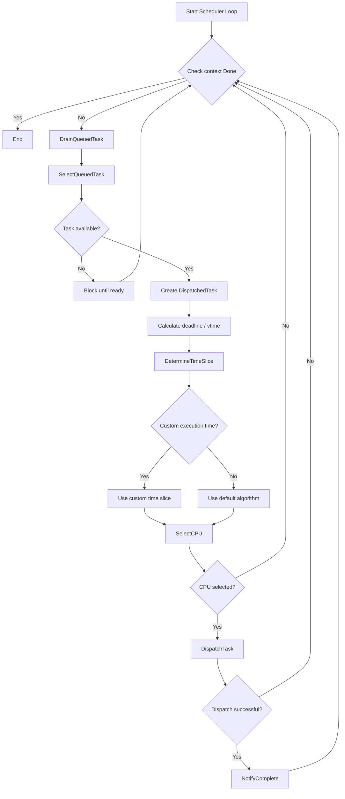
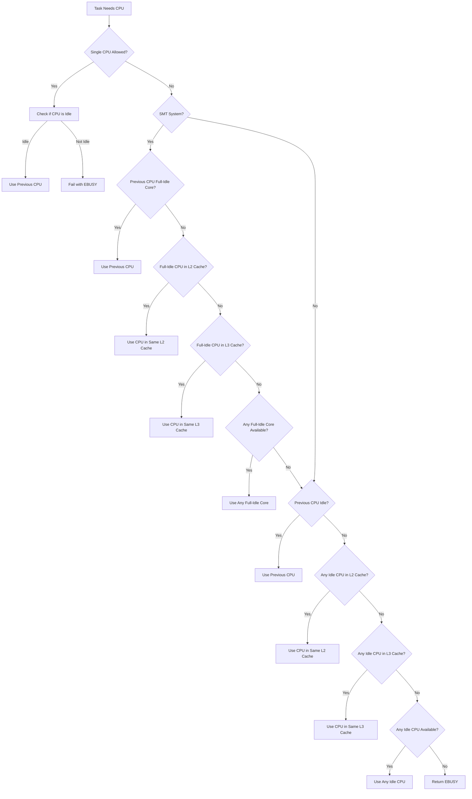
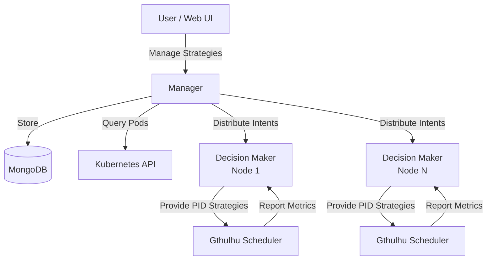
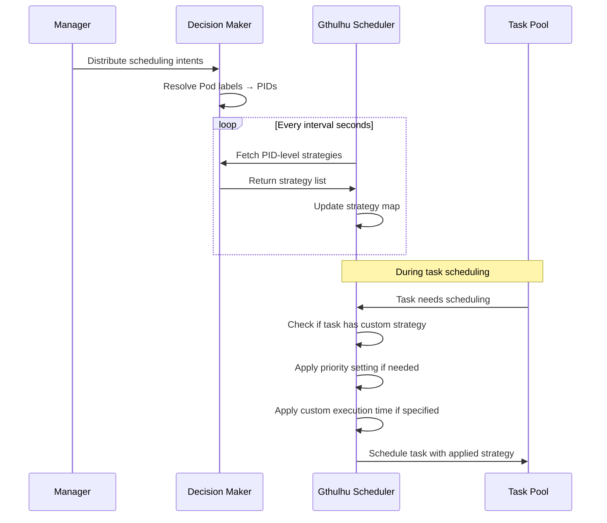
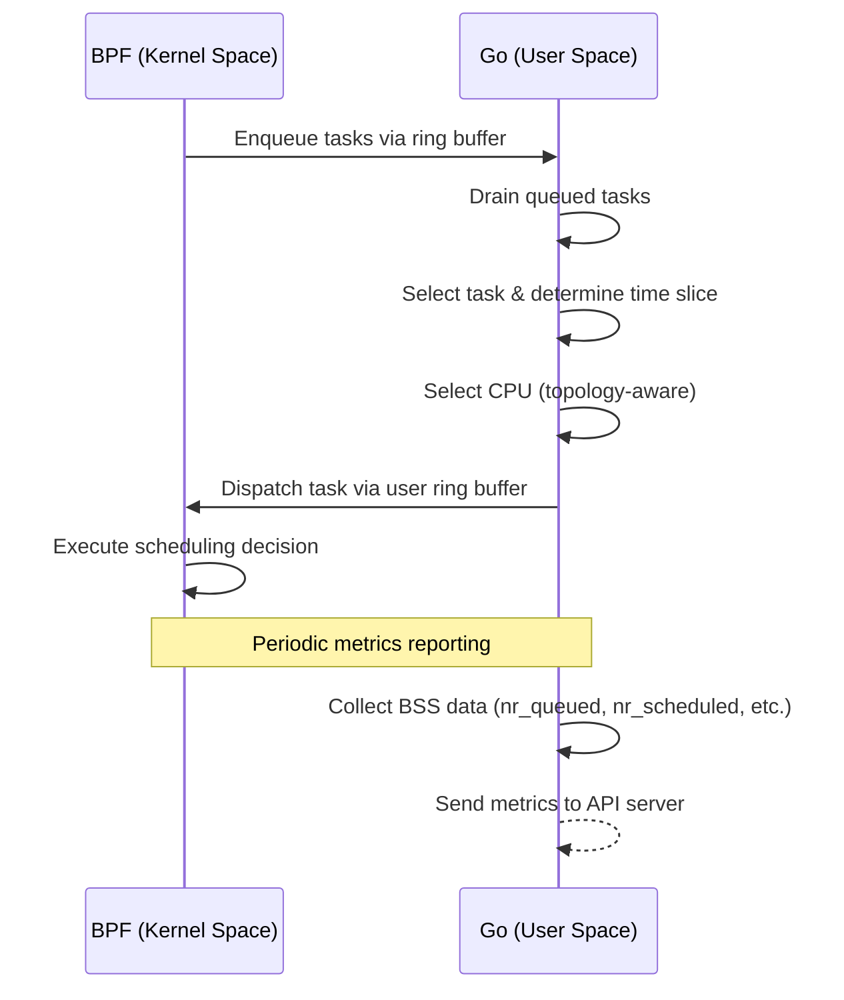

# How It Works

This page provides detailed information about the core working principles and technical architecture of Gthulhu.

## Overall Architecture

Gthulhu provides an orchestrable, distributed scheduler solution for the cloud-native ecosystem.
The architecture consists of multiple components working together:


```mermaid
graph TB
    subgraph "Control Plane"
        U[User / Web UI] -->|Configure Strategies| M[Manager<br/>Central Management]
        M -->|Persist| DB[(MongoDB)]
        M -->|Query Pods| K8S[Kubernetes API<br/>Pod Informer]
    end

    M -->|Distribute Intents| DM1
    M -->|Distribute Intents| DM2
    M -->|Distribute Intents| DMN

    subgraph "Node 1"
        DM1[Decision Maker] --> S1[Gthulhu Scheduler<br/>sched_ext / eBPF]
    end

    subgraph "Node 2"
        DM2[Decision Maker] --> S2[Gthulhu Scheduler<br/>sched_ext / eBPF]
    end

    subgraph "Node N"
        DMN[Decision Maker] --> SN[Gthulhu Scheduler<br/>sched_ext / eBPF]
    end
```

### Component Overview

#### 1. Manager (Control Plane)

The [Manager](https://github.com/Gthulhu/api) serves as the central management service, responsible for:

- User authentication and authorization (JWT)
- Role and permission management (RBAC)
- CRUD operations for scheduling strategies
- Monitoring Pod status via Kubernetes Informer
- Distributing scheduling intents to Decision Makers on each node
- Data persistence to MongoDB

#### 2. Decision Maker (Per-Node Agent)

The [Decision Maker](https://github.com/Gthulhu/api) is deployed on each Kubernetes node as a DaemonSet, responsible for:

- Receiving scheduling intents from the Manager
- Scanning `/proc` filesystem to discover Pod processes
- Converting scheduling strategies (label-based) into concrete PID-based scheduling decisions
- Providing PID-level strategies to the local Gthulhu Scheduler
- Collecting eBPF scheduler metrics and exposing them via Prometheus

#### 3. Gthulhu Scheduler (sched_ext)

The [Gthulhu Scheduler](https://github.com/Gthulhu/Gthulhu) is the core scheduling component running on each node, built on a dual-component design:



##### BPF Scheduler

A BPF scheduler implemented based on the Linux kernel's sched_ext framework, responsible for low-level scheduling functions such as task queue management, CPU selection logic, and scheduling execution.
The BPF scheduler communicates with the user-space Gthulhu scheduler through two types of eBPF Maps: ring buffer and user ring buffer.

##### User Space Scheduler

The user-space scheduler, developed using the [qumun framework](https://github.com/Gthulhu/qumun), receives information about tasks to be scheduled from the ring buffer eBPF Map and makes decisions based on scheduling policies.
Finally, the scheduling results are sent back to the BPF Scheduler through the user ring buffer eBPF Map.

## Plugin System



Gthulhu supports a plugin-based design using a **factory pattern** with a plugin registry, allowing developers to extend and customize scheduling policies.

### Plugin Interface

The plugin system defines two core interfaces:

- **`Sched`**: Low-level scheduler operations (`DequeueTask`, `DefaultSelectCPU`, `GetNrQueued`)
- **`CustomScheduler`**: Plugin-level operations that each scheduler must implement:
    - `DrainQueuedTask` — Drain queued tasks from eBPF
    - `SelectQueuedTask` — Select a task from the queue
    - `SelectCPU` — Select an appropriate CPU for the task
    - `DetermineTimeSlice` — Calculate the time slice for execution
    - `GetPoolCount` — Get the number of tasks in the dispatch pool
    - `SendMetrics` — Send metrics to the monitoring system
    - `GetChangedStrategies` — Retrieve changed scheduling strategies

### Available Plugins

| Mode | Description |
|------|-------------|
| `gthulhu` | Advanced scheduler with API integration, scheduling strategies, JWT authentication, and metrics reporting |
| `simple` | Simple weighted virtual runtime (vtime) scheduler |
| `simple-fifo` | Simple FIFO (First-In, First-Out) scheduler |

### Plugin Registration

Plugins are registered via Go's `init()` mechanism using the factory pattern:

```go
func init() {
    plugin.RegisterNewPlugin("myplugin", func(ctx context.Context, config *plugin.SchedConfig) (plugin.CustomScheduler, error) {
        return NewMyPlugin(config), nil
    })
}
```

## Scheduler Execution Flow

The main scheduling loop processes tasks as follows:


```mermaid
flowchart TD
    A[Start Scheduler Loop] --> B{Check context Done}
    B -->|Yes| D[End]
    B -->|No| E[DrainQueuedTask]
    E --> F[SelectQueuedTask]
    F --> G{Task available?}
    G -->|No| H[Block until ready]
    H --> B
    G -->|Yes| J[Create DispatchedTask]
    J --> K[Calculate deadline / vtime]
    K --> L[DetermineTimeSlice]
    L --> M{Custom execution time?}
    M -->|Yes| O[Use custom time slice]
    M -->|No| P[Use default algorithm]
    O --> Q[SelectCPU]
    P --> Q
    Q --> R{CPU selected?}
    R -->|No| B
    R -->|Yes| U[DispatchTask]
    U --> V{Dispatch successful?}
    V -->|No| B
    V -->|Yes| X[NotifyComplete]
    X --> B
```

## CPU Topology-Aware Scheduling

### Hierarchical CPU Selection


```mermaid
graph TB
    A[Task Needs CPU] --> AA{Single CPU Allowed?}
    AA -->|Yes| AB[Check if CPU is Idle]
    AA -->|No| B{SMT System?}
    
    AB -->|Idle| AC[Use Previous CPU]
    AB -->|Not Idle| AD[Fail with EBUSY]
    
    B -->|Yes| C{Previous CPU Full-Idle Core?}
    B -->|No| G{Previous CPU Idle?}
    
    C -->|Yes| D[Use Previous CPU]
    C -->|No| E{Full-Idle CPU in L2 Cache?}
    
    E -->|Yes| F[Use CPU in Same L2 Cache]
    E -->|No| H{Full-Idle CPU in L3 Cache?}
    
    H -->|Yes| I[Use CPU in Same L3 Cache]
    H -->|No| J{Any Full-Idle Core Available?}
    
    J -->|Yes| K[Use Any Full-Idle Core]
    J -->|No| G
    
    G -->|Yes| L[Use Previous CPU]
    G -->|No| M{Any Idle CPU in L2 Cache?}
    
    M -->|Yes| N[Use CPU in Same L2 Cache]
    M -->|No| O2{Any Idle CPU in L3 Cache?}
    
    O2 -->|Yes| P[Use CPU in Same L3 Cache]
    O2 -->|No| Q{Any Idle CPU Available?}
    
    Q -->|Yes| R[Use Any Idle CPU]
    Q -->|No| S[Return EBUSY]
```

## API and Scheduling Strategy Design

Gthulhu implements a flexible mechanism to dynamically adjust scheduling behavior through RESTful API interfaces. The system uses a dual-mode API architecture with a Manager and per-node Decision Makers.

### API Architecture


```mermaid
graph TB
    A[User / Web UI] -->|Manage Strategies| B[Manager]
    B -->|Store| C[(MongoDB)]
    B -->|Query Pods| D[Kubernetes API]
    B -->|Distribute Intents| E[Decision Maker<br/>Node 1]
    B -->|Distribute Intents| F[Decision Maker<br/>Node N]
    E -->|Provide PID Strategies| G[Gthulhu Scheduler]
    F -->|Provide PID Strategies| H[Gthulhu Scheduler]
    G -->|Report Metrics| E
    H -->|Report Metrics| F
```

#### Manager Endpoints

The Manager handles user-facing operations:

- **POST /api/v1/auth/login**: User authentication
- **POST /api/v1/strategies**: Create scheduling strategy
- **GET /api/v1/strategies/self**: List own strategies
- **GET /api/v1/intents/self**: List scheduling intents

#### Decision Maker Endpoints

The Decision Maker runs on each node and interacts with the Gthulhu Scheduler:

- **GET /api/v1/scheduling/strategies**: Retrieves PID-level scheduling strategies for the local scheduler
- **POST /api/v1/metrics**: Receives scheduler metrics data

### Scheduling Strategy Data Model

A scheduling strategy at the Decision Maker level is represented using the following structure:

```json
{
  "success": true,
  "scheduling": [
    {
      "priority": 1,
      "execution_time": 20000000,
      "pid": 12345
    },
    {
      "priority": 0,
      "execution_time": 10000000,
      "pid": 67890
    }
  ]
}
```

Key components of a scheduling strategy:

1. **Priority** (`int`): When greater than 0, the task's virtual runtime is set to the minimum value, giving it the highest scheduling priority
2. **Execution Time** (`uint64`): Custom time slice in nanoseconds for the task
3. **PID** (`int`): Process ID to which the strategy applies

!!! note
    Label selectors for Kubernetes Pods are handled at the Manager/Decision Maker level.
    The Decision Maker resolves label selectors into specific PIDs by scanning `/proc` for matching Pod processes before passing them to the scheduler.

### Strategy Application Flow


```mermaid
sequenceDiagram
    participant M as Manager
    participant DM as Decision Maker
    participant S as Gthulhu Scheduler
    participant T as Task Pool

    M->>DM: Distribute scheduling intents
    DM->>DM: Resolve Pod labels → PIDs

    loop Every interval seconds
        S->>DM: Fetch PID-level strategies
        DM->>S: Return strategy list
        S->>S: Update strategy map
    end

    Note over S,T: During task scheduling
    T->>S: Task needs scheduling
    S->>S: Check if task has custom strategy
    S->>S: Apply priority setting if needed
    S->>S: Apply custom execution time if specified
    S->>T: Schedule task with applied strategy
```

### Authentication and Security

The Gthulhu API supports multiple security mechanisms:

- **JWT Authentication**: RSA asymmetric encryption token-based authentication between the Scheduler and Decision Maker
- **Mutual TLS (mTLS)**: Optional mutual TLS for secure communication between components
- **RBAC**: Role-Based Access Control for user management on the Manager

## Kernel Mode

Gthulhu supports an experimental **kernel mode** where scheduling decisions are made entirely in BPF space without the user-space scheduling loop. In this mode:

- The BPF scheduler handles task dispatching directly in the kernel
- The user-space component only manages strategy updates and monitoring
- Strategy changes are pushed to the BPF scheduler via eBPF map updates (`UpdatePriorityTaskWithPrio`, `RemovePriorityTask`)

This mode can reduce latency by avoiding the kernel-to-user-space round trip for each scheduling decision.

```yaml
scheduler:
  kernel_mode: true   # Enable kernel-mode scheduling
```

## BPF and User Space Communication

### Communication Mechanism


```mermaid
sequenceDiagram
    participant K as BPF (Kernel Space)
    participant U as Go (User Space)
    
    K->>U: Enqueue tasks via ring buffer
    U->>U: Drain queued tasks
    U->>U: Select task & determine time slice
    U->>U: Select CPU (topology-aware)
    U->>K: Dispatch task via user ring buffer
    K->>K: Execute scheduling decision
    
    Note over K,U: Periodic metrics reporting
    U->>U: Collect BSS data (nr_queued, nr_scheduled, etc.)
    U-->>U: Send metrics to API server
```

### Metrics Data

The scheduler collects and reports the following metrics:

| Metric | Description |
|--------|-------------|
| `nr_queued` | Number of tasks queued in the scheduler |
| `nr_scheduled` | Number of tasks scheduled |
| `nr_running` | Number of tasks currently running |
| `nr_online_cpus` | Number of online CPUs |
| `nr_user_dispatches` | Number of user-space dispatches |
| `nr_kernel_dispatches` | Number of kernel-space dispatches |
| `nr_cancel_dispatches` | Number of canceled dispatches |
| `nr_bounce_dispatches` | Number of bounce dispatches |
| `nr_failed_dispatches` | Number of failed dispatches |
| `nr_sched_congested` | Number of scheduler congestion events |

## Configuration

Gthulhu uses a YAML configuration file for all settings:

```yaml
scheduler:
  slice_ns_default: 20000000    # Default time slice (20ms)
  slice_ns_min: 1000000         # Minimum time slice (1ms)
  mode: gthulhu                 # Plugin mode: gthulhu, simple, simple-fifo
  kernel_mode: false            # Experimental kernel-mode scheduling
  max_time_watchdog: true       # Detect scheduling stalls

api:
  url: http://127.0.0.1:8080    # Decision Maker endpoint
  interval: 5                   # Strategy fetch interval (seconds)
  public_key_path: ./config/jwt_public_key.pem
  enabled: true                 # Enable API communication
  auth_enabled: true            # Enable JWT authentication
  mtls:
    enable: false               # Enable mutual TLS
    cert_pem: ""
    key_pem: ""
    ca_pem: ""

debug: false                    # Enable debug mode (pprof on :6060)
early_processing: false         # Early task processing in BPF
builtin_idle: false             # Built-in idle CPU selection in BPF
```

## Debugging and Monitoring

### BPF Tracing

```bash
# Monitor BPF program execution
sudo cat /sys/kernel/debug/tracing/trace_pipe

# Check BPF statistics
sudo bpftool prog show
sudo bpftool map dump name task_info_map
```

## Differences from CFS

| Feature | CFS (Completely Fair Scheduler) | Gthulhu |
|---------|----------------------------------|---------|
| Scheduling Policy | Virtual runtime based | Virtual runtime + latency optimization |
| Task Classification | Unified processing | Automatic classification optimization |
| CPU Selection | Basic load balancing | Topology-aware + cache affinity |
| Dynamic Adjustment | Limited | Comprehensive adaptive adjustment |
| Extensibility | Kernel built-in | User-space extensible (plugin system) |
| Multi-Node | Not applicable | Distributed scheduling via Manager |
| Strategy Management | Static kernel parameters | Dynamic REST API + Kubernetes integration |

---

!!! info "Deep Dive"
    For more implementation details, refer to the [API Reference](api-reference.md) and source code comments.
