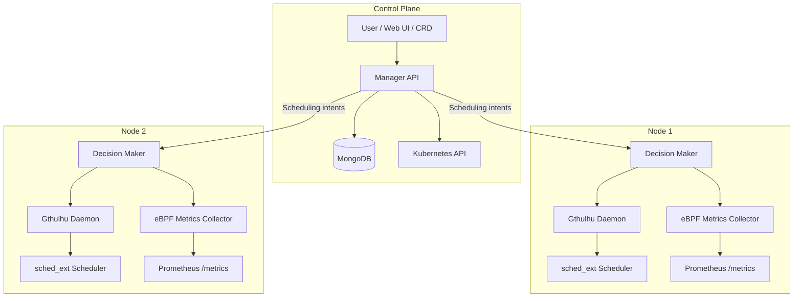
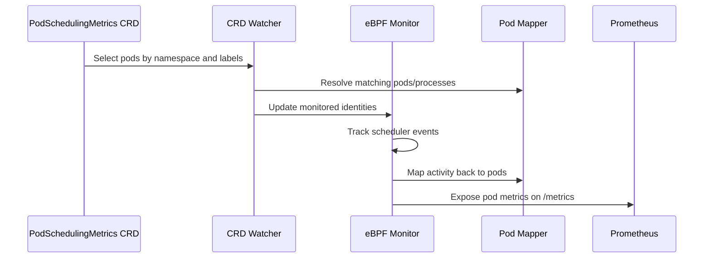
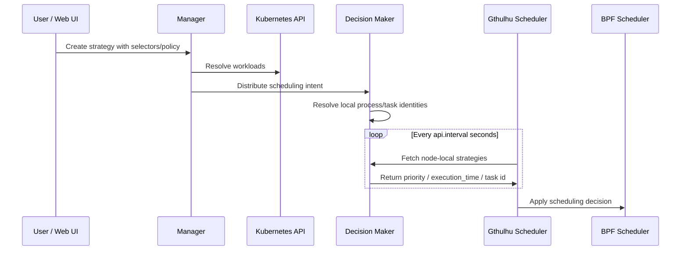

# How It Works

Gthulhu connects Kubernetes workload intent to Linux scheduler behavior. It has two layers:

- **Pod scheduling observability**: the base feature, powered by an eBPF monitor that collects scheduler metrics and exports pod-level Prometheus data.
- **Custom CPU scheduling**: an advanced feature for Linux 6.12+ with `sched_ext`, where Gthulhu applies bounded scheduling policies through a user-space or kernel scheduler path.

The two layers can run together, or Gthulhu can run in monitor-only mode.

## Architecture


```mermaid
graph TB
    subgraph "Control Plane"
        U[User / Web UI / CRD] --> M[Manager API]
        M --> DB[(MongoDB)]
        M --> K8S[Kubernetes API]
    end

    M -->|Scheduling intents| DM1
    M -->|Scheduling intents| DM2

    subgraph "Node 1"
        DM1[Decision Maker] --> MON1[eBPF Metrics Collector]
        DM1 --> G1[Gthulhu Daemon]
        G1 --> S1[sched_ext Scheduler]
        MON1 --> P1[Prometheus /metrics]
    end

    subgraph "Node 2"
        DM2[Decision Maker] --> MON2[eBPF Metrics Collector]
        DM2 --> G2[Gthulhu Daemon]
        G2 --> S2[sched_ext Scheduler]
        MON2 --> P2[Prometheus /metrics]
    end
```

### Manager

The Manager owns cluster-level intent and persistent control-plane state. It resolves workload selectors through Kubernetes APIs and distributes scheduling intent to Decision Makers.

### Decision Maker

A Decision Maker runs on each node. It resolves cluster-level intent into node-local Linux tasks, exposes local scheduling strategies, and serves the monitor/scheduler path.

### Gthulhu daemon

The daemon can run:

- monitor-only;
- user-space `sched_ext` scheduling;
- experimental kernel-mode policy application;
- selected upstream `scx` schedulers where configured.

## Pod Scheduling Metrics Flow

The monitor does not require `sched_ext`. It attaches eBPF programs to scheduler events, maps process/task activity back to Kubernetes Pods, and exports metrics such as runtime, wait time, context switches, run count, and CPU migrations.


```mermaid
sequenceDiagram
    participant C as PodSchedulingMetrics CRD
    participant W as CRD Watcher
    participant B as eBPF Monitor
    participant P as Pod Mapper
    participant M as Prometheus

    C->>W: Select pods by namespace and labels
    W->>P: Resolve matching pods/processes
    W->>B: Update monitored identities
    B->>B: Track scheduler events
    B->>P: Map activity back to pods
    B->>M: Expose pod metrics on /metrics
```

## Scheduling Strategy Flow

Scheduling strategies start at Kubernetes/workload intent and end as node-local task decisions.


```mermaid
sequenceDiagram
    participant U as User / Web UI
    participant M as Manager
    participant K as Kubernetes API
    participant DM as Decision Maker
    participant G as Gthulhu Scheduler
    participant B as BPF Scheduler

    U->>M: Create strategy with selectors/policy
    M->>K: Resolve workloads
    M->>DM: Distribute scheduling intent
    DM->>DM: Resolve local process/task identities

    loop Every api.interval seconds
        G->>DM: Fetch node-local strategies
        DM->>G: Return priority / execution_time / task id
    end

    G->>B: Apply scheduling decision
```

## TID-aware Node Policy Matching

Linux schedules **tasks/threads**, not just thread-group leaders. Node policies therefore scan:

```text
/proc/<tgid>/task/<tid>
```

and match each thread's `comm` independently.

For example:

```text
/proc/3785998/comm               = python3.12
/proc/3785998/task/3786004/comm = EngineCore_DP0
/proc/3785998/task/3786005/comm = EngineCore_DP1
```

A node policy matching `^EngineCore(_DP[0-9]+)?$` can target the two worker threads directly even though the process leader is named `python3.12`.

The resolved strategy key is the **TID** of the matched worker. This is the entity Linux actually dispatches.

This behavior was introduced by the merged thread-aware Decision Maker work in `Gthulhu/Gthulhu#135`.

## TID-first Lookup with TGID Fallback

In the user-space scheduling plugin, strategy lookup is now consistent:

1. prefer an exact **TID** match;
2. if no TID-specific strategy exists, fall back to the **TGID**.

This allows:

- a node policy to target one specific worker thread;
- a Pod-level policy keyed by the group leader to still apply across the thread group;
- a TID-specific rule to win when both exist.

This behavior was introduced by the merged `Gthulhu/plugin#17` change.

### Current limitation

The strategy map is still keyed by a bare numeric ID. If a TID-specific target is itself the group leader (`TID == TGID`), sibling threads may resolve the same entry through TGID fallback. A future strategy shape should preserve whether the original match was task-specific or group-wide.

## Priority and Time-slice Semantics

The current intended semantics are:

- `Priority > 0` = **boosting strategy**;
- `Priority == 0` = **non-boosting strategy**;
- `execution_time` = custom time slice in nanoseconds where the scheduler path supports it.

### User-space mode

A `Priority == 0` strategy does **not** jump the run queue. It may still carry a custom time slice.

A `Priority > 0` strategy receives priority treatment through the user-space scheduler's dispatch ordering.

### Kernel mode

Kernel mode uses BPF priority state directly. Because the underlying priority map treats numeric priority `0` as the highest/preemptive level, Gthulhu must **not** insert a non-boosting `Priority == 0` strategy into that map.

The merged `Gthulhu/Gthulhu#137` fix therefore skips `Priority <= 0` when applying kernel-mode priority state and removes any stale priority entry for that task.

!!! warning "Kernel-mode slice-only parity"
    Kernel mode currently has no separate "custom slice at normal priority" state. Therefore a slice-only (`Priority == 0`) strategy has no scheduling effect in kernel mode instead of being incorrectly promoted. Full parity requires a future qumun/BPF state change.

## sched_ext Scheduler Internals

The advanced scheduler is split between Go and BPF:

- BPF implements `sched_ext` hooks, dispatch queues, task maps, priority state, and ring-buffer communication.
- Go loads configuration, initializes the active scheduler/plugin, attaches the scheduler, and handles control-plane updates.
- User-space mode selects tasks and returns dispatch decisions through ring buffers.
- Kernel mode bypasses per-task user-space selection for the priority path and updates BPF state directly.

## CPU Selection

When using the Gthulhu user-space scheduler, CPU selection prefers locality and idle capacity:

1. reuse the previous CPU when allowed and idle;
2. prefer a fully idle sibling/core when SMT is available;
3. prefer the same L2/L3 cache domain;
4. fall back to another idle CPU;
5. report busy when no suitable CPU is available.

## Claim2Core: Where the Architecture Is Going

The next architecture step is to consume actual Kubernetes allocation and compile it into a safe runtime execution plan.

```text
ResourceClaim allocation
  → Pod / cgroup
  → TGID / TID / starttime
  → proposed execution class
  → sched_ext / BPF state
  → runtime metrics / workload SLO
```

Important boundaries:

- `ResourceSlice` describes **inventory**; it is not proof that a workload owns a device.
- `ResourceClaim.status.allocation` is the source of truth for actual DRA allocation.
- Kubernetes API objects belong in the control/update path, not the microsecond scheduler hot path.
- cgroup / allocated CPU boundaries are authoritative; Gthulhu must never schedule a task outside them.
- Gthulhu schedules Linux CPU tasks, not CUDA kernels, GPU SMs, MIG, or NIC hardware queues.

See [Claim2Core](claim2core.md) for the roadmap.

## Runtime Configuration

A typical configuration looks like:

```yaml
monitor:
  enabled: true
  collection_interval_sec: 10

scheduler:
  slice_ns_default: 20000000
  slice_ns_min: 1000000
  mode: gthulhu
  kernel_mode: false

api:
  url: http://127.0.0.1:8080
  interval: 5
  enabled: true
  auth_enabled: true
```

Key points:

- `monitor.enabled` controls the eBPF metrics collector;
- `scheduler.mode` selects monitor-only / Gthulhu / upstream scx behavior;
- `scheduler.kernel_mode` enables the experimental BPF-side priority path;
- `api.enabled` controls communication with the Decision Maker.

## Debugging

```bash
sudo bpftool prog show
sudo bpftool map show
sudo cat /sys/kernel/debug/tracing/trace_pipe
```

When debugging policy application, always distinguish:

- TGID vs TID;
- user-space vs kernel mode;
- boosting vs non-boosting strategy;
- intended strategy vs actual BPF state.

The planned preview/provenance work in `Gthulhu/Gthulhu#134` is intended to make those distinctions directly observable.
