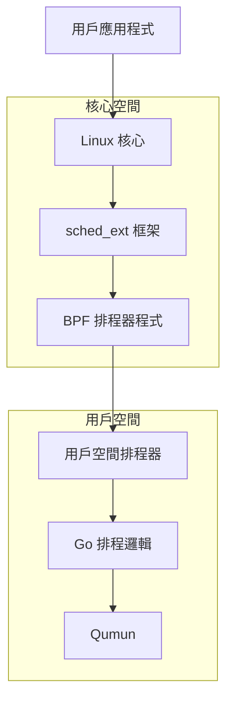
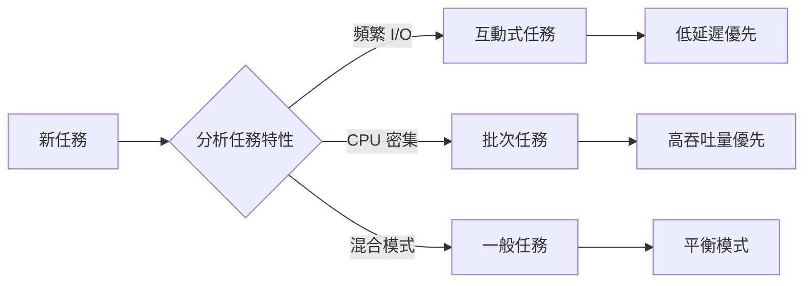
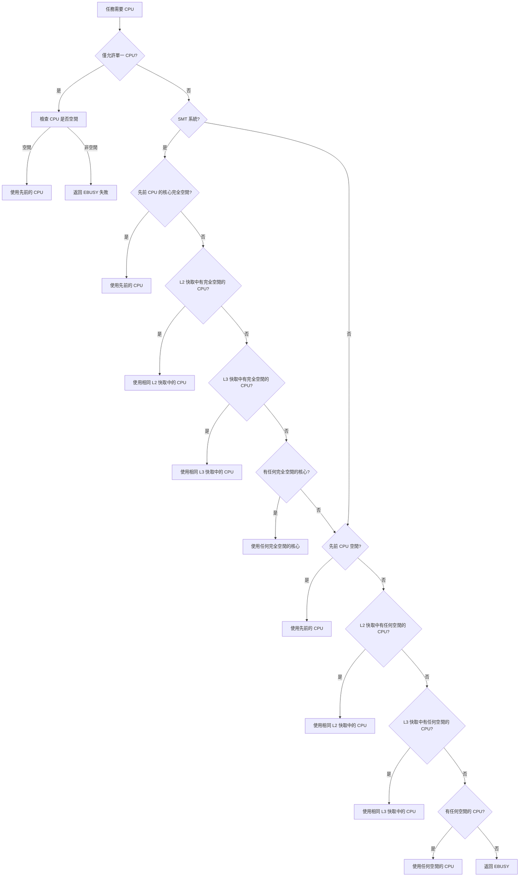
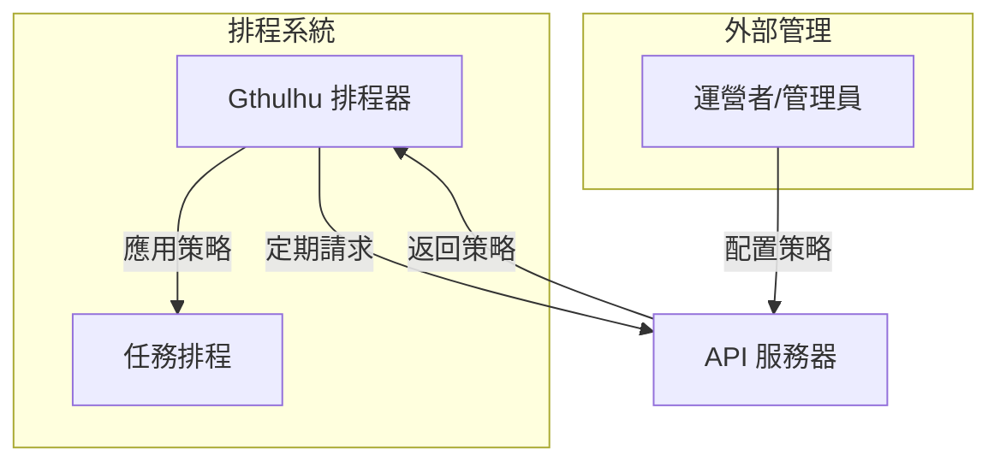
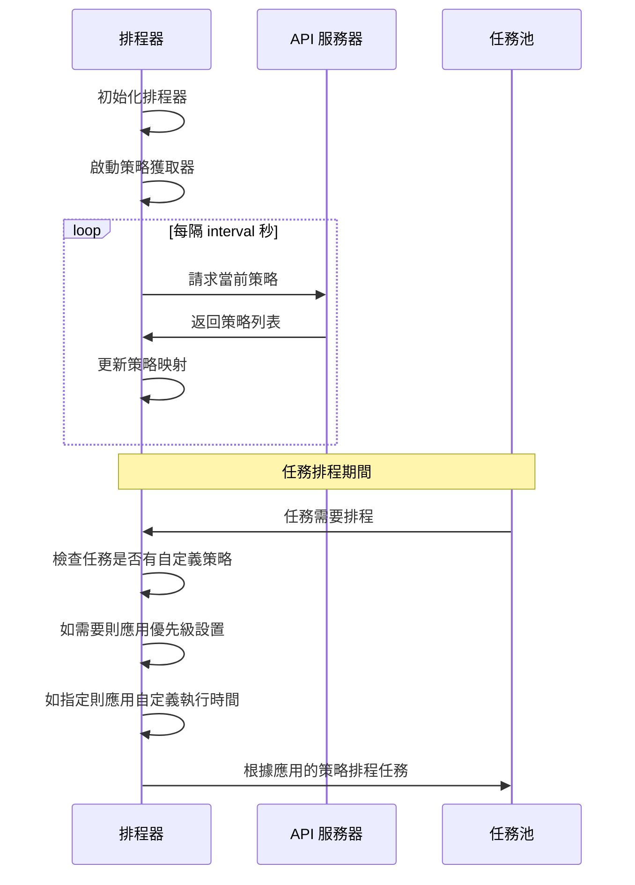
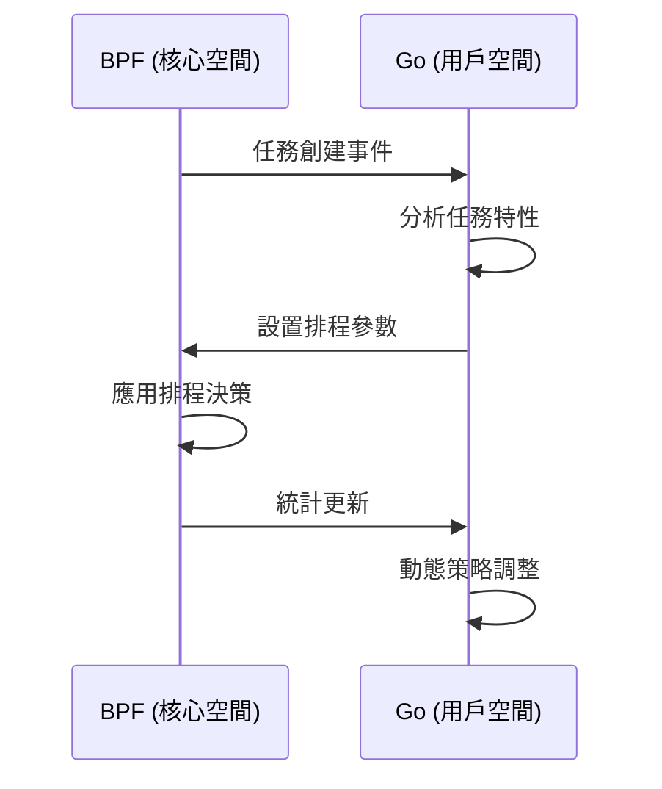

# 運作原理

本頁面提供關於 Gthulhu 和 Qumun 排程器的核心工作原理和技術架構的詳細資訊。

## 整體架構

### 雙元件設計

Gthulhu 排程器採用現代雙元件架構：



#### 1. BPF 元件 (核心空間)

- **檔案**: `main.bpf.c`
- **功能**: 實現低層級 sched_ext 框架介面
- **職責**:
  - 任務佇列管理
  - CPU 選擇邏輯
  - 基本排程決策
  - 與用戶空間通訊

#### 2. Go 元件 (用戶空間)

- **檔案**: `main.go` + Qumun
- **功能**: 實現高層級排程政策
- **職責**:
  - 複雜排程演算法
  - 任務優先級計算
  - 系統監控和統計
  - 動態參數調整

## 核心排程演算法

### 虛擬執行時間 (vruntime)

Gthulhu 使用基於虛擬執行時間的公平排程演算法：

```go
// 虛擬執行時間計算
vruntime = actual_runtime * NICE_0_WEIGHT / task_weight
```

#### 關鍵概念

1. **時間片段**
   ```c
   // 基本時間片段計算
   slice_ns = base_slice_ns * (task_weight / NICE_0_WEIGHT)
   ```

2. **任務權重**
   ```c
   // 基於 nice 值的權重計算
   weight = prio_to_weight[task->static_prio - MAX_RT_PRIO]
   ```

3. **排程決策**
   ```c
   // 選擇具有最小虛擬執行時間的任務
   next_task = min_vruntime_task(runqueue)
   ```

### 延遲敏感優化

#### 任務分類

系統自動識別和分類不同類型的任務：



## CPU 拓撲感知排程

### 階層式 CPU 選擇



## API 和排程策略設計

Gthulhu 實現了一個靈活的機制，通過 RESTful API 介面動態調整其排程行為。這使運營者能夠在不重啟或重新編譯代碼的情況下微調排程器的性能特性。

### API 架構

API 服務器提供用於獲取和設置排程策略的端點：



#### API 端點

API 服務器公開了兩個主要端點用於排程策略管理：

- **GET /api/v1/scheduling/strategies**: 獲取當前排程策略
- **POST /api/v1/scheduling/strategies**: 設置新的排程策略

### 排程策略數據模型

排程策略使用以下結構表示：

```json
{
  "scheduling": [
    {
      "priority": true,
      "execution_time": 20000000,
      "pid": 12345
    },
    {
      "priority": false,
      "execution_time": 10000000,
      "selectors": [
        {
          "key": "tier",
          "value": "control-plane"
        }
      ]
    }
  ]
}
```

排程策略的關鍵組件：

1. **優先級** (`boolean`): 當為 true 時，任務的虛擬執行時間設置為最小值，有效地賦予其最高排程優先級
2. **執行時間** (`uint64`): 任務的自定義時間片（以納秒為單位）
3. **PID** (`int`): 策略適用的進程 ID
4. **選擇器** (`array`): 可選的 Kubernetes 標籤選擇器，用於定位進程組

### 策略應用流程

獲取和應用排程策略的過程遵循以下順序：



### Kubernetes 集成

對於容器化環境，Gthulhu 可以使用標籤選擇器將排程策略映射到特定的 pod：

1. **標籤選擇器解析**: API 服務器通過掃描系統中匹配的 pod 將標籤選擇器轉換為特定的 PID
2. **PID 映射**: 識別每個 pod 的進程並將其與適當的排程策略相關聯
3. **動態更新**: 隨著 pod 的創建、銷毀或移動，排程器通過定期刷新其策略來適應變化

### 策略優先級邏輯

應用排程策略時，Gthulhu 遵循以下規則：

1. **直接 PID 匹配**: 明確指定 PID 的策略具有最高優先級
2. **標籤選擇器匹配**: 使用標籤選擇器的策略適用於所有匹配的進程
3. **默認行為**: 沒有特定策略的進程使用標準排程演算法

### 配置參數

策略獲取行為可以通過排程器的配置文件進行配置：

```yaml
api:
  url: "http://api-server:8080"   # API 服務器端點
  interval: 10                    # 刷新間隔（秒）
```

這種架構允許在不中斷排程器操作的情況下對排程行為進行動態、細粒度的控制。

## BPF 和用戶空間通信

### 通信機制



## 調試和監控

### BPF 追踪

```bash
# 監控 BPF 程式執行
sudo cat /sys/kernel/debug/tracing/trace_pipe

# 檢查 BPF 統計數據
sudo bpftool prog show
sudo bpftool map dump name task_info_map
```

## 與 CFS 的差異

| 功能 | CFS (完全公平排程器) | Gthulhu |
|---------|----------------------------------|---------|
| 排程策略 | 基於虛擬執行時間 | 虛擬執行時間 + 延遲優化 |
| 任務分類 | 統一處理 | 自動分類優化 |
| CPU 選擇 | 基本負載平衡 | 拓撲感知 + 快取親和性 |
| 動態調整 | 有限 | 全面自適應調整 |
| 可擴展性 | 核心內建 | 用戶空間可擴展 |

## 未來發展方向

1. **機器學習集成**: 使用 ML 模型預測任務行為
2. **容器感知排程**: 針對容器化環境的優化
3. **能源優化**: 集成電源管理考量
4. **實時任務支持**: 支持硬實時任務排程

---

!!! info "深入了解"
    有關更多實現細節，請參閱 [API 參考](api-reference.md) 和源代碼註釋。