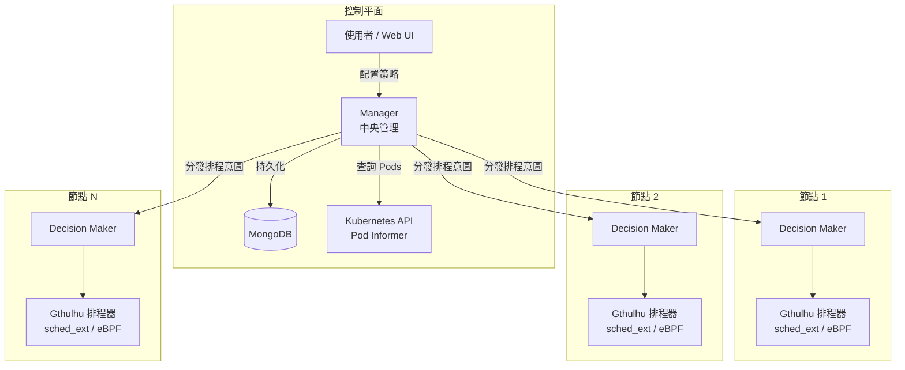
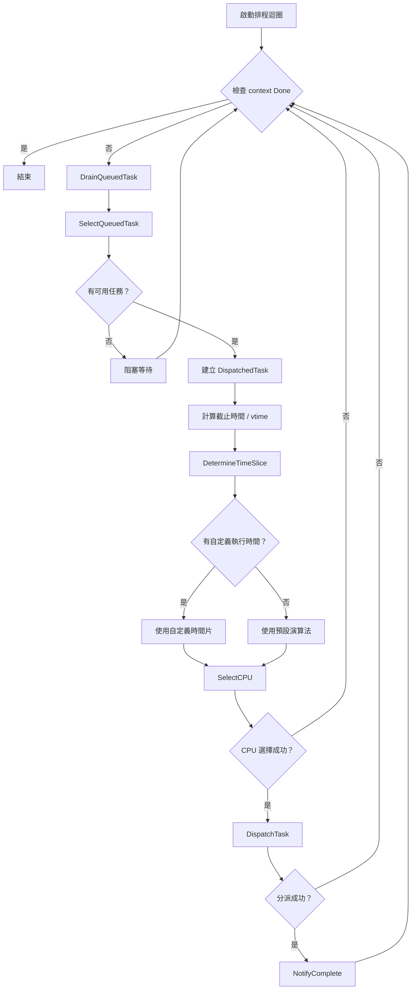
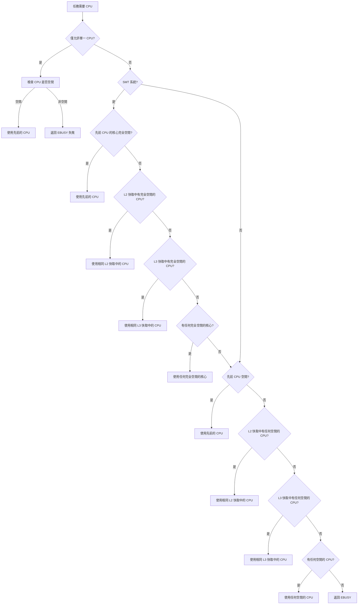
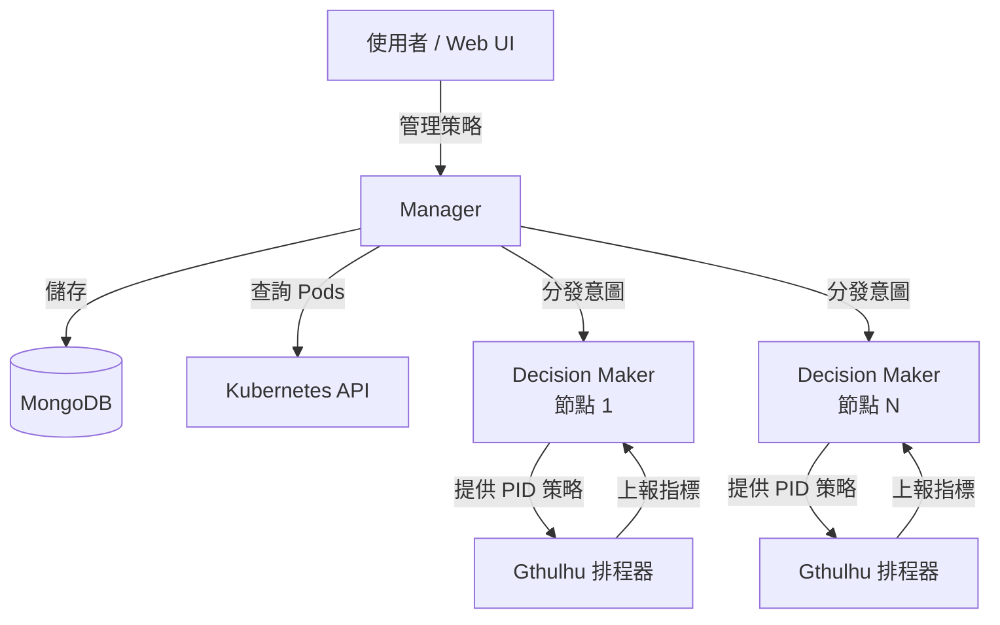
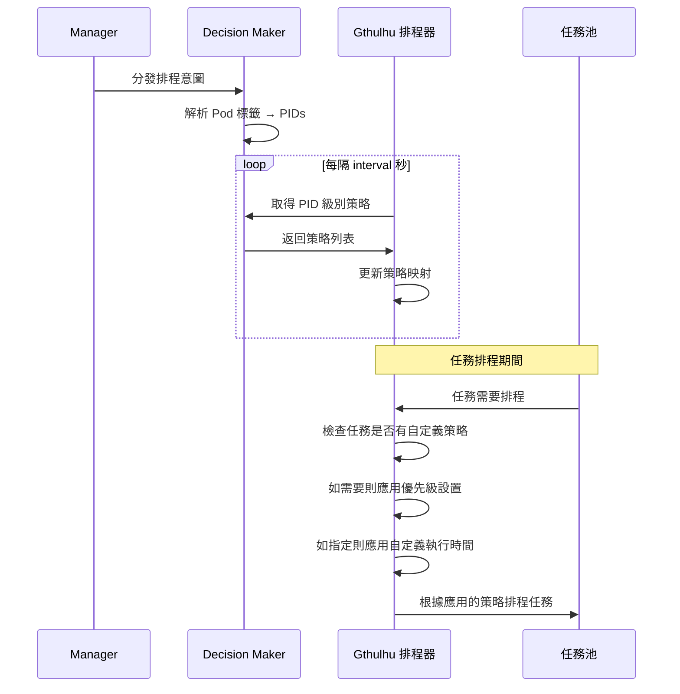
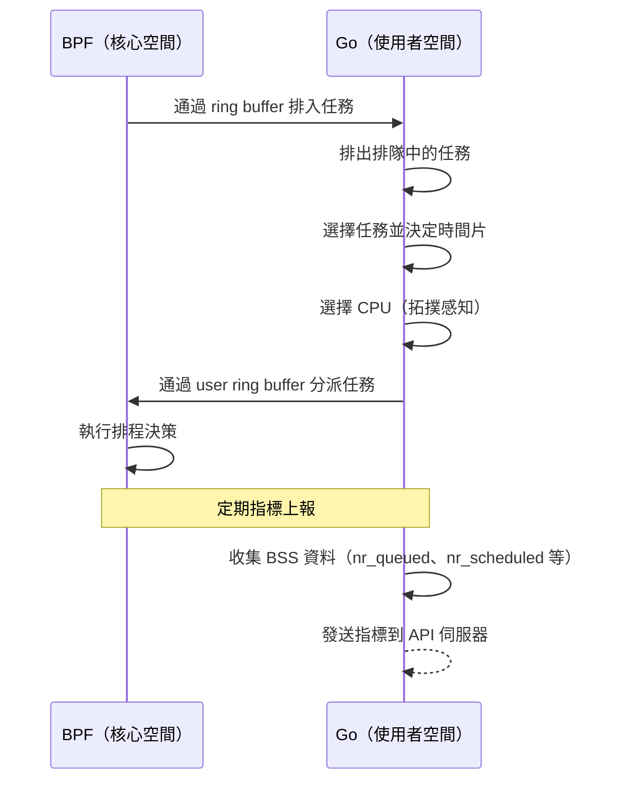

# 運作原理

本頁面提供關於 Gthulhu 核心工作原理和技術架構的詳細資訊。

## 整體架構

Gthulhu 為雲原生生態系統提供可編排的分散式排程器解決方案。
其架構由多個元件協同運作：


```mermaid
graph TB
    subgraph "控制平面"
        U[使用者 / Web UI] -->|配置策略| M[Manager<br/>中央管理]
        M -->|持久化| DB[(MongoDB)]
        M -->|查詢 Pods| K8S[Kubernetes API<br/>Pod Informer]
    end

    M -->|分發排程意圖| DM1
    M -->|分發排程意圖| DM2
    M -->|分發排程意圖| DMN

    subgraph "節點 1"
        DM1[Decision Maker] --> S1[Gthulhu 排程器<br/>sched_ext / eBPF]
    end

    subgraph "節點 2"
        DM2[Decision Maker] --> S2[Gthulhu 排程器<br/>sched_ext / eBPF]
    end

    subgraph "節點 N"
        DMN[Decision Maker] --> SN[Gthulhu 排程器<br/>sched_ext / eBPF]
    end
```

### 元件概覽

#### 1. Manager（控制平面）

[Manager](https://github.com/Gthulhu/api) 作為中央管理服務，負責：

- 使用者認證與授權（JWT）
- 角色與權限管理（RBAC）
- 排程策略的 CRUD 操作
- 通過 Kubernetes Informer 監控 Pod 狀態
- 將排程意圖分發到各節點的 Decision Maker
- 資料持久化至 MongoDB

#### 2. Decision Maker（節點代理）

[Decision Maker](https://github.com/Gthulhu/api) 以 DaemonSet 形式部署在每個 Kubernetes 節點上，負責：

- 接收來自 Manager 的排程意圖
- 掃描 `/proc` 檔案系統以發現 Pod 進程
- 將排程策略（基於標籤）轉換為具體的 PID 級別排程決策
- 向本地 Gthulhu 排程器提供 PID 級別的策略
- 收集 eBPF 排程器指標並通過 Prometheus 暴露

#### 3. Gthulhu 排程器（sched_ext）

[Gthulhu 排程器](https://github.com/Gthulhu/Gthulhu) 是運行在每個節點上的核心排程元件，採用雙元件設計：


##### BPF Scheduler

基於 Linux 核心的 sched_ext 框架實作的 BPF 排程器，負責低階排程功能，如任務佇列管理、CPU 選擇邏輯和執行排程。
BPF 排程器通過 ring buffer 與 user ring buffer 兩種 eBPF Map 與使用者空間的 Gthulhu 排程器溝通。

##### 使用者空間排程器

使用 [qumun framework](https://github.com/Gthulhu/qumun) 開發的使用者空間排程器，它會接收來自 ring buffer eBPF Map 的待排程任務資訊，並根據排程策略進行決策。
最後再將排程結果經過 user ring buffer eBPF Map 回傳給 BPF Scheduler。

## 插件系統


Gthulhu 支援基於 **工廠模式** 的插件化設計，通過插件註冊機制，允許開發者擴展和自定義排程策略。

### 插件介面

插件系統定義了兩個核心介面：

- **`Sched`**：低階排程器操作（`DequeueTask`、`DefaultSelectCPU`、`GetNrQueued`）
- **`CustomScheduler`**：每個排程器必須實現的插件級操作：
    - `DrainQueuedTask` — 從 eBPF 排出排隊中的任務
    - `SelectQueuedTask` — 從佇列中選擇一個任務
    - `SelectCPU` — 為任務選擇合適的 CPU
    - `DetermineTimeSlice` — 計算執行的時間片
    - `GetPoolCount` — 取得調度池中的任務數量
    - `SendMetrics` — 發送指標到監控系統
    - `GetChangedStrategies` — 取得已變更的排程策略

### 可用插件

| 模式 | 說明 |
|------|------|
| `gthulhu` | 進階排程器，支援 API 整合、排程策略、JWT 認證和指標上報 |
| `simple` | 簡易加權虛擬執行時間（vtime）排程器 |
| `simple-fifo` | 簡易先進先出（FIFO）排程器 |

### 插件註冊

插件通過 Go 的 `init()` 機制使用工廠模式進行註冊：

```go
func init() {
    plugin.RegisterNewPlugin("myplugin", func(ctx context.Context, config *plugin.SchedConfig) (plugin.CustomScheduler, error) {
        return NewMyPlugin(config), nil
    })
}
```

## 排程器執行流程

主排程迴圈按以下方式處理任務：


```mermaid
flowchart TD
    A[啟動排程迴圈] --> B{檢查 context Done}
    B -->|是| D[結束]
    B -->|否| E[DrainQueuedTask]
    E --> F[SelectQueuedTask]
    F --> G{有可用任務？}
    G -->|否| H[阻塞等待]
    H --> B
    G -->|是| J[建立 DispatchedTask]
    J --> K[計算截止時間 / vtime]
    K --> L[DetermineTimeSlice]
    L --> M{有自定義執行時間？}
    M -->|是| O[使用自定義時間片]
    M -->|否| P[使用預設演算法]
    O --> Q[SelectCPU]
    P --> Q
    Q --> R{CPU 選擇成功？}
    R -->|否| B
    R -->|是| U[DispatchTask]
    U --> V{分派成功？}
    V -->|否| B
    V -->|是| X[NotifyComplete]
    X --> B
```

## CPU 拓撲感知排程

### 階層式 CPU 選擇


```mermaid
graph TB
    A[任務需要 CPU] --> AA{僅允許單一 CPU?}
    AA -->|是| AB[檢查 CPU 是否空閒]
    AA -->|否| B{SMT 系統?}
    
    AB -->|空閒| AC[使用先前的 CPU]
    AB -->|非空閒| AD[返回 EBUSY 失敗]
    
    B -->|是| C{先前 CPU 的核心完全空閒?}
    B -->|否| G{先前 CPU 空閒?}
    
    C -->|是| D[使用先前的 CPU]
    C -->|否| E{L2 快取中有完全空閒的 CPU?}
    
    E -->|是| F[使用相同 L2 快取中的 CPU]
    E -->|否| H{L3 快取中有完全空閒的 CPU?}
    
    H -->|是| I[使用相同 L3 快取中的 CPU]
    H -->|否| J{有任何完全空閒的核心?}
    
    J -->|是| K[使用任何完全空閒的核心]
    J -->|否| G
    
    G -->|是| L[使用先前的 CPU]
    G -->|否| M{L2 快取中有任何空閒的 CPU?}
    
    M -->|是| N[使用相同 L2 快取中的 CPU]
    M -->|否| O{L3 快取中有任何空閒的 CPU?}
    
    O -->|是| P[使用相同 L3 快取中的 CPU]
    O -->|否| Q{有任何空閒的 CPU?}
    
    Q -->|是| R[使用任何空閒的 CPU]
    Q -->|否| S[返回 EBUSY]
```

## API 和排程策略設計

Gthulhu 實現了靈活的機制，通過 RESTful API 介面動態調整排程行為。系統使用 Manager 和節點級 Decision Maker 的雙模式 API 架構。

### API 架構


```mermaid
graph TB
    A[使用者 / Web UI] -->|管理策略| B[Manager]
    B -->|儲存| C[(MongoDB)]
    B -->|查詢 Pods| D[Kubernetes API]
    B -->|分發意圖| E[Decision Maker<br/>節點 1]
    B -->|分發意圖| F[Decision Maker<br/>節點 N]
    E -->|提供 PID 策略| G[Gthulhu 排程器]
    F -->|提供 PID 策略| H[Gthulhu 排程器]
    G -->|上報指標| E
    H -->|上報指標| F
```

#### Manager 端點

Manager 處理面向使用者的操作：

- **POST /api/v1/auth/login**：使用者認證
- **POST /api/v1/strategies**：建立排程策略
- **GET /api/v1/strategies/self**：列出自己的策略
- **GET /api/v1/intents/self**：列出排程意圖

#### Decision Maker 端點

Decision Maker 運行在每個節點上，與 Gthulhu 排程器互動：

- **GET /api/v1/scheduling/strategies**：取得本地排程器的 PID 級別排程策略
- **POST /api/v1/metrics**：接收排程器指標資料

### 排程策略資料模型

Decision Maker 層級的排程策略使用以下結構表示：

```json
{
  "success": true,
  "scheduling": [
    {
      "priority": 1,
      "execution_time": 20000000,
      "pid": 12345
    },
    {
      "priority": 0,
      "execution_time": 10000000,
      "pid": 67890
    }
  ]
}
```

排程策略的關鍵組件：

1. **優先級** (`int`)：當大於 0 時，任務的虛擬執行時間設置為最小值，賦予其最高排程優先級
2. **執行時間** (`uint64`)：任務的自定義時間片（以納秒為單位）
3. **PID** (`int`)：策略適用的進程 ID

!!! note
    Kubernetes Pod 的標籤選擇器在 Manager/Decision Maker 層級處理。
    Decision Maker 通過掃描 `/proc` 尋找匹配的 Pod 進程，將標籤選擇器解析為具體的 PID，然後再傳遞給排程器。

### 策略應用流程


```mermaid
sequenceDiagram
    participant M as Manager
    participant DM as Decision Maker
    participant S as Gthulhu 排程器
    participant T as 任務池

    M->>DM: 分發排程意圖
    DM->>DM: 解析 Pod 標籤 → PIDs

    loop 每隔 interval 秒
        S->>DM: 取得 PID 級別策略
        DM->>S: 返回策略列表
        S->>S: 更新策略映射
    end

    Note over S,T: 任務排程期間
    T->>S: 任務需要排程
    S->>S: 檢查任務是否有自定義策略
    S->>S: 如需要則應用優先級設置
    S->>S: 如指定則應用自定義執行時間
    S->>T: 根據應用的策略排程任務
```

### 認證與安全

Gthulhu API 支援多種安全機制：

- **JWT 認證**：排程器與 Decision Maker 之間基於 RSA 非對稱加密的 Token 認證
- **雙向 TLS（mTLS）**：元件之間可選的雙向 TLS 安全通訊
- **RBAC**：Manager 上的角色型存取控制用於使用者管理

## 核心模式

Gthulhu 支援實驗性的**核心模式**（Kernel Mode），排程決策完全在 BPF 空間中進行，無需使用者空間排程迴圈。在此模式下：

- BPF 排程器直接在核心中處理任務分派
- 使用者空間元件僅管理策略更新和監控
- 策略變更通過 eBPF map 更新推送至 BPF 排程器（`UpdatePriorityTaskWithPrio`、`RemovePriorityTask`）

此模式可通過避免每次排程決策的核心到使用者空間往返來降低延遲。

```yaml
scheduler:
  kernel_mode: true   # 啟用核心模式排程
```

## BPF 和使用者空間通訊

### 通訊機制


```mermaid
sequenceDiagram
    participant K as BPF（核心空間）
    participant U as Go（使用者空間）
    
    K->>U: 通過 ring buffer 排入任務
    U->>U: 排出排隊中的任務
    U->>U: 選擇任務並決定時間片
    U->>U: 選擇 CPU（拓撲感知）
    U->>K: 通過 user ring buffer 分派任務
    K->>K: 執行排程決策
    
    Note over K,U: 定期指標上報
    U->>U: 收集 BSS 資料（nr_queued、nr_scheduled 等）
    U-->>U: 發送指標到 API 伺服器
```

### 指標資料

排程器收集並上報以下指標：

| 指標 | 說明 |
|------|------|
| `nr_queued` | 排程器中排隊的任務數 |
| `nr_scheduled` | 已排程的任務數 |
| `nr_running` | 當前正在運行的任務數 |
| `nr_online_cpus` | 線上 CPU 數量 |
| `nr_user_dispatches` | 使用者空間分派次數 |
| `nr_kernel_dispatches` | 核心空間分派次數 |
| `nr_cancel_dispatches` | 取消的分派次數 |
| `nr_bounce_dispatches` | 反彈的分派次數 |
| `nr_failed_dispatches` | 失敗的分派次數 |
| `nr_sched_congested` | 排程器擁塞事件次數 |

## 配置

Gthulhu 使用 YAML 配置檔案管理所有設定：

```yaml
scheduler:
  slice_ns_default: 20000000    # 預設時間片（20ms）
  slice_ns_min: 1000000         # 最小時間片（1ms）
  mode: gthulhu                 # 插件模式：gthulhu、simple、simple-fifo
  kernel_mode: false            # 實驗性核心模式排程
  max_time_watchdog: true       # 偵測排程停滯

api:
  url: http://127.0.0.1:8080    # Decision Maker 端點
  interval: 5                   # 策略取得間隔（秒）
  public_key_path: ./config/jwt_public_key.pem
  enabled: true                 # 啟用 API 通訊
  auth_enabled: true            # 啟用 JWT 認證
  mtls:
    enable: false               # 啟用雙向 TLS
    cert_pem: ""
    key_pem: ""
    ca_pem: ""

debug: false                    # 啟用除錯模式（pprof 在 :6060）
early_processing: false         # 在 BPF 中提前處理任務
builtin_idle: false             # 在 BPF 中使用內建空閒 CPU 選擇
```

## 除錯和監控

### BPF 追蹤

```bash
# 監控 BPF 程式執行
sudo cat /sys/kernel/debug/tracing/trace_pipe

# 檢查 BPF 統計資料
sudo bpftool prog show
sudo bpftool map dump name task_info_map
```

## 與 CFS 的差異

| 功能 | CFS（完全公平排程器） | Gthulhu |
|---------|----------------------------------|---------|
| 排程策略 | 基於虛擬執行時間 | 虛擬執行時間 + 延遲優化 |
| 任務分類 | 統一處理 | 自動分類優化 |
| CPU 選擇 | 基本負載平衡 | 拓撲感知 + 快取親和性 |
| 動態調整 | 有限 | 全面自適應調整 |
| 可擴展性 | 核心內建 | 使用者空間可擴展（插件系統） |
| 多節點 | 不適用 | 通過 Manager 實現分散式排程 |
| 策略管理 | 靜態核心參數 | 動態 REST API + Kubernetes 整合 |

---

!!! info "深入了解"
    有關更多實現細節，請參閱 [API 參考](api-reference.md) 和源代碼註釋。