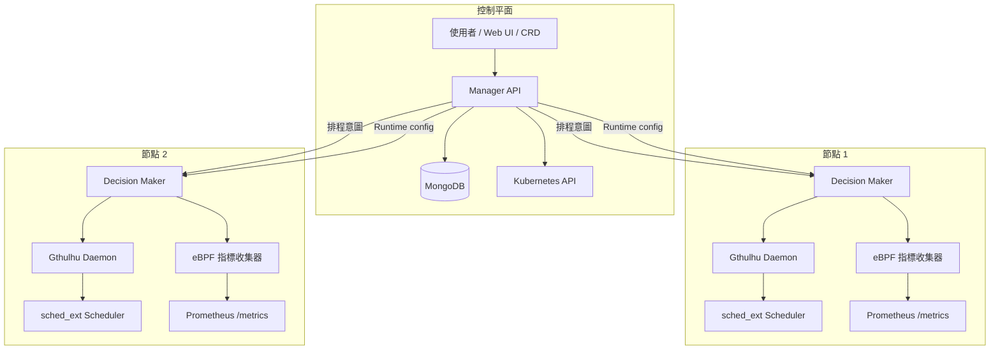
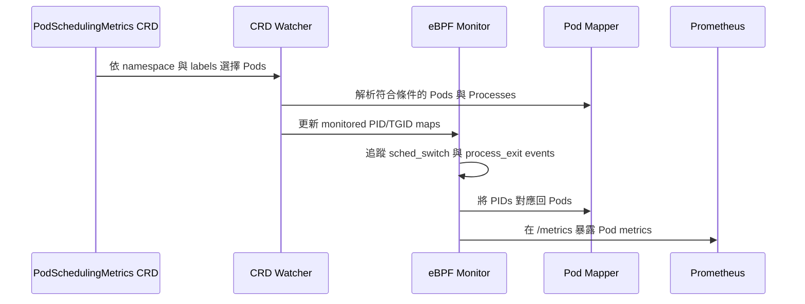
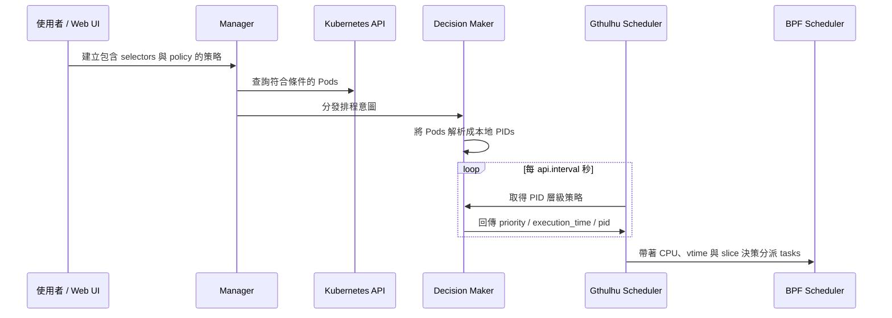
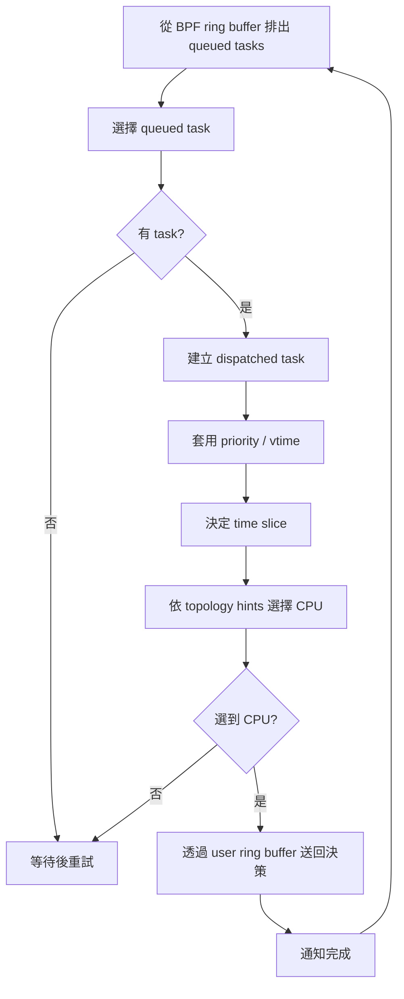

# 運作原理

Gthulhu 將 Kubernetes 工作負載意圖連接到 Linux 核心排程行為。系統分成兩層：

- **Pod 排程可觀測性**：基礎功能，透過 eBPF monitor 收集排程指標，並匯出 Pod 層級 Prometheus 資料。
- **自訂 CPU 排程**：進階功能，適用於支援 `sched_ext` 的 Linux 6.12+ 節點，透過使用者空間排程器與 BPF scheduler 套用優先級與時間片策略。

兩層可以一起執行；若未配置 scheduler mode，Gthulhu 也可以只執行 monitor-only 模式。

## 架構


```mermaid
graph TB
    subgraph "控制平面"
        U[使用者 / Web UI / CRD] --> M[Manager API]
        M --> DB[(MongoDB)]
        M --> K8S[Kubernetes API]
    end

    M -->|排程意圖| DM1
    M -->|排程意圖| DM2
    M -->|Runtime config| DM1
    M -->|Runtime config| DM2

    subgraph "節點 1"
        DM1[Decision Maker] --> MON1[eBPF 指標收集器]
        DM1 --> G1[Gthulhu Daemon]
        G1 --> S1[sched_ext Scheduler]
        MON1 --> P1[Prometheus /metrics]
    end

    subgraph "節點 2"
        DM2[Decision Maker] --> MON2[eBPF 指標收集器]
        DM2 --> G2[Gthulhu Daemon]
        G2 --> S2[sched_ext Scheduler]
        MON2 --> P2[Prometheus /metrics]
    end
```

### Manager

Manager 是面向使用者的控制平面服務。依目前 API server 實作，它負責：

- 認證與 token 生命週期：`/api/v1/auth/login`、`/api/v1/auth/refresh`、`/api/v1/auth/logout`
- RBAC 資源：使用者、角色與權限
- 排程策略：`/api/v1/strategies`
- 排程意圖：`/api/v1/intents/self`
- 依節點查詢 Pod-to-PID：`/api/v1/nodes`、`/api/v1/nodes/:nodeID/pods/pids`
- Pod 排程指標設定與 runtime values：`/api/v1/pod-scheduling-metrics`、`/api/v1/pod-scheduling-metrics/runtime`、`/api/v1/classify`
- Scheduler runtime configuration：`/api/v1/scheduler/runtime-config/apply`、`/api/v1/scheduler/runtime-config/status`

Manager 會將狀態持久化到 MongoDB，並透過 Kubernetes API 解析工作負載 selector。

### Decision Maker

Decision Maker 以每節點一個服務的形式運作。它接收 Manager 發出的叢集層級意圖，解析成節點本地 Process 資訊，並服務本地 scheduler 與 monitor。

重要端點包含：

- `POST /api/v1/intents` — 接收 Manager 發出的排程意圖
- `GET /api/v1/scheduling/strategies` — 提供 PID 層級策略給本地 scheduler
- `POST /api/v1/metrics` — 接收 Gthulhu daemon 上報的 scheduler BSS metrics
- `GET /api/v1/pods/pids` — 回傳該節點的 Pod-to-PID mapping
- `POST /api/v1/runtime-config` 與 `GET /api/v1/runtime-config` — 套用與查看 runtime daemon configuration
- `POST /api/v1/auth/token` — 簽發 scheduler 對本地 API 呼叫使用的 token
- `GET /metrics` — 暴露 Decision Maker 的 Prometheus metrics

### Gthulhu Daemon

Gthulhu 根目錄的 binary 可以執行 monitor、scheduler，或兩者同時執行：

- **monitor** 由 `monitor.enabled` 啟用，是預設的基礎功能。
- **scheduler** 在 `scheduler.mode` 設為 `gthulhu`、`simple` 或 `scx` 時啟用。
- 若 `scheduler.mode` 設為 `none`，daemon 會停留在 monitor-only 模式。

## Pod 排程指標流程

monitor 的設計不依賴 `sched_ext`。它會載入 `sched_monitor.bpf.o`，將 eBPF 程式掛到 scheduler tracepoints，讀取 BPF maps，將 PID 對應回 Kubernetes Pod，最後匯出 Pod 層級 metrics。


```mermaid
sequenceDiagram
    participant C as PodSchedulingMetrics CRD
    participant W as CRD Watcher
    participant B as eBPF Monitor
    participant P as Pod Mapper
    participant M as Prometheus

    C->>W: 依 namespace 與 labels 選擇 Pods
    W->>P: 解析符合條件的 Pods 與 Processes
    W->>B: 更新 monitored PID/TGID maps
    B->>B: 追蹤 sched_switch 與 process_exit events
    B->>P: 將 PIDs 對應回 Pods
    B->>M: 在 /metrics 暴露 Pod metrics
```

collector 追蹤 runtime、wait time、自願/非自願上下文切換、run count、CPU migrations 等訊號。這些 metrics 可供 Prometheus、Grafana dashboard 與 KEDA-based scaling 使用。

## 排程策略流程

排程策略從 Kubernetes 工作負載層級開始，最後變成每個節點上的 PID 層級決策。


```mermaid
sequenceDiagram
    participant U as 使用者 / Web UI
    participant M as Manager
    participant K as Kubernetes API
    participant DM as Decision Maker
    participant G as Gthulhu Scheduler
    participant B as BPF Scheduler

    U->>M: 建立包含 selectors 與 policy 的策略
    M->>K: 查詢符合條件的 Pods
    M->>DM: 分發排程意圖
    DM->>DM: 將 Pods 解析成本地 PIDs

    loop 每 api.interval 秒
        G->>DM: 取得 PID 層級策略
        DM->>G: 回傳 priority / execution_time / pid
    end

    G->>B: 帶著 CPU、vtime 與 slice 決策分派 tasks
```

PID 層級策略格式如下：

```json
{
  "priority": 1,
  "execution_time": 20000000,
  "pid": 12345
}
```

- `priority` 大於 `0` 時，該 task 會獲得優先處理。
- `execution_time` 代表自訂時間片，單位為奈秒。
- `pid` 是套用策略的 Linux Process。

## sched_ext Scheduler 內部設計

進階 scheduler 分成 BPF 與 Go 兩部分：

- `main.bpf.c` 實作低階 `sched_ext` hooks、dispatch queues、task maps、priority tracking 與 ring buffer communication。
- `main.go` 載入設定、初始化 plugin、載入 `main.bpf.o`、attach scheduler、初始化 CPU topology domains，並執行 dispatch loop。
- plugin layer 提供排程策略實作：`gthulhu`、`simple`、`simple-fifo`。

### 使用者空間 Dispatch Loop


```mermaid
flowchart TD
    A[從 BPF ring buffer 排出 queued tasks] --> B[選擇 queued task]
    B --> C{有 task?}
    C -->|否| D[等待後重試]
    C -->|是| E[建立 dispatched task]
    E --> F[套用 priority / vtime]
    F --> G[決定 time slice]
    G --> H[依 topology hints 選擇 CPU]
    H --> I{選到 CPU?}
    I -->|否| D
    I -->|是| J[透過 user ring buffer 送回決策]
    J --> K[通知完成]
    K --> A
```

BPF 透過 ring buffer 將 tasks 排入使用者空間。Go 端排出 tasks，交給啟用中的 plugin 選擇工作、決定時間片、選擇 CPU，再透過 user ring buffer 回傳 dispatch decision。BPF 最後執行實際的 `sched_ext` dispatch。

### 優先級處理

在 user-space scheduler mode 中，priority 透過將 dispatched task 的 virtual time 設為最小值來表達。BPF 會追蹤 priority tasks，並可將其插入 dispatch queue 前端或觸發 preemption 行為。

在 kernel mode 中，每次 task 決策不再經過 user-space loop。Go process 會監看策略變更，並透過 `UpdatePriorityTaskWithPrio` 與 `RemovePriorityTask` 更新 BPF maps，讓 BPF 直接在核心空間 dispatch。

## CPU 選擇

Gthulhu 會在 attach scheduler 前初始化 CPU topology 與 cache domains。CPU 選擇偏好 locality 與 idle capacity：

1. 如果前一次 CPU 允許且 idle，優先重用。
2. 在 SMT 系統上，優先選擇 fully idle sibling/core。
3. 優先選擇同一個 L2 或 L3 cache domain 的 CPU。
4. 最後才選擇任意 idle CPU。
5. 若沒有合適 CPU，回傳 busy。

使用者空間 scheduler 提供 CPU hints，BPF 負責最後 dispatch 與 kick 行為。

## Runtime Configuration

daemon 會讀取 YAML 設定，也可以透過 Decision Maker 接收 runtime configuration。

```yaml
monitor:
  enabled: true
  bpf_object_path: sched_monitor.bpf.o
  collection_interval_sec: 10
  monitor_all: false
  stream_events: false
  prometheus_port: 9090
  enable_crd_watcher: true

scheduler:
  slice_ns_default: 20000000
  slice_ns_min: 1000000
  mode: gthulhu
  scheduler_name: ""
  kernel_mode: false
  max_time_watchdog: true

api:
  url: http://127.0.0.1:8080
  interval: 5
  public_key_path: ./api/config/jwt_public_key.pem
  enabled: true
  auth_enabled: true
```

重要行為：

- `monitor.enabled` 控制基礎 eBPF metrics collector。
- `scheduler.mode` 控制 daemon 要監督哪一種 scheduler process：`none`、`gthulhu`、`simple` 或 `scx`。
- `scheduler.scheduler_name` 在 `scheduler.mode` 為 `scx` 時必填；daemon 會在套用 runtime config 前確認 `/gthulhu/<scheduler_name>` 是允許且可執行的 binary。
- `scheduler.kernel_mode` 啟用實驗性的 BPF-side dispatch。
- `api.enabled` 控制是否與 Decision Maker 溝通。
- `api.auth_enabled` 啟用 scheduler API calls 的 JWT authentication。
- `api.mtls` 可啟用 scheduler 與 API server 之間的 mutual TLS。

## Metrics

Gthulhu 回報兩類 metrics：

| 來源 | 範例 | 消費者 |
|------|------|--------|
| eBPF pod monitor | wait time、runtime、context switches、CPU migrations | Prometheus、Grafana、KEDA |
| sched_ext BSS data | `nr_queued`、`nr_scheduled`、`nr_running`、dispatch counters、congestion counters | Decision Maker API 與 logs |

scheduler 會定期從 BPF module 讀取 BSS data。若 API communication 已啟用，會將這些 metrics POST 給 Decision Maker。

## 除錯

開發或操作 scheduler 時常用的指令：

```bash
# 追蹤 BPF debug output
sudo cat /sys/kernel/debug/tracing/trace_pipe

# 檢查已載入的 BPF programs 與 maps
sudo bpftool prog show
sudo bpftool map show

# 使用指定設定啟動 Gthulhu daemon
sudo ./main scheduler -config config/config.yaml
```

若要部署 monitor-only 模式，請在 runtime configuration 中將 `scheduler.mode` 設為 `none`。若要使用 upstream sched_ext scheduler，請部署 scx-flavored image，並設定 `scheduler.mode: scx` 與 image 內建的 scheduler name，例如 `scx_bpfland` 或 `scx_cake`。
