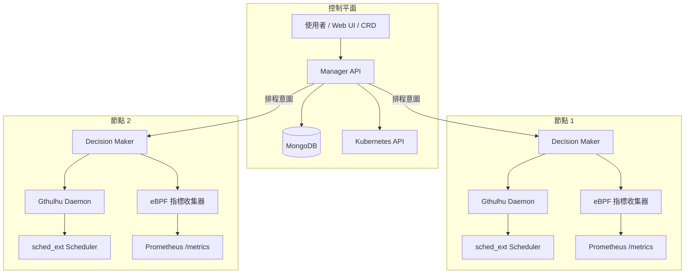
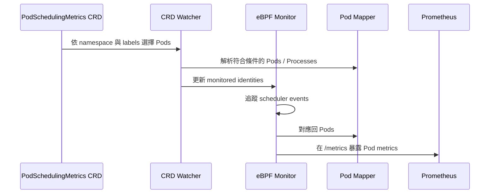
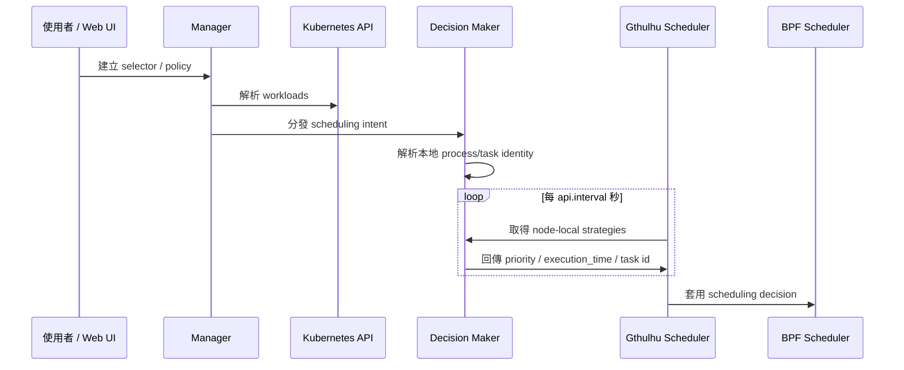

# 運作原理

Gthulhu 將 Kubernetes 工作負載意圖連接到 Linux 核心排程行為。系統分成兩層：

- **Pod 排程可觀測性**：基礎功能，透過 eBPF monitor 收集排程指標並匯出 Pod 層級 Prometheus 資料。
- **自訂 CPU 排程**：進階功能，適用於 Linux 6.12+ 與 `sched_ext`，由 user-space 或 kernel scheduler path 套用有邊界的 runtime scheduling policy。

兩層可以一起執行，也可以只執行 monitor-only 模式。

## 架構


```mermaid
graph TB
    subgraph "控制平面"
        U[使用者 / Web UI / CRD] --> M[Manager API]
        M --> DB[(MongoDB)]
        M --> K8S[Kubernetes API]
    end

    M -->|排程意圖| DM1
    M -->|排程意圖| DM2

    subgraph "節點 1"
        DM1[Decision Maker] --> MON1[eBPF 指標收集器]
        DM1 --> G1[Gthulhu Daemon]
        G1 --> S1[sched_ext Scheduler]
        MON1 --> P1[Prometheus /metrics]
    end

    subgraph "節點 2"
        DM2[Decision Maker] --> MON2[eBPF 指標收集器]
        DM2 --> G2[Gthulhu Daemon]
        G2 --> S2[sched_ext Scheduler]
        MON2 --> P2[Prometheus /metrics]
    end
```

### Manager

Manager 負責 cluster-level intent 與 control-plane state，透過 Kubernetes API 解析 workload selector，並把 scheduling intent 分發到各節點 Decision Maker。

### Decision Maker

Decision Maker 每個 Node 一個。它把 cluster-level intent 解析成 node-local Linux task，提供 local scheduling strategies，並服務 monitor / scheduler path。

### Gthulhu daemon

Daemon 可以執行：

- monitor-only；
- user-space `sched_ext` scheduling；
- experimental kernel-mode policy application；
- 配置後的 upstream `scx` scheduler。

## Pod 排程指標流程

Monitor 不依賴 `sched_ext`。它將 eBPF 程式掛到 scheduler events，將 process/task activity 對應回 Kubernetes Pod，並匯出 runtime、wait time、context switch、run count、CPU migration 等 metrics。


```mermaid
sequenceDiagram
    participant C as PodSchedulingMetrics CRD
    participant W as CRD Watcher
    participant B as eBPF Monitor
    participant P as Pod Mapper
    participant M as Prometheus

    C->>W: 依 namespace 與 labels 選擇 Pods
    W->>P: 解析符合條件的 Pods / Processes
    W->>B: 更新 monitored identities
    B->>B: 追蹤 scheduler events
    B->>P: 對應回 Pods
    B->>M: 在 /metrics 暴露 Pod metrics
```

## 排程策略流程

Scheduling strategy 從 Kubernetes/workload intent 開始，最後落成 node-local task decision。


```mermaid
sequenceDiagram
    participant U as 使用者 / Web UI
    participant M as Manager
    participant K as Kubernetes API
    participant DM as Decision Maker
    participant G as Gthulhu Scheduler
    participant B as BPF Scheduler

    U->>M: 建立 selector / policy
    M->>K: 解析 workloads
    M->>DM: 分發 scheduling intent
    DM->>DM: 解析本地 process/task identity

    loop 每 api.interval 秒
        G->>DM: 取得 node-local strategies
        DM->>G: 回傳 priority / execution_time / task id
    end

    G->>B: 套用 scheduling decision
```

## TID-aware Node Policy Matching

Linux 排的是 **task/thread**，不是只排 thread-group leader。因此 node policy 會掃描：

```text
/proc/<tgid>/task/<tid>
```

並獨立比對每個 thread 的 `comm`。

例如：

```text
/proc/3785998/comm               = python3.12
/proc/3785998/task/3786004/comm = EngineCore_DP0
/proc/3785998/task/3786005/comm = EngineCore_DP1
```

即使 process leader 名稱是 `python3.12`，`^EngineCore(_DP[0-9]+)?$` 仍可以直接命中兩個 worker threads。

解析後的 strategy key 是被命中 worker 的 **TID**，也就是 Linux 真正 dispatch 的 entity。

這個行為來自已合併的 `Gthulhu/Gthulhu#135`。

## TID-first Lookup 與 TGID Fallback

User-space scheduling plugin 現在使用一致的 lookup semantics：

1. 先找 exact **TID** match；
2. 沒有 TID-specific strategy 才 fallback 到 **TGID**。

因此：

- node policy 可以只命中單一 worker thread；
- Pod-level policy 仍可透過 TGID 對整個 thread group 生效；
- 當 TID 與 TGID rule 同時存在時，TID-specific rule 優先。

這個行為來自已合併的 `Gthulhu/plugin#17`。

### 目前限制

Strategy map 仍以 bare numeric ID 為 key。如果 target 本身就是 group leader（`TID == TGID`），sibling thread 可能透過 TGID fallback 讀到同一筆 entry。後續應讓 strategy shape 保留它原本是 task-specific 還是 group-wide。

## Priority 與 Time-slice Semantics

目前語意是：

- `Priority > 0` = **boosting strategy**；
- `Priority == 0` = **non-boosting strategy**；
- `execution_time` = scheduler path 支援時使用的 custom time slice，單位 ns。

### User-space mode

`Priority == 0` 不會跳到 run queue 前面，但仍可攜帶 custom time slice。

`Priority > 0` 才會在 user-space scheduler dispatch ordering 中獲得 priority treatment。

### Kernel mode

Kernel mode 直接使用 BPF priority state。底層 priority map 將數值 `0` 解讀成最高 / preemptive priority，因此 Gthulhu **不能**把 non-boosting `Priority == 0` strategy 插進這個 map。

已合併的 `Gthulhu/Gthulhu#137` 因此會在 kernel-mode priority apply 時跳過 `Priority <= 0`，並移除該 task 可能殘留的 stale priority entry。

!!! warning "Kernel mode 的 slice-only parity"
    Kernel mode 目前沒有獨立的「normal priority + custom slice」state。因此 slice-only (`Priority == 0`) strategy 在 kernel mode 目前是無效果，而不是被錯誤提升成最高 priority。要做到完整 parity，之後需要修改 qumun/BPF state model。

## sched_ext Scheduler 內部設計

進階 scheduler 由 Go 與 BPF 共同構成：

- BPF 實作 `sched_ext` hooks、dispatch queues、task maps、priority state 與 ring-buffer communication。
- Go 載入設定、初始化 scheduler/plugin、attach scheduler，並處理 control-plane updates。
- User-space mode 由 Go/plugin 選 task，透過 ring buffer 回傳 dispatch decision。
- Kernel mode 對 priority path 省略逐 task 的 user-space selection，直接更新 BPF state。

## CPU 選擇

Gthulhu user-space scheduler 的 CPU selection 偏好 locality 與 idle capacity：

1. 前一次 CPU 仍可用且 idle 時優先重用；
2. SMT 系統優先 fully idle sibling/core；
3. 優先同一 L2/L3 cache domain；
4. fallback 到其他 idle CPU；
5. 沒有適合 CPU 時回報 busy。

## Claim2Core：下一階段架構

下一步是消費 Kubernetes 的 actual allocation，將它編譯成安全的 runtime execution plan。

```text
ResourceClaim allocation
  → Pod / cgroup
  → TGID / TID / starttime
  → proposed execution class
  → sched_ext / BPF state
  → runtime metrics / workload SLO
```

重要邊界：

- `ResourceSlice` 描述 **inventory**，不能證明 workload 已取得 device。
- `ResourceClaim.status.allocation` 才是 DRA actual allocation 的 source of truth。
- Kubernetes API object 應存在 control/update path，不能放進微秒級 scheduler hot path。
- cgroup / allocated CPU boundary 是硬邊界，Gthulhu 不得把 task 移出允許集合。
- Gthulhu 排的是 Linux CPU task，不是 CUDA kernel、GPU SM、MIG 或 NIC hardware queue。

完整 roadmap 請看 [Claim2Core](claim2core.md)。

## Runtime Configuration

典型設定：

```yaml
monitor:
  enabled: true
  collection_interval_sec: 10

scheduler:
  slice_ns_default: 20000000
  slice_ns_min: 1000000
  mode: gthulhu
  kernel_mode: false

api:
  url: http://127.0.0.1:8080
  interval: 5
  enabled: true
  auth_enabled: true
```

重點：

- `monitor.enabled` 控制 eBPF metrics collector；
- `scheduler.mode` 控制 monitor-only / Gthulhu / upstream scx 行為；
- `scheduler.kernel_mode` 啟用 experimental BPF-side priority path；
- `api.enabled` 控制是否與 Decision Maker 溝通。

## 除錯

```bash
sudo bpftool prog show
sudo bpftool map show
sudo cat /sys/kernel/debug/tracing/trace_pipe
```

排查 policy application 時，務必區分：

- TGID vs TID；
- user-space vs kernel mode；
- boosting vs non-boosting strategy；
- intended strategy vs actual BPF state。

`Gthulhu/Gthulhu#134` 規劃中的 preview/provenance 功能，就是要讓這些差異可以被直接觀測與驗證。
