Welcome to the official documentation for **Gthulhu** and **SCX GoLand Core** - advanced Linux schedulers designed to optimize cloud-native workloads using the Linux Scheduler Extension (sched_ext) framework.

## 📰 Latest News

!!! success "Gthulhu joins CNCF Landscape"
    Gthulhu is now part of the [CNCF (Cloud Native Computing Foundation) Landscape](https://landscape.cncf.io/?item=provisioning--automation-configuration--gthulhu), joining the ecosystem of cloud-native technologies.

!!! success "Gthulhu joins eBPF Application Landscape"
    Gthulhu has been added to the [eBPF Application Landscape](https://ebpf.io/applications/), recognized as an innovative eBPF-based scheduling solution.

## Overview
Gthulhu is a next-generation scheduler designed for the cloud-native ecosystem, built with Golang and powered by the qumun framework.

The name Gthulhu is inspired by Cthulhu, a mythical creature known for its many tentacles. Just as tentacles can grasp and steer, Gthulhu symbolizes the ability to take the helm and navigate the complex world of modern distributed systems — much like how Kubernetes uses a ship’s wheel as its emblem.

The prefix “G” comes from Golang, the language at the core of this project, highlighting both its technical foundation and its developer-friendly design.

Underneath, Gthulhu runs on the qumun framework (qumun means “heart” in the Bunun language, an Indigenous people of Taiwan), reflecting the role of a scheduler as the beating heart of the operating system. This not only emphasizes its central importance in orchestrating workloads but also shares a piece of Taiwan’s Indigenous culture with the global open-source community.

## Inspiration
The project is inspired by the Andrea Righi's talk "Crafting a Linux kernel scheduler in Rust". So I spent sometime to re-implement the scx_rustland, which is called qumun (scx_goland). After I done all of infrastructure setup, I redefine the project's mission, I make Gthulhu to be a generic scheduling solution dedicated to cloud-native workloads.

## What it does
Gthulhu simplfies the transformation from user's intents to scheduling policies. User can use machine friendly language (e.g. json) or use AI agent with MCP to communicate with Gthulhu, then Gthulhu will optimize specific workloads based on what you gave!

## DEMO

Click the image below to see our DEMO on YouTube!

<iframe width="560" height="315" src="https://www.youtube.com/embed/p7cPlWHQrDY?si=WmI7TXsxTixD3E2C" title="YouTube video player" frameborder="0" allow="accelerometer; autoplay; clipboard-write; encrypted-media; gyroscope; picture-in-picture; web-share" referrerpolicy="strict-origin-when-cross-origin" allowfullscreen></iframe>

## Product Roadmap

```mermaid
timeline
        title Gthulhu 2025 Roadmap
        section 2025 Q1 - Q2 <br> Gthulhu -- bare metal 
          scx_goland (qumun) : ☑️  7x24 test : ☑️  CI/CD pipeline
          Gthulhu : ☑️  CI/CD pipeline : ☑️  Official doc
          K8s integration : ☑️  Helm chart support : ☑️  API Server
        section 2025 Q3 - Q4 <br> Cloud-Native Scheduling Solution
          Gthulhu : ☑️ plugin mode : ☑️  Running on Ubuntu 25.04
          K8s integration : ☑️  Container image release : ☑️  MCP tool : Multiple node management system
          Release 1 : ☑️  R1 DEMO (free5GC) : ☑️  R1 DEMO (MCP) : R1 DEMO (Agent Builder)
```

## Architecture

## Community

### Get Involved

- 💬 **Discussions**: [GitHub Discussions](https://github.com/Gthulhu/Gthulhu/discussions)
- 🐛 **Issues**: [GitHub Issues](https://github.com/Gthulhu/Gthulhu/issues)
- 📧 **Contact**: [Project Maintainers](mailto:maintainers@gthulhu.dev)
- 📰 **Media Coverage**: Check out [Media Coverage & Mentions](mentioned.en.md) to see project impact

### Contributing

We welcome contributions! See our [Contributing Guide](contributing.en.md) to get started.

### License

This software is distributed under the terms of the GNU General Public License version 2.

---

!!! tip "Getting Started"
    New to Gthulhu? Start with our [Installation Guide](installation.en.md) and learn [How It Works](how-it-works.en.md).

!!! info "Learn More"
    Explore the [Development History](development-history.en.md) to understand technical challenges and solutions.

!!! info "Need Help?"
    Check our [FAQ](faq.en.md) for common questions or create an issue on GitHub.
