<a href="https://landscape.cncf.io/?item=provisioning--automation-configuration--gthulhu" target="_blank"></a>

[](https://insights.linuxfoundation.org/project/gthulhu)

Welcome to the official website of Gthulhu. This site provides detailed information about Gthulhu, an advanced Linux scheduler designed to optimize cloud-native workloads based on the Linux Scheduler Extension (sched_ext) framework.

## 📰 Latest News

!!! success "Gthulhu joins CNCF Landscape"
    Gthulhu is now part of the [CNCF (Cloud Native Computing Foundation) Landscape](https://landscape.cncf.io/?item=provisioning--automation-configuration--gthulhu), joining the ecosystem of cloud-native technologies.

!!! success "Gthulhu joins eBPF Application Landscape"
    Gthulhu has been added to the [eBPF Application Landscape](https://ebpf.io/applications/), recognized as an innovative eBPF-based scheduling solution.

## Overview

Gthulhu aims to provide an orchestrable distributed scheduler solution for the cloud-native ecosystem, meeting the dynamic and diverse requirements of cloud-native applications, such as:

- Trading systems that require low-latency processing capabilities
- Big data analytics that need high-throughput computing resources
- Machine learning tasks that require flexible resource allocation

The default Linux kernel scheduler emphasizes fairness and cannot be optimized for the specific needs of different applications. Furthermore, when these applications run in distributed architectures, traditional schedulers often fail to effectively coordinate and allocate resources, leading to performance bottlenecks and resource waste.

### Architecture Overview

To enable users to easily transform their intents into scheduling policies, Gthulhu provides an intuitive interface that allows users to communicate using machine-readable languages (such as JSON) or through AI agents with MCP. Behind these interfaces, several key components work together:

#### 1\. Gthulhu API Server (Manager Mode)

The Manager accepts policy requests from users and transforms them into specific scheduling intents.

```bash
$ curl -X POST http://localhost:8080/api/v1/strategies \
  -H "Content-Type: application/json" \
  -H "Authorization: Bearer <TOKEN>" \
  -d '{            
    "strategyNamespace": "default",
    "labelSelectors": [
      {"key": "app.kubernetes.io/name", "value": "prometheus"}
    ],
    "k8sNamespace": ["default"],
    "priority": 10,
    "executionTime": 20000000
  }'
```

The example above demonstrates how to send a scheduling policy request to the Gthulhu API Server using the curl command. Upon receiving the request, the Manager attempts to select Pods from the Kubernetes cluster that match the label selectors and adjusts the scheduling policies for these Pods based on the specified priority and execution time.

#### 2\. Gthulhu API Server (Decision Maker Mode)

The Decision Maker runs as a sidecar alongside the Gthulhu Scheduler on each node in the cluster, identifying target Process(es) based on the scheduling intents sent by the Manager.

#### 3\. Gthulhu Scheduler

Each node in the Kubernetes cluster runs a Gthulhu Scheduler, which is responsible for monitoring system resource usage and periodically obtaining scheduling decisions from the Decision Maker. Based on these decisions, the Gthulhu Scheduler adjusts the CPU time and priority of target Process(es).

The Gthulhu Scheduler can be further divided into two parts:

- **Gthulhu Agent**: Responsible for interacting with the Linux Kernel's sched_ext framework and applying scheduling decisions.
- **Qumun Framework**: Provides the underlying eBPF code and related tools, ensuring that the Gthulhu Agent can efficiently communicate with the Linux kernel.

The diagram below illustrates the overall architecture of Gthulhu:

```
┌─────────────────────────────────────────────────────────────────────────────────┐
│                              Gthulhu Architecture                               │
├─────────────────────────────────────────────────────────────────────────────────┤
│                                                                                 │
│   ┌─────────────┐         ┌─────────────────────┐         ┌─────────────────┐   │
│   │    User     │ ──────▶ │      Manager        │ ──────▶ │    MongoDB      │   │
│   │  (Web UI)   │         │ (Central Management)│         │  (Persistence)  │   │
│   └─────────────┘         └──────────┬──────────┘         └─────────────────┘   │
│                                      │                                          │
│                                      │                                          │
│              ┌───────────────────────┼───────────────────────┐                  │
│              │                       │                       │                  │
│              ▼                       ▼                       ▼                  │
│   ┌─────────────────┐     ┌─────────────────┐     ┌─────────────────┐           │
│   │ Gthulhu Agent & │     │ Gthulhu Agent & │     │ Gthulhu Agent & │           │
│   │ Decision Maker  │     │ Decision Maker  │ ... │ Decision Maker  │           │
│   │   (Node 1)      │     │   (Node 2)      │     │   (Node N)      │           │
│   └────────┬────────┘     └────────┬────────┘     └────────┬────────┘           │
│            │                       │                       │                    │
│            ▼                       ▼                       ▼                    │
│   ┌─────────────────┐     ┌─────────────────┐     ┌─────────────────┐           │
│   │  sched_ext      │     │  sched_ext      │     │  sched_ext      │           │
│   │ (eBPF Scheduler)│     │ (eBPF Scheduler)│     │ (eBPF Scheduler)│           │
│   └─────────────────┘     └─────────────────┘     └─────────────────┘           │
│                                                                                 │
└─────────────────────────────────────────────────────────────────────────────────┘
```

After understanding the overall architecture of Gthulhu, we can see more clearly how each component works together to achieve efficient cloud-native workload scheduling.

## DEMO

Click the link below to watch our DEMO on YouTube!

<iframe width="560" height="315" src="https://www.youtube.com/embed/MfU64idQcHg?si=HAdQLQU1NaoQEbkf" title="YouTube video player" frameborder="0" allow="accelerometer; autoplay; clipboard-write; encrypted-media; gyroscope; picture-in-picture; web-share" referrerpolicy="strict-origin-when-cross-origin" allowfullscreen></iframe>

<iframe width="560" height="315" src="https://www.youtube.com/embed/p7cPlWHQrDY?si=WmI7TXsxTixD3E2C" title="YouTube video player" frameborder="0" allow="accelerometer; autoplay; clipboard-write; encrypted-media; gyroscope; picture-in-picture; web-share" referrerpolicy="strict-origin-when-cross-origin" allowfullscreen></iframe>

## Product Roadmap

```mermaid
timeline
        title Gthulhu 2025 Roadmap
        section 2025 Q1 - Q2 <br> Gthulhu -- bare metal 
          scx_goland (qumun) : ☑️  7x24 test : ☑️  CI/CD pipeline
          Gthulhu : ☑️  CI/CD pipeline : ☑️  Official doc
          K8s integration : ☑️  Helm chart support : ☑️  API Server
        section 2025 Q3 - Q4 <br> Cloud-Native Scheduling Solution
          Gthulhu : ☑️ plugin mode : ☑️  Running on Ubuntu 25.04
          K8s integration : ☑️  Container image release : ☑️  MCP tool : Multiple node management system
          Release 1 : ☑️  R1 DEMO (free5GC) : ☑️  R1 DEMO (MCP) : R1 DEMO (Agent Builder)
```



## License

This project is licensed under the **Apache License 2.0**.

## Community & Support

- **GitHub**: [Gthulhu](https://github.com/Gthulhu/Gthulhu) | [Qumun](https://github.com/Gthulhu/scx_goland_core)
- **Issue Reporting**: Please report issues on GitHub Issues
- **Feature Requests**: Welcome to submit Pull Requests or open Issues for discussion
- **Media Coverage**: Check out [Media Coverage & Mentions](mentioned.md) to see project impact

---

## Next Steps

- 📖 Read [How It Works](how-it-works.md) to understand the technical details
- 🎯 Check out [Project Goals](project-goals.md) to learn about the development direction
- 📜 Browse [Development History](development-history.md) to understand technical challenges and solutions
- 🛠️ Refer to [API Documentation](api-reference.md) for development
