# Gthulhu

Welcome to the official documentation for **Gthulhu** and **SCX GoLand Core** - advanced Linux schedulers designed to optimize cloud-native workloads using the Linux Scheduler Extension (sched_ext) framework.

<div class="grid cards" markdown>

-   **High Performance**

    ---

    Microsecond-level scheduling latency and intelligent task prioritization for modern applications

-   **Cloud Native**

    ---

    Optimized for containerized environments, microservices, and distributed workloads

-   **Topology Aware**

    ---

    CPU cache hierarchy and NUMA awareness for optimal performance on modern hardware

-   **Extensible**

    ---

    User-space scheduler framework allowing custom scheduling policies

</div>

## DEMO

Click the image below to see our DEMO on YouTube!

[{ width="200" }](https://www.youtube.com/watch?v=MfU64idQcHg)

## Product Roadmap

```mermaid
timeline
        title Gthulhu 2025 Roadmap
        section 2025 Q1 - Q2 <br> Gthulhu -- bare metal 
          scx_goland (qumun) : ☑️  7x24 test : ☑️  CI/CD pipeline
          Gthulhu : ☑️  CI/CD pipeline : ☑️  Official doc
          K8s integration : ☑️  Helm chart support : ☑️  API Server
        section 2025 Q3 - Q4 <br> Cloud-Native Scheduling Solution
          Gthulhu : ☑️ plugin mode : ☑️  Running on Ubuntu 25.04
          K8s integration : ☑️  Container image release : ☑️  MCP tool : Multiple node management system
          Release 1 : ☑️  R1 DEMO (free5GC) : ☑️  R1 DEMO (MCP) : R1 DEMO (Agent Builder)
```



## Overview

{ width="300" }

Gthulhu optimizes cloud-native workloads using the Linux Scheduler Extension for different application scenarios. The scheduler consists of two main components:

1. **BPF Component**: Implements low-level sched-ext functionalities in kernel space
2. **Go Component**: User-space scheduler implementing actual scheduling policies with [scx_goland_core](https://github.com/Gthulhu/scx_goland_core)

## Architecture


## Key Features

### 🚀 Performance Optimizations

- **Virtual Runtime (vruntime) Based Scheduling**: Fair scheduling with low latency
- **Latency-Sensitive Task Prioritization**: Automatic detection and prioritization of interactive workloads
- **Dynamic Time Slice Adjustment**: Adaptive time slice allocation based on workload characteristics
- **CPU Topology Aware Task Placement**: Cache-aware task assignment for optimal performance
- **Automatic Idle CPU Selection**: Intelligent CPU selection algorithms

### ☁️ Cloud-Native Features

- **Container Awareness**: Understanding of container boundaries and resource limits
- **Microservice Optimization**: Reduced inter-service communication latency
- **Elastic Scaling Support**: Dynamic resource allocation capabilities
- **Multi-Tenant Isolation**: Fair resource sharing between different tenants

### 🔧 Developer-Friendly

- **User-Space Extensibility**: Custom scheduling policies without kernel modifications
- **Rich Debugging Tools**: Comprehensive monitoring and debugging capabilities
- **Complete Documentation**: From beginner to advanced developer guides
- **Active Community**: Open and welcoming developer community

## Quick Start

### Prerequisites

- Linux kernel 6.12+ with sched_ext support
- Go 1.22+
- LLVM/Clang 17+
- libbpf

### Installation

```bash
# Clone the repository
git clone https://github.com/Gthulhu/Gthulhu.git
cd Gthulhu

# Set up dependencies
make dep
git submodule init && git submodule update

# Build the scheduler
make build

# Run the scheduler (requires root)
sudo ./main
```

### Docker Quick Start

```bash
# Build Docker image
make image

# Run in container
docker run --privileged=true --pid host --rm gthulhu:latest /gthulhu/main
```

## Use Cases

### 🎮 Interactive Applications

Perfect for applications requiring low latency and smooth user experience:

- Desktop environments
- Gaming applications  
- Real-time multimedia
- Video conferencing

### 🏢 Enterprise Workloads

Optimized for business-critical applications:

- Web servers and APIs
- Database systems
- Application servers
- Batch processing

### 🔬 High-Performance Computing

Designed for compute-intensive workloads:

- Scientific computing
- Data analytics
- Machine learning training
- Simulation workloads


## System Requirements

### Minimum Requirements

- **OS**: Linux with kernel 6.12+
- **Architecture**: x86_64
- **Memory**: 2GB RAM
- **Storage**: 1GB available space

## Community

### Get Involved

- 💬 **Discussions**: [GitHub Discussions](https://github.com/Gthulhu/Gthulhu/discussions)
- 🐛 **Issues**: [GitHub Issues](https://github.com/Gthulhu/Gthulhu/issues)
- 📧 **Contact**: [Project Maintainers](mailto:maintainers@gthulhu.dev)
- 📰 **Media Coverage**: Check out [Media Coverage & Mentions](mentioned.en.md) to see project impact

### Contributing

We welcome contributions! See our [Contributing Guide](contributing.en.md) to get started.

### License

This software is distributed under the terms of the GNU General Public License version 2.

---

!!! tip "Getting Started"
    New to Gthulhu? Start with our [Installation Guide](installation.en.md) and learn [How It Works](how-it-works.en.md).

!!! info "Learn More"
    Explore the [Development History](development-history.en.md) to understand technical challenges and solutions.

!!! info "Need Help?"
    Check our [FAQ](faq.en.md) for common questions or create an issue on GitHub.
