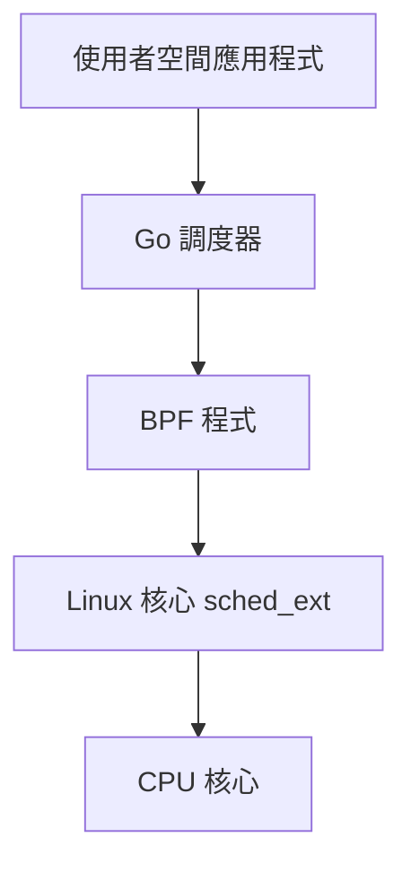

# Gthulhu & SCX GoLand Core

歡迎來到 Gthulhu 和 SCX GoLand Core 的官方文檔！

## 專案概述

**Gthulhu** 和 **SCX GoLand Core** 是基於 Linux Scheduler Extension (sched_ext) 技術的高效能調度器解決方案，專為雲原生環境和低延遲應用程式最佳化而設計。

{: style="width:300px"}

## 主要特色

=== "🚀 高效能調度"
    - **虛擬執行時間 (vruntime) 調度**: 基於公平調度原理，確保資源合理分配
    - **動態時間片調整**: 根據工作負載特性自動調整執行時間
    - **CPU 拓撲感知**: 智慧考慮 CPU 架構進行任務分配

=== "⚡ 低延遲最佳化"
    - **延遲敏感任務優先**: 自動識別並優先處理互動式工作負載
    - **自願上下文切換最佳化**: 根據任務行為提供優先級提升
    - **自動閒置 CPU 選擇**: 智慧分配任務到最適合的 CPU 核心

=== "🎯 應用場景"
    - **互動式應用程式**: 桌面環境、GUI 應用程式
    - **遊戲**: 提供流暢的遊戲體驗
    - **影音會議**: 確保視訊通話品質
    - **即時串流**: 減少延遲，提升串流品質

## DEMO

點擊下方連結觀看我們在 YouTube 上的 DEMO！

[{ width="200" }](https://www.youtube.com/watch?v=MfU64idQcHg)

## 架構設計

這套調度器系統採用雙組件架構：

1. **BPF 組件**: 實作低階 sched-ext 功能，在核心空間運行
2. **使用者空間調度器**: 使用 Go 語言開發，實作實際的調度策略



## 開始使用

!!! tip "快速開始"
    如果您是第一次使用，建議先查看 [安裝指南](installation.md) 來設定您的環境。

### 系統需求

- **Linux 核心**: 6.12+ (需支援 sched_ext)
- **Go**: 1.22+
- **LLVM/Clang**: 17+
- **libbpf**: 最新版本

### 快速安裝

```bash
# 克隆專案
git clone https://github.com/Gthulhu/Gthulhu.git
cd Gthulhu

# 設定相依套件
make dep
git submodule init && git submodule sync && git submodule update

# 建置專案
make build

# 執行調度器
sudo ./main
```

## 專案狀態

!!! warning "開發中"
    目前專案仍在積極開發中，**不建議在生產環境中使用**。

## 開源授權

本專案採用 **GNU General Public License version 2** 授權。

## 社群與支援

- **GitHub**: [Gthulhu](https://github.com/Gthulhu/Gthulhu) | [SCX GoLand Core](https://github.com/Gthulhu/scx_goland_core)
- **問題回報**: 請在 GitHub Issues 中回報問題
- **功能請求**: 歡迎提交 Pull Request 或開啟 Issue 討論
- **媒體報導**: 查看 [媒體報導與提及](mentioned.md) 了解專案的影響力

---

## 下一步

- 📖 查看 [工作原理](how-it-works.md) 了解技術細節
- 🎯 閱讀 [專案目標](project-goals.md) 了解發展方向
- 📜 瀏覽 [開發歷程](development-history.md) 了解技術挑戰與解決方案
- 🛠️ 參考 [API 文檔](api-reference.md) 進行開發
