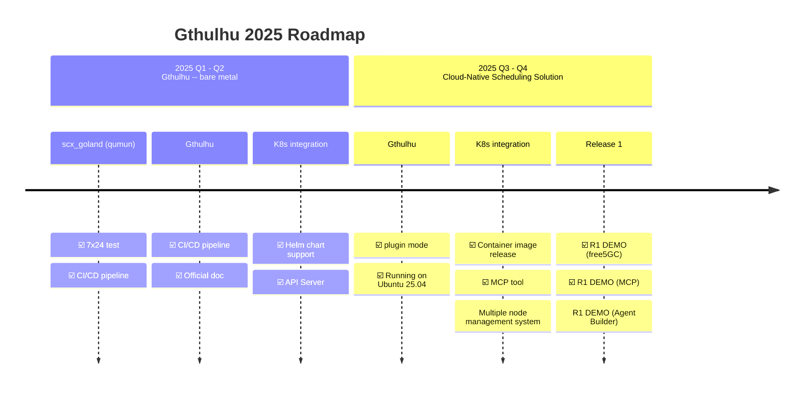

<a href="https://landscape.cncf.io/?item=provisioning--automation-configuration--gthulhu" target="_blank"></a>

[](https://insights.linuxfoundation.org/project/gthulhu)


歡迎來到 Gthulhu 的官方網站，本網站詳細介紹了 Gthulhu 這款基於 Linux Scheduler Extension (sched_ext) 框架，專為優化雲原生工作負載而設計的先進 Linux 調度器。

## 📰 Latest News

!!! success "Gthulhu 加入 CNCF Landscape"
    Gthulhu 現已成為 [CNCF (Cloud Native Computing Foundation) Landscape](https://landscape.cncf.io/?item=provisioning--automation-configuration--gthulhu) 的一部分，加入雲原生技術生態系統。

!!! success "Gthulhu 加入 eBPF Application Landscape"
    Gthulhu 已被納入 [eBPF Application Landscape](https://ebpf.io/applications/)，被認可為創新的基於 eBPF 的調度解決方案。

## 概覽

Gthulhu 旨在為雲端原生生態系統提供可編排的分散式調度器解決方案，以滿足雲端原生應用程式動態且多樣化的需求，例如：
- 需要低延遲處理能力的交易系統
- 大數據分析需要高吞吐量的運算資源
- 需要靈活資源分配的機器學習任務

預設的Linux核心調度器強調公平性，無法針對不同應用程式的特定需求進行最佳化。此外，當這些應用程式運行在分散式架構中時，傳統的調度器往往無法有效地協調和分配資源，導致效能瓶頸和資源浪費。

### 架構說明

為了讓使用者能夠輕鬆地將其意圖轉化為排程策略，Gthulhu 提供了一個直觀的介面，允許使用者使用機器可讀的語言（如 JSON）或透過 AI 代理與 MCP 進行溝通。在這些介面的背後，有幾個關鍵組件協同工作：

#### 1\. Gthulhu API Server (Manager Mode)

Manager 接受使用者的策略請求，並將其轉換為具體的排程意圖。
```bash
$ curl -X POST http://localhost:8080/api/v1/strategies \
  -H "Content-Type: application/json" \
  -H "Authorization: Bearer <TOKEN>" \
  -d '{            
    "strategyNamespace": "default",
    "labelSelectors": [
      {"key": "app.kubernetes.io/name", "value": "prometheus"}
    ],
    "k8sNamespace": ["default"],
    "priority": 10,
    "executionTime": 20000000
  }'
```
上方的範例展示了如何使用 curl 命令向 Gthulhu API Server 發送一個排程策略請求，Manger 收到該請求後會嘗試從 Kubernetes 叢集中選取符合標籤選擇器的 Pod，並根據指定的優先級和執行時間來調整這些 Pod 的排程策略。

#### 2\. Gthulhu API Server (Decision Maker Mode)

Decision Maker 會以 sidecar 的形式與叢集中每個節點上的 Gthulhu Scheduler 共存，根據 Manager 發送的的排程意圖尋找出目標 Process(es)。

#### 3\. Gthulhu Scheduler

Kubernetes 叢集中的每個節點都運行著 Gthulhu Scheduler，它負責監控系統資源使用情況，並且定時從 Decision Maker 獲取排程決策。根據這些決策，Gthulhu Scheduler 會調整目標 Process(es) 的 CPU 時間與優先度。

Gthulhu Scheduler 可再細分為兩個部分：
- **Gthulhu Agent**：負責與 Linux Kernel 的 sched_ext 框架進行互動，並應用排程決策。
- **Qumun Framework**：提供底層的 eBPF 程式碼和相關工具，確保 Gthulhu Agent 能夠高效地與 Linux 核心進行溝通。

下方的圖示展示了 Gthulhu 的整體架構：

```
┌─────────────────────────────────────────────────────────────────────────────────┐
│                              Gthulhu Architecture                               │
├─────────────────────────────────────────────────────────────────────────────────┤
│                                                                                 │
│   ┌─────────────┐         ┌─────────────────────┐         ┌─────────────────┐   │
│   │    User     │ ──────▶ │      Manager        │ ──────▶ │    MongoDB      │   │
│   │  (Web UI)   │         │ (Central Management)│         │  (Persistence)  │   │
│   └─────────────┘         └──────────┬──────────┘         └─────────────────┘   │
│                                      │                                          │
│                                      │                                          │
│              ┌───────────────────────┼───────────────────────┐                  │
│              │                       │                       │                  │
│              ▼                       ▼                       ▼                  │
│   ┌─────────────────┐     ┌─────────────────┐     ┌─────────────────┐           │
│   │ Gthulhu Agent & │     │ Gthulhu Agent & │     │ Gthulhu Agent & │           │
│   │ Decision Maker  │     │ Decision Maker  │ ... │ Decision Maker  │           │
│   │   (Node 1)      │     │   (Node 2)      │     │   (Node N)      │           │
│   └────────┬────────┘     └────────┬────────┘     └────────┬────────┘           │
│            │                       │                       │                    │
│            ▼                       ▼                       ▼                    │
│   ┌─────────────────┐     ┌─────────────────┐     ┌─────────────────┐           │
│   │  sched_ext      │     │  sched_ext      │     │  sched_ext      │           │
│   │ (eBPF Scheduler)│     │ (eBPF Scheduler)│     │ (eBPF Scheduler)│           │
│   └─────────────────┘     └─────────────────┘     └─────────────────┘           │
│                                                                                 │
└─────────────────────────────────────────────────────────────────────────────────┘
```

了解 Gthulhu 的整體架構後，我們可以更清楚地看到各個組件如何協同工作，以實現高效的雲原生工作負載調度。

## DEMO

點擊下方連結觀看我們在 YouTube 上的 DEMO！

<iframe width="560" height="315" src="https://www.youtube.com/embed/MfU64idQcHg?si=HAdQLQU1NaoQEbkf" title="YouTube video player" frameborder="0" allow="accelerometer; autoplay; clipboard-write; encrypted-media; gyroscope; picture-in-picture; web-share" referrerpolicy="strict-origin-when-cross-origin" allowfullscreen></iframe>

<iframe width="560" height="315" src="https://www.youtube.com/embed/p7cPlWHQrDY?si=WmI7TXsxTixD3E2C" title="YouTube video player" frameborder="0" allow="accelerometer; autoplay; clipboard-write; encrypted-media; gyroscope; picture-in-picture; web-share" referrerpolicy="strict-origin-when-cross-origin" allowfullscreen></iframe>

## 產品路線圖



## 開源授權

本專案採用 **Apache License 2.0** 授權。

## 社群與支援

- **GitHub**: [Gthulhu](https://github.com/Gthulhu/Gthulhu) | [Qumun](https://github.com/Gthulhu/scx_goland_core)
- **問題回報**: 請在 GitHub Issues 中回報問題
- **功能請求**: 歡迎提交 Pull Request 或開啟 Issue 討論
- **媒體報導**: 查看 [媒體報導與提及](mentioned.md) 了解專案的影響力

---

## 下一步

- 📖 查看 [工作原理](how-it-works.md) 了解技術細節
- 🎯 閱讀 [專案目標](project-goals.md) 了解發展方向
- 📜 瀏覽 [開發歷程](development-history.md) 了解技術挑戰與解決方案
- 🛠️ 參考 [API 文檔](api-reference.md) 進行開發
