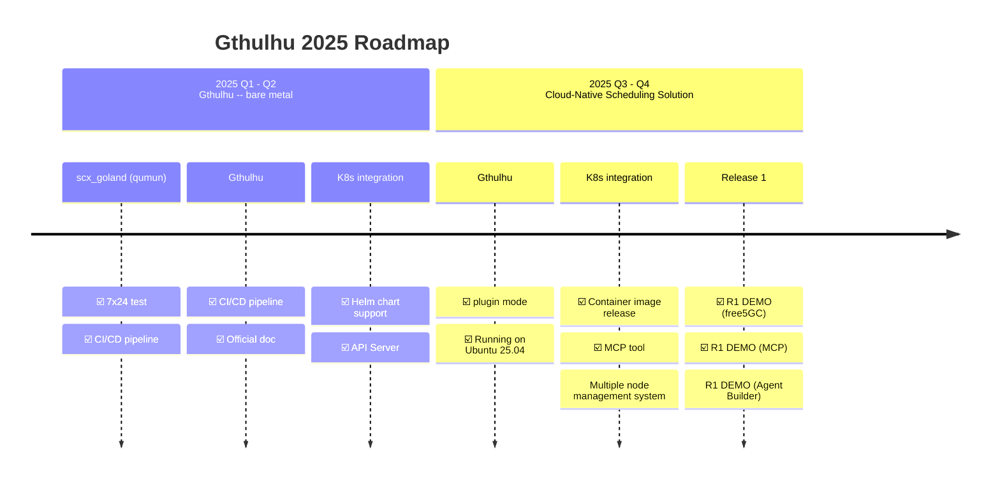
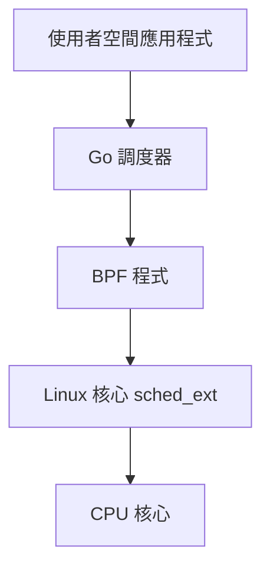

歡迎來到 Gthulhu 和 SCX GoLand Core 的官方文檔！

## 📰 Latest News

!!! success "Gthulhu 加入 CNCF Landscape"
    Gthulhu 現已成為 [CNCF (Cloud Native Computing Foundation) Landscape](https://landscape.cncf.io/?item=provisioning--automation-configuration--gthulhu) 的一部分，加入雲原生技術生態系統。

!!! success "Gthulhu 加入 eBPF Application Landscape"
    Gthulhu 已被納入 [eBPF Application Landscape](https://ebpf.io/applications/)，被認可為創新的基於 eBPF 的調度解決方案。

## 概覽
Gthulhu 是為雲原生生態打造的下一代調度器，以 Go 語言開發，並由 qumun 框架驅動。

名稱 Gthulhu 靈感來自神話生物克蘇魯（Cthulhu），其多條觸手象徵掌舵與掌控。正如觸手可抓握與引導，Gthulhu 代表在現代分散式系統的複雜世界裡掌舵前行的能力——就像 Kubernetes 以船舵作為其徽章一樣。

字首「G」源自本專案的核心語言 Go，突顯其技術基礎與對開發者友善的設計。

在底層，Gthulhu 運行於 qumun 框架之上（qumun 在台灣原住民族布農語中意為「心臟」），呼應調度器作為作業系統「心臟」的角色。這不僅強調其在協調工作負載上的核心地位，也向全球開源社群分享一部分台灣原住民族文化。

## 靈感來源
本專案受 Andrea Righi 的演講「Crafting a Linux kernel scheduler in Rust」啟發。於是我花時間重寫 scx_rustland，命名為 qumun（scx_goland）。在完成基礎設施架構後，我重新定義了專案使命，讓 Gthulhu 成為面向雲原生工作負載的通用調度解決方案。

## 功能與價值
Gthulhu 簡化了從使用者意圖到調度策略的轉換。使用者可以使用機器友善的格式（例如 JSON），或透過具備 MCP 的 AI 代理與 Gthulhu 溝通，之後 Gthulhu 會根據您的輸入為特定工作負載進行最佳化。

## DEMO

點擊下方連結觀看我們在 YouTube 上的 DEMO！

<iframe width="560" height="315" src="https://www.youtube.com/embed/p7cPlWHQrDY?si=WmI7TXsxTixD3E2C" title="YouTube video player" frameborder="0" allow="accelerometer; autoplay; clipboard-write; encrypted-media; gyroscope; picture-in-picture; web-share" referrerpolicy="strict-origin-when-cross-origin" allowfullscreen></iframe>

## Product Roadmap

## 架構設計

這套調度器系統採用雙組件架構：

1. **BPF 組件**: 實作低階 sched-ext 功能，在核心空間運行
2. **使用者空間調度器**: 使用 Go 語言開發，實作實際的調度策略

## 開源授權

本專案採用 **GNU General Public License version 2** 授權。

## 社群與支援

- **GitHub**: [Gthulhu](https://github.com/Gthulhu/Gthulhu) | [SCX GoLand Core](https://github.com/Gthulhu/scx_goland_core)
- **問題回報**: 請在 GitHub Issues 中回報問題
- **功能請求**: 歡迎提交 Pull Request 或開啟 Issue 討論
- **媒體報導**: 查看 [媒體報導與提及](mentioned.md) 了解專案的影響力

---

## 下一步

- 📖 查看 [工作原理](how-it-works.md) 了解技術細節
- 🎯 閱讀 [專案目標](project-goals.md) 了解發展方向
- 📜 瀏覽 [開發歷程](development-history.md) 了解技術挑戰與解決方案
- 🛠️ 參考 [API 文檔](api-reference.md) 進行開發
