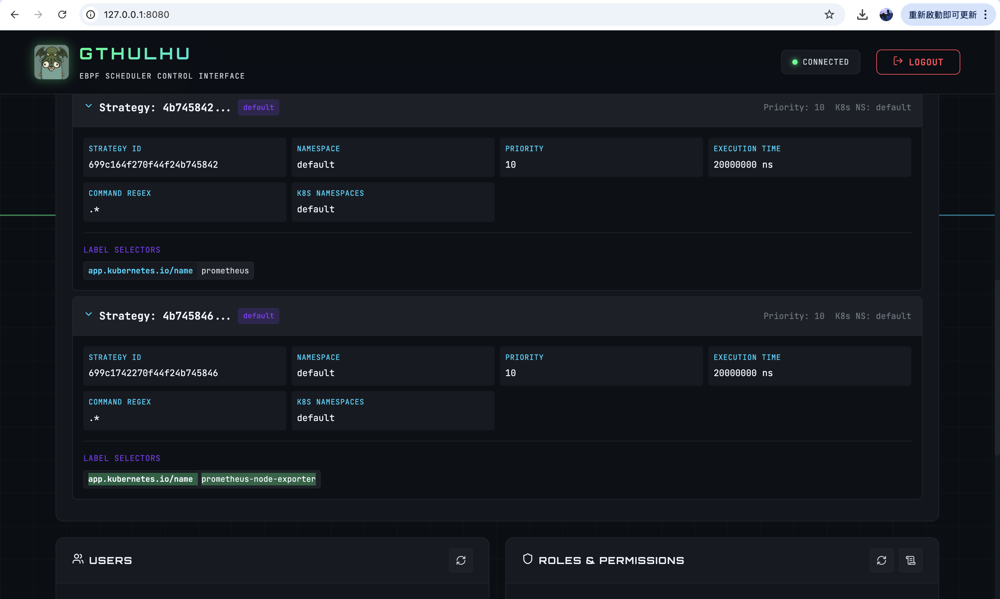
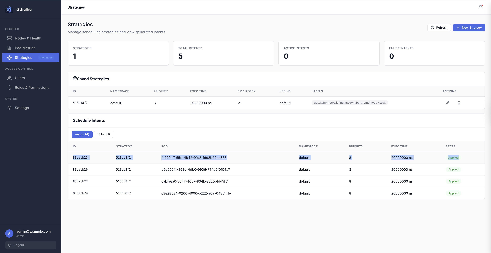
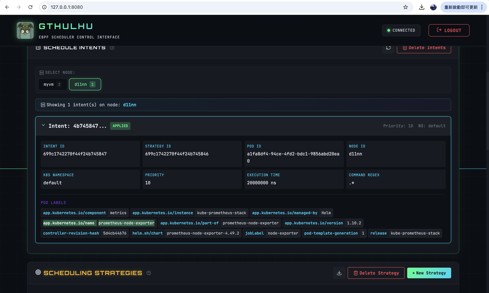

# Managing Multi-Node Policies with Gthulhu


Following the content from "Configuring Scheduling Policies via Web GUI", this section will introduce how to use Gthulhu to manage scheduling policies across multiple nodes.
In fact, Gthulhu was designed from the beginning to manage scheduling policies across multiple nodes. When configuring a Policy, Gthulhu automatically synchronizes the configuration to all nodes.

The verification environment for this section is a Kubernetes cluster with two nodes: myvm and d11nn.

```
$ kubectl get po --selector app.kubernetes.io/name=prometheus-node-exporter -o wide
NAME                                                   READY   STATUS    RESTARTS   AGE   IP           NODE    NOMINATED NODE   READINESS GATES
kube-prometheus-stack-prometheus-node-exporter-fdc7l   1/1     Running   1          44h   172.16.0.4   myvm    <none>           <none>
kube-prometheus-stack-prometheus-node-exporter-k8gg4   1/1     Running   0          50m   172.16.0.5   d11nn   <none>           <none>
```

From the output above, we can see that Prometheus Node Exporter has been deployed on both nodes: myvm and d11nn.

Next, we configure the scheduling policies through the Web GUI and verify that the scheduling policies have been synchronized on both nodes:



As we can observe, the scheduling policies on both nodes have indeed been synchronized, which demonstrates that Gthulhu successfully synchronized the configuration to all nodes:



