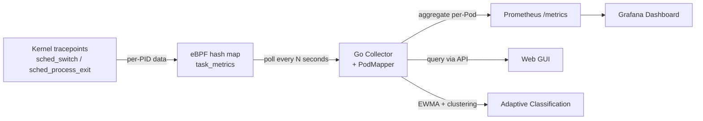

# Pod-Level Scheduling Metrics


Gthulhu provides **pod-level scheduling metrics** powered by eBPF, allowing you to observe low-level kernel scheduling behavior for each Pod in your cluster — without modifying application code.

## Overview

The metrics collection pipeline works as follows:



1. **eBPF tracepoints** (`tp_btf/sched_switch`, `tp_btf/sched_process_exit`) capture per-PID scheduling events in the kernel.
2. **Go Collector** periodically reads the BPF hash map and maps PIDs to Pods using `/proc/<pid>/cgroup`.
3. Per-PID metrics are **aggregated into per-Pod** metrics and exposed via Prometheus and the REST API.

## Available Metrics

| Metric | Description |
|--------|-------------|
| Voluntary Context Switches | Times the task voluntarily yielded the CPU (e.g., I/O wait) |
| Involuntary Context Switches | Times the task was preempted by the scheduler |
| CPU Time (ns) | Total CPU execution time in nanoseconds |
| Wait Time (ns) | Time spent waiting in the run queue |
| Run Count | Number of times the task was scheduled to run |
| CPU Migrations | Number of times the task migrated between CPU cores |

Prometheus metric names use the `gthulhu_pod_` prefix, for example:

- `gthulhu_pod_voluntary_ctx_switches_total`
- `gthulhu_pod_involuntary_ctx_switches_total`
- `gthulhu_pod_cpu_time_nanoseconds_total`
- `gthulhu_pod_wait_time_nanoseconds_total`
- `gthulhu_pod_run_count_total`
- `gthulhu_pod_cpu_migrations_total`
- `gthulhu_pod_process_count`

All metrics carry labels: `pod_name`, `pod_uid`, `namespace`, `node_name`.

## Configuring Metrics Collection

You can create metrics collection configurations using either the **Web GUI** or the **PodSchedulingMetrics CRD**.

### Option A: Web GUI


1. Log in to the Gthulhu Web GUI (see [Configuring the scheduling policies](gui.md) for access instructions).
2. Navigate to **Pod Metrics** in the sidebar.
3. Click **New Config** to open the configuration panel.

Fill in the following fields:

| Field | Description |
|-------|-------------|
| **Label Selectors** | Key-value pairs to match target Pods (at least one required). For example, `app=nginx`. |
| **K8s Namespaces** | Comma-separated list of namespaces to scope the collection. Leave empty for all namespaces. |
| **Command Regex** | Regular expression to filter processes inside matched Pods. For example, `nginx\|worker`. |
| **Collection Interval (s)** | How often metrics are aggregated and exported (default: 10 seconds). |
| **Enabled** | Toggle to enable or disable this configuration. |
| **Metrics to Collect** | Checkboxes to select which metrics to collect. By default, Voluntary Ctx Switches, Involuntary Ctx Switches, and CPU Time are enabled. |

After saving, the configuration takes effect immediately — the eBPF collector on each node will begin tracking the matching Pods' processes.

### Option B: PodSchedulingMetrics CRD

If you prefer declarative configuration, apply a `PodSchedulingMetrics` custom resource:

```yaml
apiVersion: gthulhu.io/v1alpha1
kind: PodSchedulingMetrics
metadata:
  name: monitor-upf
  namespace: default
spec:
  labelSelectors:
    - key: app
      value: upf
  k8sNamespaces:
    - free5gc
  commandRegex: ".*"
  collectionIntervalSeconds: 10
  enabled: true
  metrics:
    voluntaryCtxSwitches: true
    involuntaryCtxSwitches: true
    cpuTimeNs: true
    waitTimeNs: false
    runCount: false
    cpuMigrations: false
```

Apply it with:

```bash
kubectl apply -f pod-scheduling-metrics.yaml
```

The CRD Watcher on each node detects the resource and dynamically updates the eBPF monitoring scope.

## Viewing Runtime Metrics

### Web GUI


On the **Pod Metrics** page, the **Latest Collected Metrics** table displays real-time data:

| Column | Description |
|--------|-------------|
| NAMESPACE | Pod namespace |
| POD | Pod name |
| NODE | Node where the Pod is running |
| VOL CTX SW | Voluntary context switches |
| INVOL CTX SW | Involuntary context switches |
| CPU TIME | CPU execution time (nanoseconds) |
| WAIT TIME | Run-queue wait time (nanoseconds) |
| RUN COUNT | Number of scheduling events |
| CPU MIGR | CPU migration count |

Click **Refresh** at any time to fetch the latest data.

### REST API

You can also query runtime metrics programmatically:

```bash
# List all metrics configurations
curl -H "Authorization: Bearer $TOKEN" \
  http://localhost:8080/api/v1/pod-scheduling-metrics

# Get latest collected runtime metrics
curl -H "Authorization: Bearer $TOKEN" \
  http://localhost:8080/api/v1/pod-scheduling-metrics/runtime
```

The runtime endpoint returns a JSON response like:

```json
{
  "success": true,
  "data": {
    "items": [
      {
        "namespace": "free5gc",
        "podName": "upf-pod-abc123",
        "nodeID": "worker-1",
        "voluntaryCtxSwitches": 15234,
        "involuntaryCtxSwitches": 892,
        "cpuTimeNs": 4820000000,
        "waitTimeNs": 120000000,
        "runCount": 16126,
        "cpuMigrations": 47
      }
    ],
    "warnings": []
  }
}
```

### Prometheus & Grafana

The metrics are exported on the monitor's Prometheus endpoint (default port `9090`). You can:

1. Add the Gthulhu monitor as a **Prometheus scrape target**.
2. Use **Grafana** to build dashboards visualizing scheduling behavior across Pods.

Example PromQL queries:

```promql
# Voluntary context switches rate per Pod
rate(gthulhu_pod_voluntary_ctx_switches_total[5m])

# CPU time per Pod in the last hour
increase(gthulhu_pod_cpu_time_nanoseconds_total[1h])

# Top 10 Pods by involuntary context switches
topk(10, rate(gthulhu_pod_involuntary_ctx_switches_total[5m]))
```

## Adaptive Classification

**Adaptive Classification** automatically identifies workload patterns and potential scheduling bottlenecks from each Pod's short-term and long-term scheduling behavior. It builds EWMA (exponentially weighted moving average) profiles from collected pod-level metrics, then uses adaptive clustering to label Pods with inferred workload types. This helps you decide whether to adjust CPU resources, priority, or NUMA placement.

On the **Pod Metrics** page, the **Adaptive Classification** table can be filtered by:

| Filter | Description |
|--------|-------------|
| namespace | Show only Pods in the specified Kubernetes namespace. |
| phase | Filter by classifier lifecycle phase, such as `stable` or `drifting`. |
| type | Filter by inferred workload type, such as `cpu_heavy`. |

The table columns are:

| Column | Description |
|--------|-------------|
| NAMESPACE | Kubernetes namespace where the Pod runs. |
| POD | Pod name. |
| PHASE | Current lifecycle phase of the classifier. |
| CURRENT TYPE | Workload labels inferred by the model. A Pod may have multiple labels. |
| CONFIDENCE | How closely the Pod's short-term EWMA profile matches its assigned cluster center (0–100%). |
| DRIFT | Offset score between the short-term and long-term EWMA profiles, used to detect behavior changes. |
| ACTION | Scheduling adjustment recommendation generated from the classification result. |
| DETAIL | Opens a side panel with classification details for the Pod. |

### Classifier Phases

| Phase | Description |
|-------|-------------|
| `cold_start` | Insufficient samples (fewer than 10), so no stable classification is produced yet. |
| `warming_up` | Initial samples have been collected (about 10–30), and preliminary clustering is being built. |
| `stable` | The model has converged, and classification results can be used as the primary signal. |
| `drifting` | A workload behavior shift has been detected, and the system is observing whether it persists. |
| `transitioning` | Drift has been confirmed, and the model is re-clustering or updating the classification. |

### Workload Types

| Type | Basis |
|------|-------|
| `cpu_heavy` | High CPU time per scheduling run, likely a CPU-intensive workload. |
| `interactive` | High voluntary context switch ratio, common in interactive or I/O-wait-heavy workloads. |
| `needs_higher_priority` | High involuntary preemption, possibly caused by scheduling contention or insufficient priority. |
| `cache_unfriendly` | Frequent cross-L3 cache migrations, which may reduce cache locality. |
| `numa_unfriendly` | Frequent cross-NUMA-node migrations, which may increase memory access latency. |
| `scheduling_latency` | High wait time relative to run count, indicating more visible scheduling latency. |
| `balanced` | No dominant bottleneck signature; overall behavior is relatively balanced. |

### Drift and Recommended Actions

The drift score is the average deviation between short-term and long-term EWMA profiles, normalized by long-term variance. A score above `1.5` enters the `drifting` state; if the high offset continues for 3 consecutive periods, the classifier confirms `transitioning`, meaning the workload type may have changed.

| Recommended Action | Description |
|--------------------|-------------|
| `increase_cpu_limit` | The Pod may be CPU-limited or CPU-starved; check CPU requests and limits. |
| `pin_to_numa_node` | NUMA migration rate is high; evaluate NUMA binding or topology-aware placement. |
| `raise_priority` | Involuntary preemption pressure is high; check priority and resource contention. |
| `keep_current` / `no_action` | The Pod is stable or has no obvious bottleneck, so the current configuration can be kept. |

## Prerequisites

| Component | Requirement |
|-----------|-------------|
| Linux Kernel | 5.2+ with BTF enabled (no sched_ext required for metrics-only mode) |
| Gthulhu Monitor | Deployed as a DaemonSet on each node |
| Prometheus | For metric storage and querying |
| Grafana | (Optional) For visualization |
