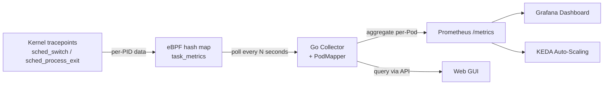
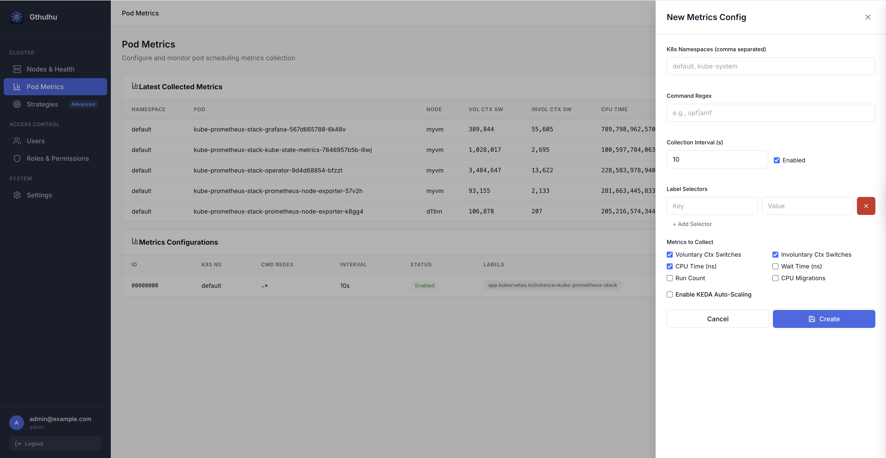
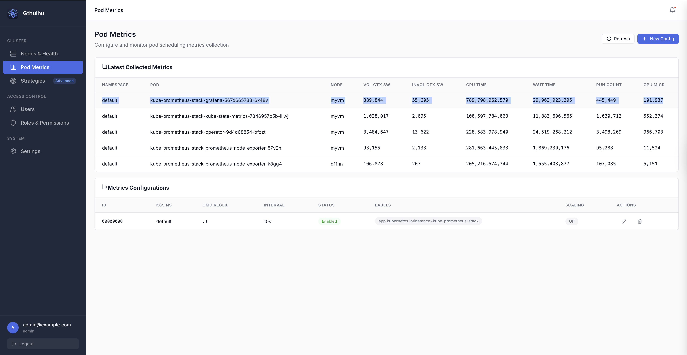

# Pod-Level Scheduling Metrics


Gthulhu provides **pod-level scheduling metrics** powered by eBPF, allowing you to observe low-level kernel scheduling behavior for each Pod in your cluster — without modifying application code.

## Overview

The metrics collection pipeline works as follows:



1. **eBPF tracepoints** (`tp_btf/sched_switch`, `tp_btf/sched_process_exit`) capture per-PID scheduling events in the kernel.
2. **Go Collector** periodically reads the BPF hash map and maps PIDs to Pods using `/proc/<pid>/cgroup`.
3. Per-PID metrics are **aggregated into per-Pod** metrics and exposed via Prometheus and the REST API.

## Available Metrics

| Metric | Description |
|--------|-------------|
| Voluntary Context Switches | Times the task voluntarily yielded the CPU (e.g., I/O wait) |
| Involuntary Context Switches | Times the task was preempted by the scheduler |
| CPU Time (ns) | Total CPU execution time in nanoseconds |
| Wait Time (ns) | Time spent waiting in the run queue |
| Run Count | Number of times the task was scheduled to run |
| CPU Migrations | Number of times the task migrated between CPU cores |

Prometheus metric names use the `gthulhu_pod_` prefix, for example:

- `gthulhu_pod_voluntary_ctx_switches_total`
- `gthulhu_pod_involuntary_ctx_switches_total`
- `gthulhu_pod_cpu_time_nanoseconds_total`
- `gthulhu_pod_wait_time_nanoseconds_total`
- `gthulhu_pod_run_count_total`
- `gthulhu_pod_cpu_migrations_total`
- `gthulhu_pod_process_count`

All metrics carry labels: `pod_name`, `pod_uid`, `namespace`, `node_name`.

## Configuring Metrics Collection

You can create metrics collection configurations using either the **Web GUI** or the **PodSchedulingMetrics CRD**.

### Option A: Web GUI



1. Log in to the Gthulhu Web GUI (see [Configuring the scheduling policies](gui.md) for access instructions).
2. Navigate to **Pod Metrics** in the sidebar.
3. Click **New Config** to open the configuration panel.

Fill in the following fields:

| Field | Description |
|-------|-------------|
| **Label Selectors** | Key-value pairs to match target Pods (at least one required). For example, `app=nginx`. |
| **K8s Namespaces** | Comma-separated list of namespaces to scope the collection. Leave empty for all namespaces. |
| **Command Regex** | Regular expression to filter processes inside matched Pods. For example, `nginx\|worker`. |
| **Collection Interval (s)** | How often metrics are aggregated and exported (default: 10 seconds). |
| **Enabled** | Toggle to enable or disable this configuration. |
| **Metrics to Collect** | Checkboxes to select which metrics to collect. By default, Voluntary Ctx Switches, Involuntary Ctx Switches, and CPU Time are enabled. |

After saving, the configuration takes effect immediately — the eBPF collector on each node will begin tracking the matching Pods' processes.

### Option B: PodSchedulingMetrics CRD

If you prefer declarative configuration, apply a `PodSchedulingMetrics` custom resource:

```yaml
apiVersion: gthulhu.io/v1alpha1
kind: PodSchedulingMetrics
metadata:
  name: monitor-upf
  namespace: default
spec:
  labelSelectors:
    - key: app
      value: upf
  k8sNamespaces:
    - free5gc
  commandRegex: ".*"
  collectionIntervalSeconds: 10
  enabled: true
  metrics:
    voluntaryCtxSwitches: true
    involuntaryCtxSwitches: true
    cpuTimeNs: true
    waitTimeNs: false
    runCount: false
    cpuMigrations: false
```

Apply it with:

```bash
kubectl apply -f pod-scheduling-metrics.yaml
```

The CRD Watcher on each node detects the resource and dynamically updates the eBPF monitoring scope.

## Viewing Runtime Metrics

### Web GUI



On the **Pod Metrics** page, the **Latest Collected Metrics** table displays real-time data:

| Column | Description |
|--------|-------------|
| NAMESPACE | Pod namespace |
| POD | Pod name |
| NODE | Node where the Pod is running |
| VOL CTX SW | Voluntary context switches |
| INVOL CTX SW | Involuntary context switches |
| CPU TIME | CPU execution time (nanoseconds) |
| WAIT TIME | Run-queue wait time (nanoseconds) |
| RUN COUNT | Number of scheduling events |
| CPU MIGR | CPU migration count |

Click **Refresh** at any time to fetch the latest data.

### REST API

You can also query runtime metrics programmatically:

```bash
# List all metrics configurations
curl -H "Authorization: Bearer $TOKEN" \
  http://localhost:8080/api/v1/pod-scheduling-metrics

# Get latest collected runtime metrics
curl -H "Authorization: Bearer $TOKEN" \
  http://localhost:8080/api/v1/pod-scheduling-metrics/runtime
```

The runtime endpoint returns a JSON response like:

```json
{
  "success": true,
  "data": {
    "items": [
      {
        "namespace": "free5gc",
        "podName": "upf-pod-abc123",
        "nodeID": "worker-1",
        "voluntaryCtxSwitches": 15234,
        "involuntaryCtxSwitches": 892,
        "cpuTimeNs": 4820000000,
        "waitTimeNs": 120000000,
        "runCount": 16126,
        "cpuMigrations": 47
      }
    ],
    "warnings": []
  }
}
```

### Prometheus & Grafana

The metrics are exported on the monitor's Prometheus endpoint (default port `9090`). You can:

1. Add the Gthulhu monitor as a **Prometheus scrape target**.
2. Use **Grafana** to build dashboards visualizing scheduling behavior across Pods.

Example PromQL queries:

```promql
# Voluntary context switches rate per Pod
rate(gthulhu_pod_voluntary_ctx_switches_total[5m])

# CPU time per Pod in the last hour
increase(gthulhu_pod_cpu_time_nanoseconds_total[1h])

# Top 10 Pods by involuntary context switches
topk(10, rate(gthulhu_pod_involuntary_ctx_switches_total[5m]))
```

## KEDA Auto-Scaling Integration

Pod scheduling metrics can drive **KEDA-based auto-scaling**. When creating a metrics configuration (via GUI or CRD), enable the **Scaling** section:

| Field | Description |
|-------|-------------|
| **Metric Name** | The Prometheus metric to use as trigger (e.g., `gthulhu_pod_voluntary_ctx_switches_total`) |
| **Target Value** | Threshold value that triggers scaling |
| **Scale Target Name** | Name of the Deployment/StatefulSet to scale |
| **Scale Target Kind** | Resource kind (default: `Deployment`) |
| **Min Replicas** | Minimum replica count |
| **Max Replicas** | Maximum replica count |
| **Cooldown (s)** | Cooldown period between scaling events (default: 300s) |

Example CRD with scaling:

```yaml
apiVersion: gthulhu.io/v1alpha1
kind: PodSchedulingMetrics
metadata:
  name: scale-on-ctx-switches
  namespace: default
spec:
  labelSelectors:
    - key: app
      value: my-service
  collectionIntervalSeconds: 10
  enabled: true
  metrics:
    voluntaryCtxSwitches: true
  scaling:
    enabled: true
    metricName: gthulhu_pod_voluntary_ctx_switches_total
    targetValue: "1000"
    scaleTargetRef:
      apiVersion: apps/v1
      kind: Deployment
      name: my-service
    minReplicaCount: 2
    maxReplicaCount: 20
    cooldownPeriod: 300
```

The scaling path is: **eBPF → Prometheus → Prometheus Adapter → KEDA ScaledObject → HPA → Pod replicas**.

## Prerequisites

| Component | Requirement |
|-----------|-------------|
| Linux Kernel | 5.2+ with BTF enabled (no sched_ext required for metrics-only mode) |
| Gthulhu Monitor | Deployed as a DaemonSet on each node |
| Prometheus | For metric storage and querying |
| Grafana | (Optional) For visualization |
| KEDA | (Optional) For auto-scaling based on scheduling metrics |
