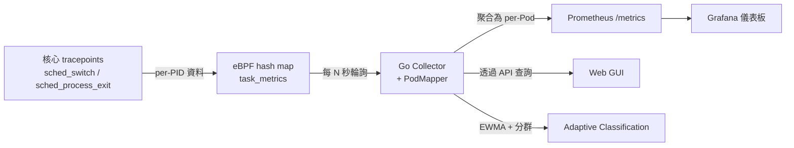

# Pod 層級的排程指標


Gthulhu 提供由 eBPF 驅動的 **Pod 層級排程指標**，讓您在不修改應用程式程式碼的情況下，觀察叢集中每個 Pod 的底層核心排程行為。

## 概述

指標收集管線運作方式如下：



1. **eBPF tracepoints**（`tp_btf/sched_switch`、`tp_btf/sched_process_exit`）在核心層捕捉每個 PID 的排程事件。
2. **Go Collector** 定期讀取 BPF hash map，並透過 `/proc/<pid>/cgroup` 將 PID 對映到 Pod。
3. 每個 PID 的指標**聚合為 Pod 層級指標**，並透過 Prometheus 和 REST API 公開。

## 可用指標

| 指標 | 說明 |
|------|------|
| 自願上下文切換（Voluntary Context Switches） | 任務主動讓出 CPU 的次數（例如 I/O 等待） |
| 非自願上下文切換（Involuntary Context Switches） | 任務被排程器搶佔的次數 |
| CPU 時間（ns） | 總 CPU 執行時間（奈秒） |
| 等待時間（ns） | 在執行佇列中等待的時間 |
| 執行次數（Run Count） | 任務被排程執行的次數 |
| CPU 遷移（CPU Migrations） | 任務在 CPU 核心之間遷移的次數 |

Prometheus 指標名稱使用 `gthulhu_pod_` 前綴，例如：

- `gthulhu_pod_voluntary_ctx_switches_total`
- `gthulhu_pod_involuntary_ctx_switches_total`
- `gthulhu_pod_cpu_time_nanoseconds_total`
- `gthulhu_pod_wait_time_nanoseconds_total`
- `gthulhu_pod_run_count_total`
- `gthulhu_pod_cpu_migrations_total`
- `gthulhu_pod_process_count`

所有指標帶有以下標籤：`pod_name`、`pod_uid`、`namespace`、`node_name`。

## 設定指標收集

您可以透過 **Web GUI** 或 **PodSchedulingMetrics CRD** 建立指標收集設定。

### 方式一：Web GUI


1. 登入 Gthulhu Web GUI（存取方式請參閱[設定排程策略](gui.zh.md)）。
2. 在側邊欄中點選 **Pod Metrics**。
3. 點擊 **New Config** 開啟設定面板。

填寫以下欄位：

| 欄位 | 說明 |
|------|------|
| **Label Selectors** | 用於匹配目標 Pod 的鍵值對（至少需要一組）。例如 `app=nginx`。 |
| **K8s Namespaces** | 以逗號分隔的命名空間列表，限制收集範圍。留空表示所有命名空間。 |
| **Command Regex** | 用於過濾匹配 Pod 內行程的正規表示式。例如 `nginx\|worker`。 |
| **Collection Interval (s)** | 指標聚合和匯出的頻率（預設：10 秒）。 |
| **Enabled** | 啟用或停用此設定的開關。 |
| **Metrics to Collect** | 勾選要收集的指標。預設啟用自願上下文切換、非自願上下文切換和 CPU 時間。 |

儲存後，設定立即生效——每個節點上的 eBPF 收集器將開始追蹤匹配 Pod 的行程。

### 方式二：PodSchedulingMetrics CRD

如果您偏好宣告式設定，可以套用 `PodSchedulingMetrics` 自訂資源：

```yaml
apiVersion: gthulhu.io/v1alpha1
kind: PodSchedulingMetrics
metadata:
  name: monitor-upf
  namespace: default
spec:
  labelSelectors:
    - key: app
      value: upf
  k8sNamespaces:
    - free5gc
  commandRegex: ".*"
  collectionIntervalSeconds: 10
  enabled: true
  metrics:
    voluntaryCtxSwitches: true
    involuntaryCtxSwitches: true
    cpuTimeNs: true
    waitTimeNs: false
    runCount: false
    cpuMigrations: false
```

使用以下指令套用：

```bash
kubectl apply -f pod-scheduling-metrics.yaml
```

每個節點上的 CRD Watcher 會偵測到該資源，並動態更新 eBPF 監控範圍。

## 檢視執行時期指標

### Web GUI


在 **Pod Metrics** 頁面，**Latest Collected Metrics** 表格會顯示即時資料：

| 欄位 | 說明 |
|------|------|
| NAMESPACE | Pod 命名空間 |
| POD | Pod 名稱 |
| NODE | Pod 所在的節點 |
| VOL CTX SW | 自願上下文切換 |
| INVOL CTX SW | 非自願上下文切換 |
| CPU TIME | CPU 執行時間（奈秒） |
| WAIT TIME | 執行佇列等待時間（奈秒） |
| RUN COUNT | 排程事件次數 |
| CPU MIGR | CPU 遷移次數 |

隨時點擊 **Refresh** 可取得最新資料。

### REST API

您也可以透過程式化方式查詢執行時期指標：

```bash
# 列出所有指標設定
curl -H "Authorization: Bearer $TOKEN" \
  http://localhost:8080/api/v1/pod-scheduling-metrics

# 取得最新收集的執行時期指標
curl -H "Authorization: Bearer $TOKEN" \
  http://localhost:8080/api/v1/pod-scheduling-metrics/runtime
```

執行時期端點回傳的 JSON 回應如下：

```json
{
  "success": true,
  "data": {
    "items": [
      {
        "namespace": "free5gc",
        "podName": "upf-pod-abc123",
        "nodeID": "worker-1",
        "voluntaryCtxSwitches": 15234,
        "involuntaryCtxSwitches": 892,
        "cpuTimeNs": 4820000000,
        "waitTimeNs": 120000000,
        "runCount": 16126,
        "cpuMigrations": 47
      }
    ],
    "warnings": []
  }
}
```

### Prometheus 與 Grafana

指標透過 monitor 的 Prometheus 端點匯出（預設埠號 `9090`）。您可以：

1. 將 Gthulhu monitor 新增為 **Prometheus 抓取目標**。
2. 使用 **Grafana** 建立儀表板，視覺化各 Pod 的排程行為。

範例 PromQL 查詢：

```promql
# 每個 Pod 的自願上下文切換速率
rate(gthulhu_pod_voluntary_ctx_switches_total[5m])

# 過去一小時每個 Pod 的 CPU 時間
increase(gthulhu_pod_cpu_time_nanoseconds_total[1h])

# 非自願上下文切換最多的前 10 個 Pod
topk(10, rate(gthulhu_pod_involuntary_ctx_switches_total[5m]))
```

## Adaptive Classification

**Adaptive Classification** 會根據 Pod 的短期與長期排程行為，自動辨識工作負載型態與可能的排程瓶頸。它使用收集到的 Pod 層級指標建立 EWMA（指數加權移動平均）輪廓，並透過自適應分群模型將 Pod 標記為不同類型，協助您判斷是否需要調整 CPU、優先權或 NUMA 配置。

在 **Pod Metrics** 頁面的 **Adaptive Classification** 表格中，您可以依以下條件篩選結果：

| 篩選器 | 說明 |
|--------|------|
| namespace | 僅顯示指定 Kubernetes 命名空間中的 Pod。 |
| phase | 依分類器生命週期階段篩選，例如 `stable` 或 `drifting`。 |
| type | 依推論出的工作負載類型篩選，例如 `cpu_heavy`。 |

表格欄位說明如下：

| 欄位 | 說明 |
|------|------|
| NAMESPACE | Pod 所在的 Kubernetes 命名空間。 |
| POD | Pod 名稱。 |
| PHASE | 分類器目前的生命週期階段。 |
| CURRENT TYPE | 模型推論出的工作負載標籤，可能同時有多個。 |
| CONFIDENCE | Pod 的短期 EWMA 輪廓與所屬分群中心的接近程度（0–100%）。 |
| DRIFT | 短期與長期 EWMA 輪廓的偏移分數，用於偵測行為變化。 |
| ACTION | 根據分類結果產生的排程調整建議。 |
| DETAIL | 開啟側邊面板檢視該 Pod 的分類細節。 |

### 分類器階段

| 階段 | 說明 |
|------|------|
| `cold_start` | 樣本不足（少於 10 筆），暫不產生穩定分類。 |
| `warming_up` | 已累積初步樣本（約 10–30 筆），正在建立初始分群。 |
| `stable` | 模型已收斂，分類結果可作為主要判斷依據。 |
| `drifting` | 偵測到工作負載行為偏移，系統正在觀察是否持續。 |
| `transitioning` | 行為偏移已確認，模型正在重新分群或更新分類。 |

### 工作負載類型

| 類型 | 判斷依據 |
|------|----------|
| `cpu_heavy` | 每次排程執行的 CPU 時間偏高，可能屬於 CPU 密集型工作負載。 |
| `interactive` | 自願上下文切換比例高，常見於互動式或 I/O 等待較多的工作負載。 |
| `needs_higher_priority` | 非自願搶佔偏高，可能受到排程競爭或優先權不足影響。 |
| `cache_unfriendly` | 跨 L3 快取遷移頻繁，可能造成快取區域性下降。 |
| `numa_unfriendly` | 跨 NUMA 節點遷移頻繁，可能造成記憶體存取延遲增加。 |
| `scheduling_latency` | 等待時間相對於執行次數偏高，代表排程延遲較明顯。 |
| `balanced` | 未呈現明顯瓶頸特徵，整體行為相對均衡。 |

### Drift 與建議動作

Drift 分數表示短期 EWMA 與長期 EWMA 的平均偏差，並以長期變異量標準化。當分數大於 `1.5` 時會進入 `drifting` 狀態；若連續 3 個週期維持高偏移，會確認為 `transitioning`，代表工作負載型態可能已改變。

| 建議動作 | 說明 |
|----------|------|
| `increase_cpu_limit` | Pod 可能受 CPU 限制或 CPU 飢餓影響，建議檢查 CPU request/limit。 |
| `pin_to_numa_node` | NUMA 遷移率偏高，建議評估 NUMA 綁定或拓撲感知配置。 |
| `raise_priority` | 非自願搶佔壓力偏高，建議檢查優先權與資源競爭情況。 |
| `keep_current` / `no_action` | Pod 行為穩定或無明顯瓶頸，可維持目前設定。 |

## 先決條件

| 元件 | 需求 |
|------|------|
| Linux 核心 | 5.2+ 且啟用 BTF（僅收集指標不需要 sched_ext） |
| Gthulhu Monitor | 以 DaemonSet 方式部署在每個節點上 |
| Prometheus | 用於指標儲存與查詢 |
| Grafana | （選用）用於視覺化 |
