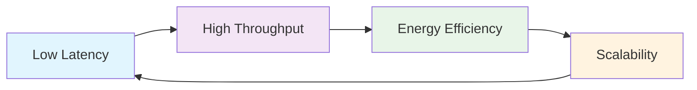
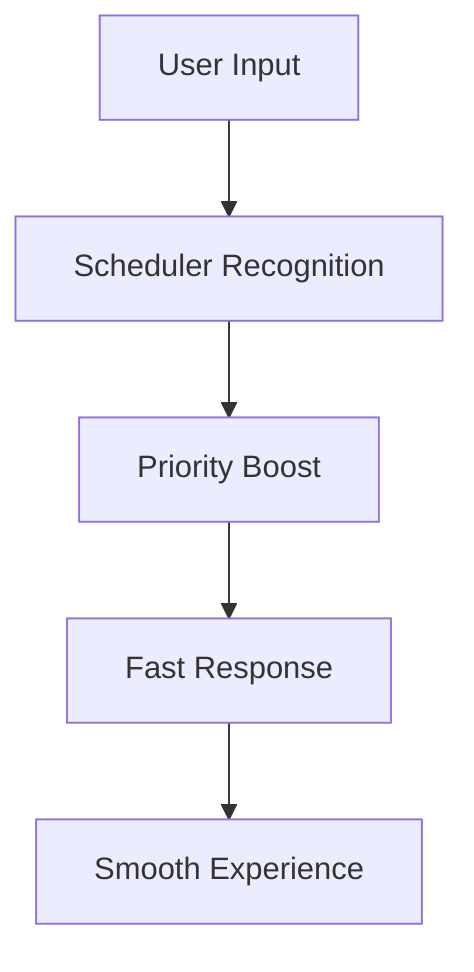
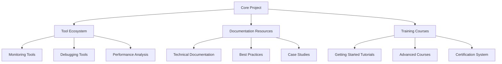

# Project Goals

This page introduces the design philosophy, development objectives, and future vision of the Gthulhu and SCX GoLand Core projects.

## Project Vision

### Core Mission

**Making Linux schedulers smarter, more efficient, and better adapted to modern application requirements**

With the proliferation of cloud-native applications, containerized deployments, and microservice architectures, traditional schedulers can no longer fully meet the diverse needs of modern workloads. The Gthulhu project is committed to:

- 🎯 **Providing Low-Latency Scheduling**: Better responsiveness for interactive applications and real-time systems
- 🚀 **Optimizing Cloud-Native Environments**: Designed specifically for containerized and microservice environments
- 🔧 **Supporting Extensible Architecture**: Enabling developers to easily customize scheduling policies
- 📊 **Data-Driven Approach**: Continuously optimizing scheduling decisions using actual runtime data

## Design Principles

### 1. Performance First



- **Microsecond-Level Scheduling Latency**: Target scheduling decision time at microsecond level
- **Minimize Context Switch Overhead**: Reduce unnecessary context switches through intelligent task allocation
- **Zero-Copy Data Transfer**: Avoid data copying whenever possible

### 2. Adaptive Design

```yaml
Design Features:
  Dynamic Adjustment: Automatically adjust scheduling parameters based on system load
  Learning Capability: Learn optimal scheduling patterns from historical data
  Environment Awareness: Automatically identify different application scenarios and workloads
  Flexible Configuration: Support runtime parameter adjustment without system restart
```

### 3. Developer Friendly

- **Clear API Design**: Provide concise and intuitive programming interfaces
- **Rich Debugging Tools**: Built-in detailed monitoring and debugging capabilities
- **Complete Documentation**: Comprehensive documentation from beginner to advanced
- **Active Community Support**: Build an open and friendly developer community

## Target Application Scenarios

### 🎮 Interactive Applications

**Goal**: Provide smooth user experience

- **Desktop Environments**: Ensure GUI application responsiveness
- **Gaming**: Reduce input latency, provide stable frame rates
- **Multimedia**: Optimize audio/video playback experience



### ☁️ Cloud-Native Environments

**Goal**: Optimize containerized workloads

- **Microservices**: Improve inter-service communication latency
- **Container Scheduling**: Increase container startup speed
- **Resource Utilization**: Maximize hardware resource efficiency

```yaml
Cloud-Native Optimization:
  Container Awareness: Understanding container boundaries and resource limits
  Service Discovery: Optimize inter-service network communication
  Elastic Scaling: Support dynamic resource allocation
  Multi-Tenancy: Ensure fairness and isolation between tenants
```

### 🔬 High-Performance Computing

**Goal**: Provide maximum computational throughput

- **Scientific Computing**: Optimize CPU-intensive tasks
- **Data Analytics**: Improve big data processing efficiency
- **Machine Learning**: Accelerate AI/ML workloads

## Technical Objectives

### Short-Term Goals (6-12 months)

1. **Stability Improvements**
   - [ ] Complete basic functionality testing
   - [ ] Fix known stability issues
   - [ ] Establish automated testing pipeline

2. **Performance Optimization**
   - [ ] Reduce scheduling latency to < 10μs
   - [ ] Reduce context switch overhead by 20%
   - [ ] Optimize memory usage

3. **Feature Completion**
   - [ ] Complete CPU topology support
   - [ ] NUMA-aware scheduling
   - [ ] Real-time task support

### Medium-Term Goals (1-2 years)

1. **Intelligent Scheduling**
   - [ ] Machine learning assisted decision making
   - [ ] Predictive task allocation
   - [ ] Self-adaptive parameter adjustment

2. **Ecosystem Integration**
   - [ ] Native Kubernetes support
   - [ ] Deep Docker integration
   - [ ] Inclusion in major distributions

3. **Monitoring and Observability**
   - [ ] Detailed performance metrics
   - [ ] Visual monitoring dashboard
   - [ ] Problem diagnosis tools

### Long-Term Goals (2-5 years)

1. **Industry Adoption**
   - [ ] Enterprise product integration
   - [ ] Cloud service provider adoption
   - [ ] Standard specification development

2. **Technical Innovation**
   - [ ] Quantum computing scheduling support
   - [ ] Edge computing optimization
   - [ ] Heterogeneous computing platform support

## Performance Metrics and Benchmarks

!!! warning "Development Status"
    The data below represents our development goals and early testing results, not production benchmarks. The project is currently in active development.

### Benchmark Test Scenarios

```bash
# Latency testing
cyclictest -t 8 -p 99 -i 1000 -d 0

# Throughput testing
sysbench cpu --cpu-max-prime=20000 run

# Interactivity testing
hackbench -p -l 100

# Mixed workload testing
stress-ng --cpu 4 --io 2 --vm 2 --timeout 300s
```

## Community Development Goals

### Developer Community

**Goal**: Build an active and diverse developer community

- **Core Contributors**: Cultivate 10+ core developers
- **Community Contributions**: Attract 100+ community contributors
- **Enterprise Participation**: Gain technical support from 5+ enterprises

### Ecosystem Building



### Knowledge Sharing

- **Technical Blog**: Regularly publish technical articles and case analyses
- **Conference Presentations**: Participate in international conferences to share technical achievements
- **Workshops**: Host technical workshops and training activities
- **Open Source Collaboration**: Establish partnerships with other open source projects

## Sustainable Development

### Technical Sustainability

1. **Code Quality**: Continuously improve code quality and test coverage
2. **Documentation Maintenance**: Keep documentation timely and complete
3. **Compatibility**: Ensure backward compatibility and smooth upgrade paths
4. **Security**: Regular security audits and vulnerability patching

### Community Sustainability

1. **Governance Structure**: Establish transparent and democratic project governance mechanisms
2. **Diversity**: Promote community diversity and inclusivity
3. **Mentorship Program**: Establish mentorship system for newcomers to cultivate next-generation developers
4. **Business Model**: Explore sustainable commercial support models

## Success Indicators

### Technical Success Indicators

- ✅ **Stability**: Stable operation in production environments > 99.9%
- ✅ **Performance**: Significant performance improvement compared to CFS
- ✅ **Adoption Rate**: Adopted by major distributions
- ✅ **Community Activity**: GitHub Stars > 1000, Contributors > 50

### Business Success Indicators

- 💼 **Enterprise Adoption**: 10+ enterprises using in production environments
- 💼 **Cloud Service Integration**: Support from major cloud service providers
- 💼 **Standardization**: Become part of industry standards

## Risk Assessment and Mitigation

### Technical Risks

| Risk | Probability | Impact | Mitigation Strategy |
|------|-------------|--------|---------------------|
| Kernel API Changes | Medium | High | Maintain multi-version support, close collaboration with kernel developers |
| Performance Bottlenecks | Low | Medium | Continuous performance monitoring, proactive optimization |
| Security Vulnerabilities | Low | High | Regular security audits, rapid response mechanisms |

### Market Risks

- **Increased Competition**: Maintain competitive advantage through continuous technical innovation
- **Changing Requirements**: Flexibly adjust development direction to stay close to user needs
- **Technological Disruption**: Monitor emerging technologies and adapt to changes promptly

---

!!! quote "Project Mission"
    We believe that through continuous technical innovation and open community collaboration, Gthulhu will become an important force in the Linux scheduler field, providing better performance and experience for modern applications.

!!! tip "Get Involved"
    If you agree with our goals and vision, welcome to join our developer community! Check the [Contributing Guide](contributing.en.md) to learn how to participate in project development.
