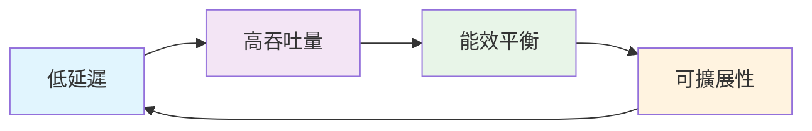
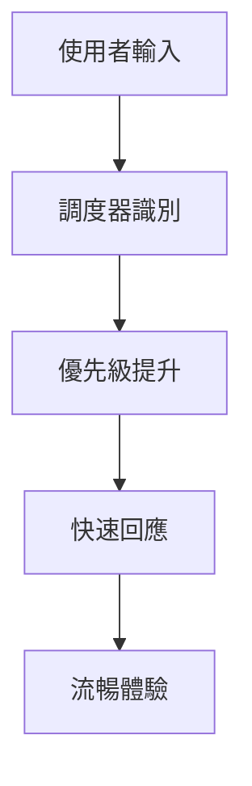
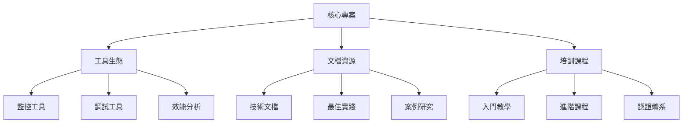

# 專案目標

本頁面介紹 Gthulhu 和 SCX GoLand Core 專案的設計理念、發展目標與未來願景。

## 專案願景

### 核心使命

**讓 Linux 調度器更智慧、更高效、更適應現代應用需求**

隨著雲原生應用、容器化部署、微服務架構的普及，傳統的調度器已無法完全滿足現代工作負載的多樣化需求。Gthulhu 專案致力於：

- 🎯 **提供低延遲調度**: 為互動式應用和即時系統提供更好的回應性
- 🚀 **最佳化雲原生環境**: 專為容器化和微服務環境設計
- 🔧 **支援可擴展架構**: 讓開發者能夠輕鬆定制調度策略
- 📊 **基於數據驅動**: 使用實際運行數據不斷最佳化調度決策

## 設計原則

### 1. 性能優先 (Performance First)



- **微秒級調度延遲**: 目標將調度決策時間控制在微秒級別
- **最小化上下文切換開銷**: 通過智慧任務分配減少不必要的上下文切換
- **零拷貝數據傳輸**: 在可能的情況下避免數據複製

### 2. 適應性設計 (Adaptive Design)

```yaml
設計特點:
  動態調整: 根據系統負載自動調整調度參數
  學習能力: 從歷史數據中學習最佳調度模式
  環境感知: 自動識別不同的應用場景和工作負載
  彈性配置: 支援運行時參數調整，無需重啟系統
```

### 3. 開發者友好 (Developer Friendly)

- **清晰的 API 設計**: 提供簡潔、直觀的程式介面
- **豐富的調試工具**: 內建詳細的監控和調試功能
- **完整的文檔**: 從入門到進階的完整文檔體系
- **活躍的社群支援**: 建立開放、友善的開發者社群

## 目標應用場景

### 🎮 互動式應用

**目標**: 提供流暢的使用者體驗

- **桌面環境**: 確保 GUI 應用的回應性
- **遊戲**: 減少輸入延遲，提供穩定的幀率
- **多媒體**: 最佳化音視頻播放體驗



### ☁️ 雲原生環境

**目標**: 最佳化容器化工作負載

- **微服務**: 改善服務間通訊延遲
- **容器調度**: 提高容器啟動速度
- **資源利用**: 最大化硬體資源效率

```yaml
雲原生最佳化:
  容器感知: 理解容器邊界和資源限制
  服務發現: 最佳化服務間的網路通訊
  彈性伸縮: 支援動態資源分配
  多租戶: 確保租戶間的公平性和隔離性
```

### 🔬 高效能運算

**目標**: 提供最大的計算吞吐量

- **科學計算**: 最佳化 CPU 密集型任務
- **數據分析**: 改善大數據處理效率
- **機器學習**: 加速 AI/ML 工作負載

## 技術目標

### 短期目標 (6-12 個月)

1. **穩定性提升**
   - [ ] 完成基礎功能測試
   - [ ] 修復已知的穩定性問題
   - [ ] 建立自動化測試流程

2. **效能優化**
   - [ ] 調度延遲降低至 < 10μs
   - [ ] 上下文切換開銷減少 20%
   - [ ] 記憶體使用量最佳化

3. **功能完善**
   - [ ] 完整的 CPU 拓撲支援
   - [ ] NUMA 感知調度
   - [ ] 即時任務支援

### 中期目標 (1-2 年)

1. **智慧化調度**
   - [ ] 機器學習輔助決策
   - [ ] 預測性任務分配
   - [ ] 自適應參數調整

2. **生態系統整合**
   - [ ] Kubernetes 原生支援
   - [ ] Docker 深度整合
   - [ ] 主流發行版收錄

3. **監控和可觀測性**
   - [ ] 詳細的效能指標
   - [ ] 視覺化監控面板
   - [ ] 問題診斷工具

### 長期目標 (2-5 年)

1. **產業採用**
   - [ ] 企業級產品整合
   - [ ] 雲服務商採用
   - [ ] 標準規範制定

2. **技術創新**
   - [ ] 量子計算調度支援
   - [ ] 邊緣計算最佳化
   - [ ] 異構計算平台支援

## 效能指標與基準

### 關鍵效能指標 (KPI)

| 指標 | 目標值 | 目前狀態 | 基準對比 |
|------|--------|----------|----------|
| 調度延遲 | < 10μs | 測試中 | CFS: ~50μs |
| 上下文切換時間 | < 2μs | 最佳化中 | CFS: ~3μs |
| CPU 利用率 | > 95% | 85% | CFS: 80% |
| 記憶體開銷 | < 1MB | 0.5MB | CFS: 0.3MB |
| 吞吐量提升 | > 15% | 10% | vs CFS |

### 基準測試場景

```bash
# 延遲測試
cyclictest -t 8 -p 99 -i 1000 -d 0

# 吞吐量測試
sysbench cpu --cpu-max-prime=20000 run

# 互動性測試
hackbench -p -l 100

# 混合負載測試
stress-ng --cpu 4 --io 2 --vm 2 --timeout 300s
```

## 社群發展目標

### 開發者社群

**目標**: 建立活躍、多元的開發者社群

- **核心貢獻者**: 培養 10+ 核心開發者
- **社群貢獻**: 吸引 100+ 社群貢獻者
- **企業參與**: 獲得 5+ 企業技術支持

### 生態系統建設



### 知識分享

- **技術部落格**: 定期發布技術文章和案例分析
- **會議演講**: 參與國際會議，分享技術成果
- **工作坊**: 舉辦技術工作坊和培訓活動
- **開源協作**: 與其他開源專案建立合作關係

## 可持續發展

### 技術可持續性

1. **程式碼品質**: 持續改進程式碼品質和測試覆蓋率
2. **文檔維護**: 保持文檔的時效性和完整性
3. **相容性**: 確保向後相容性和平滑升級路徑
4. **安全性**: 定期安全審計和漏洞修補

### 社群可持續性

1. **治理結構**: 建立透明、民主的專案治理機制
2. **多樣性**: 促進社群的多樣性和包容性
3. **導師制度**: 建立新手導師制度，培養新一代開發者
4. **商業模式**: 探索可持續的商業支援模式

## 成功指標

### 技術成功指標

- ✅ **穩定性**: 在生產環境中穩定運行 > 99.9%
- ✅ **效能**: 相較於 CFS 有明顯效能提升
- ✅ **採用率**: 被主流發行版採用
- ✅ **社群活躍度**: GitHub Stars > 1000, Contributors > 50

### 商業成功指標

- 💼 **企業採用**: 10+ 企業在生產環境中使用
- 💼 **雲服務整合**: 主要雲服務商提供支援
- 💼 **標準化**: 成為業界標準的一部分

## 風險評估與應對

### 技術風險

| 風險 | 可能性 | 影響 | 應對策略 |
|------|--------|------|----------|
| 核心 API 變更 | 中 | 高 | 維護多版本支援，與核心開發者密切合作 |
| 效能瓶頸 | 低 | 中 | 持續效能監控，提前最佳化 |
| 安全漏洞 | 低 | 高 | 定期安全審計，快速響應機制 |

### 市場風險

- **競爭加劇**: 持續技術創新，保持競爭優勢
- **需求變化**: 靈活調整發展方向，貼近用戶需求
- **技術變革**: 關注新興技術，及時適應變化

---

!!! quote "專案使命"
    我們相信，通過持續的技術創新和開放的社群協作，Gthulhu 將成為 Linux 調度器領域的重要力量，為現代應用提供更好的效能和體驗。

!!! tip "參與貢獻"
    如果您認同我們的目標和願景，歡迎加入我們的開發者社群！查看 [貢獻指南](contributing.md) 了解如何參與專案開發。
