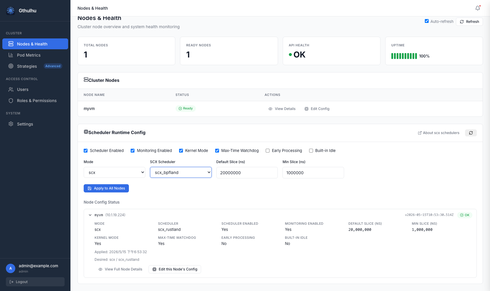

# Loading sched_ext Schedulers from the Web GUI


Gthulhu v1.2.0 adds a **Scheduler Runtime Config** panel on the **Nodes & Health** page. It lets you enable or disable scheduling features at runtime and load built-in Linux `sched_ext` schedulers, such as `scx_rustland`, without redeploying the whole cluster.

This page explains how to use the Web GUI to inspect node health, apply scheduler runtime settings, and verify whether each node accepted the desired configuration.

## Prerequisites

| Component | Requirement |
|-----------|-------------|
| Linux Kernel | 6.12+ with `CONFIG_SCHED_CLASS_EXT=y` enabled |
| Gthulhu Manager | Running and reachable from the Web GUI |
| Gthulhu Scheduler | Deployed on every target node, typically as a DaemonSet |
| sched_ext scheduler | The selected scheduler must be available in the scheduler runtime environment |

If you are using Kubernetes, forward the manager service before opening the GUI:

```bash
kubectl port-forward svc/gthulhu-manager 8080:8080
```

Then open `http://localhost:8080` and log in.

## Opening the Runtime Config Panel

1. In the sidebar, open **Nodes & Health**.
2. Review the summary cards at the top of the page:
	- **Total Nodes**: total nodes known by Gthulhu.
	- **Ready Nodes**: nodes currently reporting ready status.
	- **API Health**: manager API health result.
	- **Uptime**: recent health-check history.
3. In **Cluster Nodes**, click **View Details** to inspect a node or **Edit Config** to adjust that node's scheduler runtime configuration.
4. Use the **Scheduler Runtime Config** card to apply a shared configuration to all nodes or inspect per-node status.

The **About scx schedulers** link opens external documentation about sched_ext scheduler choices and their expected workload characteristics.

## Runtime Configuration Fields



The **Scheduler Runtime Config** card exposes the following settings:

| Field | Description |
|-------|-------------|
| **Scheduler Enabled** | Enables the scheduler runtime on target nodes. Disable it to stop applying custom scheduling behavior. |
| **Monitoring Enabled** | Keeps runtime metrics and node status reporting active. |
| **Kernel Mode** | Allows the scheduler to use kernel-side sched_ext execution when supported by the selected scheduler. |
| **Max-Time Watchdog** | Enables the watchdog that protects the system from scheduler stalls or excessive execution time. |
| **Early Processing** | Enables earlier processing of scheduling events when the selected scheduler supports it. |
| **Built-in Idle** | Uses the scheduler's built-in idle handling path when available. |
| **Mode** | Selects the runtime mode. Use `scx` to load a sched_ext scheduler. |
| **Default Slice (ns)** | Default CPU time slice in nanoseconds. |
| **Min Slice (ns)** | Minimum CPU time slice in nanoseconds. |

### Runtime Modes

| Mode | Description |
|------|-------------|
| `none` | Disables custom scheduler loading and keeps the node on the default behavior. |
| `gthulhu` | Uses Gthulhu's policy-driven scheduler path. |
| `simple` | Uses a simplified scheduler mode for lightweight testing or fallback scenarios. |
| `scx` | Loads a built-in sched_ext scheduler, such as `scx_rustland`, through the runtime loader. |

Use `scx` when you want Gthulhu to delegate scheduling to one of the available sched_ext schedulers while still monitoring node state through the Gthulhu manager.

## Applying a Scheduler to All Nodes

To apply the same runtime configuration across the cluster:

1. Open **Nodes & Health**.
2. In **Scheduler Runtime Config**, enable the desired toggles.
3. Set **Mode** to `scx`.
4. Set the slice values, for example:
	- **Default Slice (ns)**: `20000000`
	- **Min Slice (ns)**: `1000000`
5. Click **Apply to All Nodes**.
6. Wait for the **Node Config Status** list to refresh.

When the configuration is accepted, each node should show an **OK** badge and the desired mode/scheduler pair, for example `scx / scx_rustland`.

!!! warning "Cluster-wide changes"
	Applying a runtime configuration to all nodes changes scheduling behavior cluster-wide. Test the selected scheduler on a non-production node first when possible.

## Per-Node Status

The **Node Config Status** section expands each node and shows the currently applied runtime configuration.

| Field | Description |
|-------|-------------|
| **Mode** | Runtime mode currently reported by the node. |
| **Scheduler** | Loaded scheduler name, such as `scx_rustland`. |
| **Scheduler Enabled** | Whether scheduler runtime control is enabled on the node. |
| **Monitoring Enabled** | Whether the node is reporting monitoring data. |
| **Default Slice (ns)** | Applied default CPU time slice. |
| **Min Slice (ns)** | Applied minimum CPU time slice. |
| **Kernel Mode** | Whether kernel mode is enabled. |
| **Max-Time Watchdog** | Whether the watchdog is enabled. |
| **Early Processing** | Whether early processing is enabled. |
| **Built-in Idle** | Whether built-in idle handling is enabled. |
| **Applied** | Time when the node accepted the configuration. |
| **Desired** | Desired mode and scheduler requested by the manager. |

Use **View Full Node Details** for node-level health information, or **Edit this Node's Config** to override settings for a single node.

## Recommended Workflow

1. Start with **Monitoring Enabled** and verify that every node reports **Ready**.
2. Apply `scx` mode to a single test node first.
3. Confirm that **Node Config Status** shows **OK** and the expected scheduler name.
4. Watch workload behavior with **Pod Metrics** and node health indicators.
5. Roll the same configuration out with **Apply to All Nodes** after validation.

## Troubleshooting

| Symptom | What to Check |
|---------|---------------|
| Node does not show **OK** | Confirm the scheduler pod is running on the node and can reach the manager API. |
| `scx` mode fails to apply | Verify the kernel supports sched_ext and the selected scheduler is available in the runtime environment. |
| Node stops reporting status | Check network connectivity, manager logs, and scheduler logs for failed status updates. |
| Workloads behave unexpectedly | Revert to `gthulhu`, `simple`, or `none`, then inspect Pod Metrics before trying another scheduler. |

You can also inspect scheduler pod logs for the selected node:

```bash
kubectl logs -n gthulhu-system -l app=gthulhu-scheduler --tail=100
```
